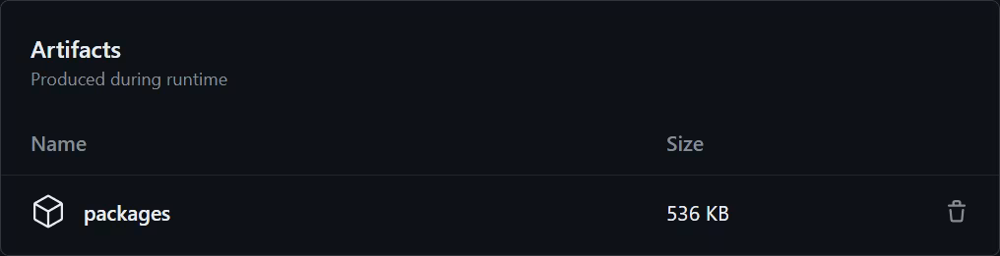
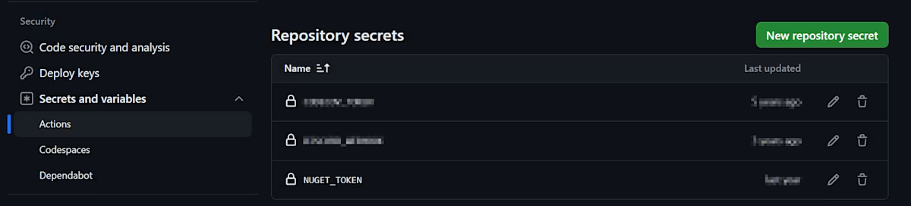

Developing a library involves a lot of moving pieces, and not all of them are just about writing code. Beyond the functionality of the library itself, you also have to consider many operational concerns, such as how it is built, tested, and released — and how those processes should be automated in an efficient and reliable way. These aspects may not be as prominent on the surface, but they still have significant implications both on your own productivity as the author, as well as the experience of the library's consumers.

Even in such a mature and opinionated ecosystem as .NET, there is no true one-size-fits-all solution. The tooling landscape — both within the platform and the wider software world — is vast and constantly evolving, so with lots of different knobs to turn and approaches to evaluate, it can be difficult to know where to start.

I have been maintaining [several open-source libraries in .NET](/projects) for over a decade, and through extensive trial and error, I have come to develop a set of practices that I find to be both effective and sustainable. These practices are not necessarily "best" in any absolute sense, but they have worked well for me and my projects, and I believe they can be a good starting point for others as well.

In this article, I will outline a typical .NET library setup, covering build settings, productivity extensions, testing and publishing workflows, and the services that help automate and tie everything together. We will go over different strategies, discuss the trade-offs between them, and see how they can be combined to establish a solid foundation for your library project.

## Scaffolding the project

Much like everything else in life, a .NET project has a beginning — and that beginning is the `dotnet new` command. It's safe to assume that, if you're reading this article, you've probably set up a fair share of .NET solutions and don't need any introduction to the process. However, since we'll be relying on certain expectations about the file structure going forward, let's use this opportunity to establish a common ground.

Generally speaking, there are two main ways to organize a solution in .NET: _the simpler way_ — where all projects are placed in their respective directories in the root of the codebase, and _the more scalable way_ — where projects are further grouped by their type and nested within the corresponding directories (`src/`, `tests/`, `samples/`, etc.). Both approaches are valid and have their place, but since we'll not be focusing on the actual codebase in this article, we'll go with the first option to keep things simple:

```
├── MyLibrary
│   ├── MyLibrary.csproj
│   └── (...)
├── MyLibrary.Tests
│   ├── MyLibrary.Tests.csproj
│   └── (...)
└── MyLibrary.sln
```

Here we have a bare-bones setup, consisting of the `MyLibrary` project that houses the library code, and the `MyLibrary.Tests` project which contains the corresponding automated tests. Both of them are unified within a single solution scope using a file named `MyLibrary.sln`, which provides a centralized entry point for the .NET tooling to discover and manage these projects.

To achieve the structure visualized above, you can either create the solution from an IDE of choice, or simply run the following `dotnet` commands in the terminal:

```bash
dotnet new classlib -n MyLibrary -o MyLibrary
dotnet new xunit -n MyLibrary.Tests -o MyLibrary.Tests
dotnet new sln -n MyLibrary
dotnet sln add MyLibrary/MyLibrary.csproj MyLibrary.Tests/MyLibrary.Tests.csproj
```

Besides that, our solution also needs to be integrated with a version control system and, ideally, a code hosting platform. When it comes to the former, the choice is fairly simple: [Git](https://git-scm.com) is the absolute standard of version control in the software world, and .NET is no exception. However, choosing a platform to host your Git repositories is a bit more nuanced, as there are many viable options available and — if you are planning to use them beyond their basic functionality — they all come with some form of vendor lock-in.

That said, unless you have a specific reason to use something else, I strongly recommend going with the obvious combination of Git and [GitHub](https://github.com) due to its wide adoption, generous free tier, and rich ecosystem of tools and integrations. This is especially relevant if you are planning to publish your library as an open-source project, as GitHub's large community of developers lends to better discoverability and collaboration opportunities.

With all that in mind, let's assume we've created a new remote repository over at `https://github.com/Tyrrrz/MyLibrary`. Now we can also initialize the repository locally and synchronize the two together:

```bash
git init
git remote add origin https://github.com/Tyrrrz/MyLibrary.git
dotnet new gitignore
```

This set of commands does a few things: it creates the `.git` directory with all the repository-specific metadata, adds a remote named `origin` pointing to the GitHub repository we've created earlier, and generates a comprehensive [`.gitignore`](https://git-scm.com/docs/gitignore) file tailored for common file and directory patterns used within the .NET ecosystem. Once all the commands are executed, the resulting file structure should look like this:

```
├── .git
│   └── (...)
├── MyLibrary
│   ├── MyLibrary.csproj
│   └── (...)
├── MyLibrary.Tests
│   ├── MyLibrary.Tests.csproj
│   └── (...)
├── .gitignore
└── MyLibrary.sln
```

At this point, we can consider the initial scaffolding of our solution to be complete. Since we don't really care about the inner workings of the library, we will simply assume that its functionality has been fully implemented, and that the associated tests are also in place and running correctly. To close this part off, let's commit our existing codebase and push it to the remote repository:

```bash
git add .
git commit -m "Initial commit"
git push -u origin main
```

## Baseline configuration

Any individual .NET project is essentially a (massive) set of instructions that direct the toolchain how to parse, compile, and package the code contained within it. These instructions are inherited through various internal `props` and `targets` files and, for the most part, pose no particular interest to you as the developer. However, there are a few aspects of the build process that you may want to configure — even if solely to establish a set of reasonable defaults.

I call these defaults the "baseline configuration", as their purpose is not to significantly alter the behavior of the build, but rather to ensure its consistency across unpredictable environments. This can be achieved with the help of the following three optional files:

- [`global.json`](https://learn.microsoft.com/dotnet/core/tools/global-json) — specifies the version of the .NET SDK that should be used for the solution and optionally instructs how to roll forward to higher versions.
- [`nuget.config`](https://learn.microsoft.com/nuget/reference/nuget-config-file) — configures settings related to the NuGet package manager, including the sources from which it should resolve package dependencies.
- [`Directory.Build.props`](https://learn.microsoft.com/visualstudio/msbuild/customize-by-directory) — defines custom MSBuild properties that are automatically applied to all projects in the solution.

Before we explore each of these files in detail, let's get started by generating boilerplates for all of them. We can do that by running the following `dotnet new` commands in the root of our solution directory:

```bash
dotnet new globaljson
dotnet new nugetconfig
dotnet new buildprops
```

### `global.json`

First off, we have the `global.json` file, whose purpose is to declare which version of the .NET SDK the solution is intended to work with. Normally, this information is not encoded in the solution file or anywhere else, so the .NET tooling relies on the default behavior of simply resolving the latest SDK that is available in the environment. This behavior is fine for local development — since you can reasonably guarantee that a compatible version of the SDK is installed on your machine — but it's a good idea to make that requirement explicit to communicate it clearly to other collaborators (and your future self) as well.

Naturally, in order to be considered compatible, the SDK must provide the capabilities that the codebase depends on, such as access to certain target frameworks, language features, compiler options, and so on. When it comes to the [.NET SDK versioning schema](https://learn.microsoft.com/dotnet/core/versions), these aspects are typically governed by the first two components of the version label (i.e. `9.0.***`), while the rest of the numbers indicate bug fixes and minor improvements (i.e. `*.*.307`). In other words, if a project is written with the C# 13 syntax and targets `net9.0`, you'd need the .NET 9.0 SDK in order to build it — but the exact version is not that important.

When you generate a `global.json` file via `dotnet new`, however, it defaults to the full version of the latest .NET SDK available on your machine. It means that anyone who wants to build the solution will also be required to have that _exact same_ SDK version installed, which is way too restrictive. To fix that, let's modify the file to look like this instead:

```json
{
  "sdk": {
    "version": "9.0.100",
    "rollForward": "latestFeature"
  }
}
```

At the time of writing, the current iteration of .NET is .NET 9.0, so we set the `version` property to `9.0.100` — the lowest SDK version within the `9.0` band. Together with the `rollForward` option set to `latestFeature`, this effectively creates a rule that allows the solution to be built by any feature or patch version of the .NET 9.0 SDK, but not by an SDK of another major or minor version (e.g. .NET 8.0 or .NET 10.0).

The reason for specifically choosing `latestFeature` instead of `latestMinor` or even `latestMajor` is to ensure runtime compatibility for executable projects in the solution, such as tests. Although .NET SDKs are generally backward-compatible between different major and minor versions, each SDK includes its corresponding version of the runtime, which is not. As a result, while a project targeting `net9.0` can still be built with the .NET 10.0 SDK, it can only be executed with the .NET 9.0 runtime — making the matching SDK version more preferable.

### `nuget.config`

Moving along, we also have `nuget.config` — a file that can configure how the NuGet package manager integrates with the build process and, most importantly, the locations it uses to restore and publish packages. By default, NuGet connects to the official [NuGet.org](https://nuget.org) registry, but this may vary between different environments due to user- and machine-specific overrides. To ensure a consistent (and secure) developer experience, we can create a solution-level configuration file that explicitly enforces the intended behavior and prevents other settings from interfering with it.

The `nuget.config` file generated by `dotnet new` provides a great starting point: it resets the list of allowed package sources to only include the official registry. This takes care of the package resolution aspect, but since we're working on a library project that we want to publish as a NuGet package as well, it's also useful to set up the default push source too. To do that, let's edit the configuration file like so:

```xml
<?xml version="1.0" encoding="utf-8"?>
<configuration>

  <packageSources>
    <clear />
    <add key="nuget" value="https://api.nuget.org/v3/index.json" />
  </packageSources>

  <config>
    <add key="defaultPushSource" value="https://api.nuget.org/v3/index.json" />
  </config>

</configuration>
```

Here we have the `<packageSources>` section that specifies the feeds from which NuGet should fetch dependencies. It's a list-based setting, so we start with the `<clear />` element to remove any previously defined sources, and then add a single item named `nuget` that points to the NuGet.org catalog. Doing so makes sure that all projects in the solution resolve packages from the official registry, regardless of any other sources that may be configured on the machine.

The following `<config>` section is reserved for key-value settings that control various aspects of the NuGet client behavior, and in our case, we use it to set `defaultPushSource` to match the package source defined earlier. Now, when we run the `dotnet nuget push` command to upload our own packages, it will also infer NuGet.org as the target location without requiring any additional arguments.

### `Directory.Build.props`

Finally, we have the `Directory.Build.props` file, which lets us define arbitrary MSBuild properties that should be applied to all projects in the solution. When running the build, the tooling automatically looks for this file (and `Directory.Build.targets`, if available) within the directory hierarchy, and implicitly includes its contents in each project specification. This convention makes `Directory.Build.props` a great place to configure common cross-cutting concerns, such as compiler options, build settings, and various metadata.

The file generated by `dotnet new` makes no assumptions about your intentions, so it simply starts off empty. Here's how I typically set it up for my library projects:

```xml
<Project>

  <!-- Compiler options -->
  <PropertyGroup>
    <LangVersion>latest</LangVersion>
    <Nullable>annotations</Nullable>
    <Nullable Condition="$([MSBuild]::IsTargetFrameworkCompatible('$(TargetFramework)', 'netstandard2.1'))">enable</Nullable>
    <TreatWarningsAsErrors>true</TreatWarningsAsErrors>
  </PropertyGroup>

  <!-- Tooling options -->
  <PropertyGroup>
    <CheckEolTargetFramework>false</CheckEolTargetFramework>
    <IsPackable>false</IsPackable>
  </PropertyGroup>

  <!-- Assembly & package metadata -->
  <PropertyGroup>
    <Version>0.0.0-dev</Version>
    <Company>YOUR_NAME_HERE</Company>
    <Copyright>Copyright (C) $(Company)</Copyright>
    <Authors>$(Company)</Authors>
    <Description>Sample library</Description>
    <PackageTags>space-separated search keyword go in here</PackageTags>
    <PackageProjectUrl>https://github.com/Tyrrrz/MyLibrary</PackageProjectUrl>
    <PackageReleaseNotes>https://github.com/Tyrrrz/MyLibrary/releases</PackageReleaseNotes>
    <PackageLicenseExpression>MIT</PackageLicenseExpression>
  </PropertyGroup>

</Project>
```

In the above snippet, we have a few different groups of properties that are used to configure various aspects of the build process. Each group is wrapped in a `<PropertyGroup>` element, which allows us to logically separate the properties based on their purpose. Such structure has no functional benefits, but it helps keep things organized and makes reading and maintaining the file easier.

Starting off with the first group of options, we set the **`<LangVersion>`** property to `latest`, instructing the C# (or F#, VB) compiler to use the most recent stable version of the language. This is contrary to the default behavior, where the language version is instead determined by the target framework of the project, essentially only allowing newer language features when building against frameworks that officially support them.

The default behavior is a sensible safeguard, seeing as language constructs may sometimes depend on certain runtime capabilities to work correctly. However, library projects, unlike applications, cannot afford to simply target the latest version of .NET — they need to maximize compatibility with their potential consumers and that often involves targeting frameworks that are several versions behind the bleeding edge.

Therefore, setting the language version explicitly forces the compiler to ignore the official guidelines and evaluate the availability of each language feature independently from the target framework. Doing so immediately unlocks some of the newest syntax that doesn't have any runtime dependencies, while also allowing other features to be backported manually to older frameworks using polyfills.

Following that, we enable the [**Nullable Reference Types**](https://learn.microsoft.com/dotnet/csharp/nullable-references) feature of the C# compiler, as it is a great way to improve the safety of our code and to more accurately advertise the capabilities of our APIs. There are two modes in which this feature can be configured: `annotations`, which instructs the compiler to emit nullability annotations for all types and members that we define; and `enable`, which also produces compiler warnings about related violations during development.

Just like many other language and compiler features, Nullable Reference Types is subject to certain availability constraints as well. In its native form, NRT was introduced with the release of C# 8 and .NET Core 3.0 — and, although it's possible to backport the bits required to annotate our own types, the compiler checks are not going to be very useful when targeting older frameworks that don't provide nullability information themselves.

Because of that, we configure this feature in a conditional way: activating the `annotations` mode as the baseline for all targets, while extending to the `enable` mode for the frameworks that fully support it. This way, our assemblies will always include nullability annotations, but we'll only get warnings about violations in our own code when building against newer frameworks.

Note how the example above relies on the `Condition="..."` attribute to validate framework compatibility. Instead of hard-codding a sequence of separate checks for each specific framework that our projects may target, we can rely on the [`IsTargetFrameworkCompatible`](https://learn.microsoft.com/visualstudio/msbuild/property-functions#msbuild-property-functions) function to establish a version boundary that accounts for different flavors of .NET. In this scenario, NRT will be fully enabled for both .NET Standard 2.1, .NET Core 3.0, as well as any newer implementations of .NET.

To round off the first section, we also set the **`TreatWarningsAsErrors`** property to `true`, directing the compiler to block the build if any warnings are encountered. In effect, this forces developers to address every potential issue in the codebase — either by fixing it or by explicitly declaring it as non-problematic. Although not required, it's generally a good idea to enable this setting for library projects as they tend to have somewhat higher expectations when it comes to code quality.

The second group of properties is dedicated to other toolchain options that are not specifically related to the compilation stage. Here, we first set the **`CheckEolTargetFramework`** property to `false`, disabling warnings when building for frameworks that have exited their support lifecycle. As mentioned before, libraries do often need to target older frameworks for compatibility reasons, so these warnings are not particularly useful in this context.

Next, we get to the **`IsPackable`** property, which controls whether a given project should be included in the packaging process. The default value is `true`, meaning that every project is treated as packable unless specified otherwise. By inverting the default, we establish a more intentional convention where NuGet packages are only created for projects that deliberately opt in.

With this setup in place, we can blindly run `dotnet pack` followed by `dotnet nuget push **/*.nupkg` on the entire solution to generate and publish all relevant NuGet artifacts in one go. Other assemblies, such as those produced by the tests and sample projects, will be automatically excluded from the process — greatly simplifying the release workflow along with its automation.

Finally, we have the third group of properties — these are used to define common metadata that gets embedded into the output assemblies and the corresponding NuGet packages. The **`<Version>`** property in particular plays a crucial role in the package management system, as it's the primary way to distinguish different iterations of the same package. For local development, we set it to a placeholder value of `0.0.0-dev`, which will be overridden with a proper version number during the release process.

The remaining fields, including **`Company`**, **`Description`**, and **`PackageProjectUrl`**, are purely informational properties that get surfaced in various places, such as assembly and NuGet package details. The purpose of these fields is to provide context about the package, its author, and where to find more information about it — so make sure to fill them out with accurate values that reflect the identity and nature of your library.

Most importantly, when developing a library, you also need to consider the license under which it will be distributed. The **`PackageLicenseExpression`** property allows you to specify a [standard SPDX license identifier](https://spdx.org/licenses) that indicates the terms of use for your package. Here, we set it to `MIT`, arguably the most popular permissive open-source license, but feel free to explore [other options](https://choosealicense.com) as well to find the best fit for your project.

Although all these metadata properties are only really relevant to the packable projects in our solution, there is no harm in applying them globally through `Directory.Build.props`. In the scenario that we have multiple NuGet packages that we want to publish from the same repository, this setup allows us to maintain a single source of truth for all metadata, while still being able to override specific fields on a per-project basis if needed.

## Library configuration

With the baseline configuration in place, we can now turn our attention to the specifics of the library project itself. These settings build upon what we've already established earlier, and focus on aspects that are particularly relevant to libraries, such as target frameworks, compatibility, and other packaging options.

Since our library project was initially created using `dotnet new classlib`, the project file (i.e. `MyLibrary.csproj`) comes with some basic configuration. We won't be using any of it, so let's instead replace the contents with the following:

```xml
<Project Sdk="Microsoft.NET.Sdk">

  <PropertyGroup>
    <TargetFrameworks>netstandard2.0;net9.0</TargetFrameworks>
    <IsPackable>true</IsPackable>
    <IsTrimmable Condition="$([MSBuild]::IsTargetFrameworkCompatible('$(TargetFramework)', 'net6.0'))">true</IsTrimmable>
    <IsAotCompatible Condition="$([MSBuild]::IsTargetFrameworkCompatible('$(TargetFramework)', 'net7.0'))">true</IsAotCompatible>
    <GenerateDocumentationFile>true</GenerateDocumentationFile>
  </PropertyGroup>

</Project>
```

When building a library, one of the most important things you have to consider early is compatibility. In the .NET world, this is mainly determined by the _target framework_ that the library is built against. The target framework essentially defines the set of shared APIs that are available to the library, as well as the runtime environment in which it will be executed.

In most cases, for an application to be able to reference a library, the library must target the same implementation of the framework (i.e. .NET Framework, .NET (Core), Xamarin, Mono, etc.) of a version that is either the same as, or lower than, the application's target framework. For example, an application targeting `net6.0` can reference libraries built for `net6.0` or `net5.0`, but not `net7.0` or `net8.0` or `net462`.

Things are further complicated by the existence of meta-frameworks, such as .NET Standard, which are designed to abstract away the differences between certain .NET implementations and their various versions. And if that didn't make things complex enough, .NET takes it up a level by making all of the naming conventions extremely inconsistent and confusing.

Choosing the right target frameworks to support is not a trivial task, as it involves planning, compromise, and a good understanding of the .NET ecosystem. The reason for that is the sheer number of different .NET implementations and versions that exist, each with its own set of capabilities and limitations.

In order to make the lives of library developers a bit easier, the .NET tooling provides a way to specify multiple target frameworks for a single project using the **`<TargetFrameworks>`** property (note the plural form). This allows us to build the library against different versions of .NET, thereby maximizing its compatibility with various applications. When running the build, the tooling will produce separate assemblies for each target framework, which can then be packaged and published as a single NuGet package.

What to target in tests?

## Workflow automation: building & testing

Just like any other software project, developing a library is an iterative process that revolves around the repeated cycle of writing and testing code. The setup we've established so far, along with the tooling provided by .NET, makes this process really simple — we can build and test our entire solution by running a single command:

```bash
$ dotnet test

Microsoft (R) Test Execution Command Line Tool Version 17.8.0 (x64)
Copyright (c) Microsoft Corporation.  All rights reserved.

Starting test execution, please wait...
A total of 1 test files matched the specified pattern.

Passed!  - Failed:     0, Passed:     8, Skipped:     0, Total:     8, Duration: 993 ms - MyLibrary.Tests.dll (net9.0)
Passed!  - Failed:     0, Passed:     8, Skipped:     0, Total:     8, Duration: 913 ms - MyLibrary.Tests.dll (net462)
```

Behind the scenes, the above command works by identifying the projects referenced by the solution file in the current directory, building them, and then executing tests found in appropriately marked test projects against all available target frameworks. If all tests pass, the command exits with a zero exit code, indicating success; otherwise, it exits with a non-zero code, signaling failure. Note how running the command does not put the responsibility of figuring out dependency graphs, build order, or test discovery on us — the project files and tooling takes care of all that automatically.

Now, while it is nice that we can run the build and tests locally, we would ideally want this process to be completely automated — so that it runs on every code change, without us having to do anything manually. This ensures that the code is always in a working state, and that new changes don't introduce any unwanted regressions.

Since we're already using GitHub to host our code repository, we can leverage its built-in automation platform, [GitHub Actions](https://github.com/features/actions) to achieve that. GitHub Actions allows us to define workflows that are triggered by specific events, such as pushing code to the repository or opening a pull request. These workflows can then run a series of jobs, which are essentially scripts that execute commands in a specified environment.

GitHub Actions workflows are conceptually based around events — so you can listen to specific types of events that indicate that something happened in the repository, and then run a series of commands in response to that event. While it's completely free for open-source projects, it also comes with a generous monthly allowance of free minutes for private repositories as well.

For a typical testing workflow, it is standard to run dotnet test on every push to the repository, as well as on every pull request. To that end, you can create a workflow file that looks something like this:

```yml
# Friendly name of the workflow
name: main

# Events that trigger the workflow
# (push and pull_request events with default filters)
on:
  push:
  pull_request:

# Workflow jobs
jobs:
  # ID of the job
  test:
    # Operating system to run the job on
    runs-on: ubuntu-latest

    # Steps to run in the job
    steps:
      # Check out the repository
      - uses: actions/checkout@v4 # ideally pin versions to hashes, read on to learn more

      # Run the dotnet test command
      - run: dotnet test --configuration Release
```

```yml
name: main

on:
  push:
  pull_request:

jobs:
  test:
    runs-on: ubuntu-latest

    steps:
      - uses: actions/checkout@v4

      # Setup .NET SDK
      - uses: actions/setup-dotnet@v4
        with:
          dotnet-version: |
            8.0.x
            6.0.x

      - run: dotnet test --configuration Release
```

```yml
name: main

on:
  push:
  pull_request:

jobs:
  test:
    # Matrix defines a list of arguments to run the job with,
    # which will be expanded into multiple jobs by GitHub Actions.
    matrix:
      os:
        - windows-latest
        - ubuntu-latest
        - macos-latest

    # We can reference the matrix arguments using the `matrix` context object
    runs-on: ${{ matrix.os }}

    steps:
      - uses: actions/checkout@v4

      - uses: actions/setup-dotnet@v4
        with:
          dotnet-version: |
            8.0.x
            6.0.x

      - - run: dotnet test --configuration Release
```

Reporting test results

- https://github.com/dorny/test-reporter
- https://github.com/Tyrrrz/GitHubActionsTestLogger

Dorny:

```yml
name: main

on:
  push:
  pull_request:

jobs:
  test:
    matrix:
      os:
        - windows-latest
        - ubuntu-latest
        - macos-latest

    runs-on: ${{ matrix.os }}

    steps:
      - uses: actions/checkout@v4

      - uses: actions/setup-dotnet@v4
        with:
          dotnet-version: |
            8.0.x
            6.0.x

      - run: >
          dotnet test
          --configuration Release
          --logger "trx;LogFileName=test-results.trx"

      - uses: dorny/test-reporter@v1
        # Run this step even if the previous step fails
        if: success() || failure()
        with:
          name: Test results
          path: '**/*.trx'
          reporter: dotnet-trx
          fail-on-error: true
```


```yml
# Testing workflow
name: main

on:
  push:
  pull_request:

jobs:
  test:
    matrix:
      os:
        - windows-latest
        - ubuntu-latest
        - macos-latest

    runs-on: ${{ matrix.os }}

    steps:
      - uses: actions/checkout@v4

      - uses: actions/setup-dotnet@v4
        with:
          dotnet-version: |
            8.0.x
            6.0.x

      - run: >
          dotnet test
          --configuration Release
          --logger "trx;LogFileName=test-results.trx"

      # Upload test result files as artifacts, so they can be fetched by the reporting workflow
      - uses: actions/upload-artifact@v4
        with:
          name: test-results
          path: '**/*.trx'
```

```yml
# Reporting workflow
name: Test results

on:
  # Run this workflow after the testing workflow completes
  workflow_run:
    workflows:
      - main
    types:
      - completed

jobs:
  report:
    runs-on: ubuntu-latest

    steps:
      # Extract the test result files from the artifacts
      - uses: dorny/test-reporter@v1
        with:
          name: Test results
          artifact: test-results
          path: '**/*.trx'
          reporter: dotnet-trx
          fail-on-error: true
```

GitHub Actions Test Logger:

```yml
name: main

on:
  push:
  pull_request:

jobs:
  test:
    matrix:
      os:
        - windows-latest
        - ubuntu-latest
        - macos-latest

    runs-on: ${{ matrix.os }}

    steps:
      - uses: actions/checkout@v4

      - uses: actions/setup-dotnet@v4
        with:
          dotnet-version: |
            8.0.x
            6.0.x

      - run: >
          dotnet test
          --configuration Release
          --logger GitHubActions
```


Coverage

```yml
name: main

on:
  push:
  pull_request:

jobs:
  test:
    matrix:
      os:
        - windows-latest
        - ubuntu-latest
        - macos-latest

    runs-on: ${{ matrix.os }}

    steps:
      - uses: actions/checkout@v4

      - uses: actions/setup-dotnet@v4
        with:
          dotnet-version: |
            8.0.x
            6.0.x

      - run: >
          dotnet test
          --configuration Release
          --logger GitHubActions
          --collect:"XPlat Code Coverage"
          --
          DataCollectionRunSettings.DataCollectors.DataCollector.Configuration.Format=opencover

      # Codecov will automatically merge coverage reports from all jobs
      - uses: codecov/codecov-action@v3
```


## Security considerations

```yml
jobs:
  test:
    permissions:
      contents: read
```

```yml
name: main

on:
  push:
  pull_request:

jobs:
  test:
    matrix:
      os:
        - windows-latest
        - ubuntu-latest
        - macos-latest

    runs-on: ${{ matrix.os }}

    permissions:
      contents: read

    steps:
      - uses: actions/checkout@v4

      - uses: actions/setup-dotnet@v4
        with:
          dotnet-version: |
            8.0.x
            6.0.x

      - run: >
          dotnet test
          --configuration Release
          --logger GitHubActions
          --collect:"XPlat Code Coverage"
          --
          DataCollectionRunSettings.DataCollectors.DataCollector.Configuration.Format=opencover

      - uses: codecov/codecov-action@v3
```

```yml
name: main

on:
  push:
  pull_request:

jobs:
  test:
    matrix:
      os:
        - windows-latest
        - ubuntu-latest
        - macos-latest

    runs-on: ${{ matrix.os }}

    permissions:
      contents: read

    steps:
      - uses: actions/checkout@b4ffde65f46336ab88eb53be808477a3936bae11 # v4.1.1

      - uses: actions/setup-dotnet@4d6c8fcf3c8f7a60068d26b594648e99df24cee3 # v4.0.0
        with:
          dotnet-version: |
            8.0.x
            6.0.x

      - run: >
          dotnet test
          --configuration Release
          --logger GitHubActions
          --collect:"XPlat Code Coverage"
          --
          DataCollectionRunSettings.DataCollectors.DataCollector.Configuration.Format=opencover
      - uses: codecov/codecov-action@eaaf4bedf32dbdc6b720b63067d99c4d77d6047d # v3.1.4
```

## Releasing workflow

```
          -p:CSharpier_Bypass=true
          -p:ContinuousIntegrationBuild=true
          -p:PublishRepositoryUrl=true
          -p:EmbedUntrackedSources=true
          -p:DebugType=embedded
```

Don't resolve `<ContinuousIntegrationBuild>` in the props files directly.

```yml
name: main

on:
  push:
  pull_request:

jobs:
  test:
    # Test job remains unchanged, but is omitted for brevity
    # ...

  pack:
    # Operating system doesn't matter here, but Ubuntu-based GitHub Actions
    # runners are both the fastest and the cheapest.
    runs-on: ubuntu-latest

    permissions:
      contents: read

    steps:
      # Clone the repository at current commit
      - uses: actions/checkout@b4ffde65f46336ab88eb53be808477a3936bae11 # v4.1.1

      # Install the .NET SDK
      - uses: actions/setup-dotnet@4d6c8fcf3c8f7a60068d26b594648e99df24cee3 # v4.0.0
        with:
          dotnet-version: 8.0.x

      # Create NuGet packages
      - run: dotnet pack --configuration Release
```

```yml
name: main

on:
  push:
  pull_request:

jobs:
  test:
    # Test job remains unchanged, but is omitted for brevity
    # ...

  pack:
    runs-on: ubuntu-latest

    permissions:
      actions: write # this is required to upload artifacts
      contents: read

    steps:
      - uses: actions/checkout@b4ffde65f46336ab88eb53be808477a3936bae11 # v4.1.1

      - uses: actions/setup-dotnet@4d6c8fcf3c8f7a60068d26b594648e99df24cee3 # v4.0.0
        with:
          dotnet-version: 8.0.x

      - run: dotnet pack --configuration Release

      # Upload all nupkg files as an artifact blob
      - uses: actions/upload-artifact@26f96dfa697d77e81fd5907df203aa23a56210a8 # v4.3.0
        with:
          name: packages
          path: '**/*.nupkg'
```



```yml
name: main

on:
  push:
  pull_request:

jobs:
  test:
    # Test job remains unchanged, but is omitted for brevity
    # ...

  pack:
    runs-on: ubuntu-latest

    permissions:
      actions: write
      contents: read

    steps:
      - uses: actions/checkout@b4ffde65f46336ab88eb53be808477a3936bae11 # v4.1.1

      - uses: actions/setup-dotnet@4d6c8fcf3c8f7a60068d26b594648e99df24cee3 # v4.0.0
        with:
          dotnet-version: 8.0.x

      - run: dotnet pack --configuration Release

      - uses: actions/upload-artifact@26f96dfa697d77e81fd5907df203aa23a56210a8 # v4.3.0
        with:
          name: packages
          path: '**/*.nupkg'

  deploy:
    # Only run this job when a new tag is pushed to the repository
    if: ${{ github.event_name == 'push' && github.ref_type == 'tag' }}

    # We only want the deploy stage to run after both the test and pack stages
    # have completed successfully.
    needs:
      - test
      - pack

    runs-on: ubuntu-latest

    permissions:
      actions: read

    steps:
      # Download the packages artifact
      - uses: actions/download-artifact@6b208ae046db98c579e8a3aa621ab581ff575935 # v4.1.1
        with:
          name: packages

      # Install the .NET SDK
      - uses: actions/setup-dotnet@4d6c8fcf3c8f7a60068d26b594648e99df24cee3 # v4.0.0
        with:
          dotnet-version: 8.0.x

      # Upload the packages to NuGet
      - run: >
          dotnet nuget push "**/*.nupkg"
          --source https://api.nuget.org/v3/index.json
          --api-key ${{ secrets.NUGET_API_KEY }}
```



```xml
<Project>

  <PropertyGroup>
    <!-- ... -->

    <!-- Update this when making a new release -->
    <Version>1.2.3</Version>
  </PropertyGroup>

</Project>
```

```yml
name: main

on:
  push:
  pull_request:

jobs:
  test:
    # Test job remains unchanged, but is omitted for brevity
    # ...

  pack:
    runs-on: ubuntu-latest

    permissions:
      actions: write
      contents: read

    steps:
      - uses: actions/checkout@b4ffde65f46336ab88eb53be808477a3936bae11 # v4.1.1

      - uses: actions/setup-dotnet@4d6c8fcf3c8f7a60068d26b594648e99df24cee3 # v4.0.0
        with:
          dotnet-version: 8.0.x

      # Set the package version to the tag name (on release)
      # or fall back to a placeholder value (on regular commits).
      - run: >
          dotnet pack
          --configuration Release
          -p:Version=${{ github.ref_name || '0.0.0-ci' }}

      - uses: actions/upload-artifact@26f96dfa697d77e81fd5907df203aa23a56210a8 # v4.3.0
        with:
          name: packages
          path: '**/*.nupkg'

  deploy:
    # Deploy job remains unchanged, but is omitted for brevity
    # ...
```

```yml
name: main

on:
  push:
  pull_request:

jobs:
  test:
    # Test job remains unchanged, but is omitted for brevity
    # ...

  pack:
    runs-on: ubuntu-latest

    permissions:
      actions: write
      contents: read

    steps:
      - uses: actions/checkout@b4ffde65f46336ab88eb53be808477a3936bae11 # v4.1.1

      - uses: actions/setup-dotnet@4d6c8fcf3c8f7a60068d26b594648e99df24cee3 # v4.0.0
        with:
          dotnet-version: 8.0.x

      # Set the package version to the tag name (on release)
      # or fall back to an auto-generated value (on regular commits).
      - run: >
          dotnet pack
          --configuration Release
          -p:Version=${{ (github.ref_type == 'tag' && github.ref_name) || format('0.0.0-ci-{0}', github.sha) }}

      - uses: actions/upload-artifact@26f96dfa697d77e81fd5907df203aa23a56210a8 # v4.3.0
        with:
          name: packages
          path: '**/*.nupkg'

  # Deploy on all commits this time, not just tags
  deploy:
    needs:
      - test
      - pack

    runs-on: ubuntu-latest

    permissions:
      actions: read

    steps:
      - uses: actions/download-artifact@6b208ae046db98c579e8a3aa621ab581ff575935 # v4.1.1
        with:
          name: packages

      - uses: actions/setup-dotnet@4d6c8fcf3c8f7a60068d26b594648e99df24cee3 # v4.0.0
        with:
          dotnet-version: 8.0.x

      - run: >
          dotnet nuget push "**/*.nupkg"
          --source https://api.nuget.org/v3/index.json
          --api-key ${{ secrets.NUGET_API_KEY }}
```

```yml
name: main

on:
  push:
  pull_request:

jobs:
  test:
    # Test job remains unchanged, but is omitted for brevity
    # ...

  pack:
    # Pack job remains unchanged, but is omitted for brevity
    # ...

  deploy:
    needs:
      - test
      - pack

    runs-on: ubuntu-latest

    permissions:
      actions: read

    steps:
      - uses: actions/download-artifact@6b208ae046db98c579e8a3aa621ab581ff575935 # v4.1.1
        with:
          name: packages

      - uses: actions/setup-dotnet@4d6c8fcf3c8f7a60068d26b594648e99df24cee3 # v4.0.0
        with:
          dotnet-version: 8.0.x

      # Deploy to NuGet.org (only tagged releases)
      - if: ${{ github.ref_type == 'tag' }}
        run: >
          dotnet nuget push "**/*.nupkg"
          --source https://api.nuget.org/v3/index.json
          --api-key ${{ secrets.NUGET_API_KEY }}

      # Deploy to GitHub Packages (all commits and releases)
      - run: >
          dotnet nuget push "**/*.nupkg"
          --source https://nuget.pkg.github.com/${{ github.repository_owner }}/index.json
          --api-key ${{ secrets.GITHUB_TOKEN }}
```


```console
$ gh release create 1.2.3 --repo my/repo --generate-notes
```

```yml
name: main

on:
  push:
  pull_request:

jobs:
  test:
    # Test job remains unchanged, but is omitted for brevity
    # ...

  pack:
    # Pack job remains unchanged, but is omitted for brevity
    # ...

  deploy:
    needs:
      - test
      - pack

    runs-on: ubuntu-latest

    permissions:
      actions: read
      contents: write # this is required to create releases

    steps:
      - uses: actions/download-artifact@6b208ae046db98c579e8a3aa621ab581ff575935 # v4.1.1
        with:
          name: packages

      - uses: actions/setup-dotnet@4d6c8fcf3c8f7a60068d26b594648e99df24cee3 # v4.0.0
        with:
          dotnet-version: 8.0.x

      - if: ${{ github.ref_type == 'tag' }}
        run: >
          dotnet nuget push "**/*.nupkg"
          --source https://api.nuget.org/v3/index.json
          --api-key ${{ secrets.NUGET_API_KEY }}

      - run: >
          dotnet nuget push "**/*.nupkg"
          --source https://nuget.pkg.github.com/${{ github.repository_owner }}/index.json
          --api-key ${{ secrets.GITHUB_TOKEN }}

      # Create a GitHub release with auto-generated release notes, and upload the packages as assets
      - if: ${{ github.ref_type == 'tag' }}
        run: >
          gh release create ${{ github.ref_name }}
          $(find . -type f -wholename **/*.nupkg -exec echo {} \; | tr '\n' ' ')
          --repo ${{ github.event.repository.full_name }}
          --title ${{ github.ref_name }}
          --generate-notes
          --verify-tag
```

## Changelog

## Formatting

CSharpier

## GitHub issue forms

## Summary

You can reference [`https://github.com/Tyrrrz/MyLibrary`](https://github.com/Tyrrrz/MyLibrary) to see the complete solution that we have built throughout this article. You can also use it a repository template to quickly bootstrap your own library project.
