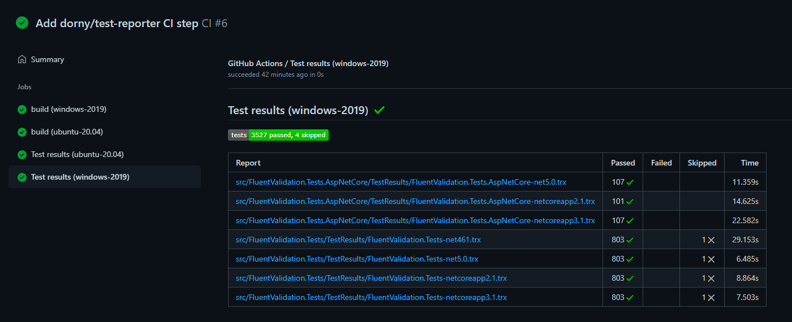
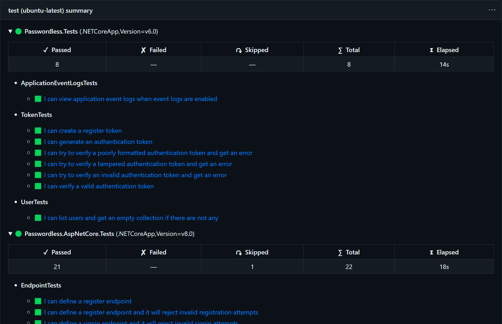
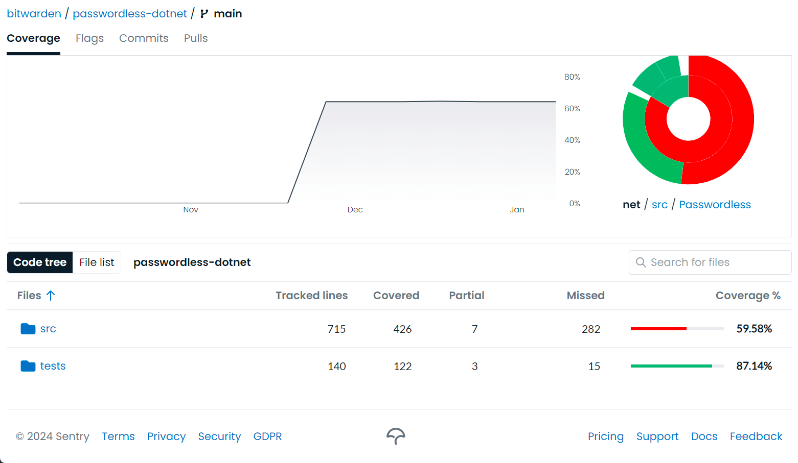

Developing a library involves a lot of moving pieces, and not all of them are just about writing code. Beyond the functionality of the library itself, you also have to consider many operational concerns, such as how it is built, tested, and released — and how those processes should be automated in an efficient and reliable way. These aspects may not be as prominent on the surface, but they still have significant implications both on your own productivity as the author, as well as the experience of the library's consumers.

Even in such a mature and opinionated ecosystem as .NET, there is no true one-size-fits-all solution. The tooling landscape — both within the platform and the wider software world — is vast and constantly evolving, so with lots of different knobs to turn and approaches to evaluate, it can be difficult to know where to start.

I have been maintaining [several open-source libraries in .NET](/projects) for over a decade, and through extensive trial and error, I have come to develop a set of practices that I find to be both effective and sustainable. These practices are not necessarily "best" in any absolute sense, but they have worked well for me and my projects, and I believe they can be a good starting point for others as well.

In this article, I will outline a typical .NET library setup, covering build settings, productivity extensions, testing and publishing workflows, and the services that help automate and tie everything together. We will go over different strategies, discuss the trade-offs between them, and see how they can be combined to establish a solid foundation for your library project.

## Bootstrapping the project

Much like everything else in life, a .NET project has a beginning — and that beginning is the `dotnet new` command. It's safe to assume that, if you're reading this article, you've probably set up a fair share of .NET solutions and don't need any introduction to the process. However, since we'll be relying on certain expectations about the project structure going forward, let's use this opportunity to establish a common ground.

Generally speaking, there are two main ways to organize a solution in .NET: _the simpler way_ — where all projects are placed in their respective directories within the repository root, and _the more scalable way_ — where projects are further grouped by their type and nested within the corresponding directories (`src/`, `tests/`, `samples/`, etc.). Both approaches are valid and have their place, but since we'll not be focusing on the actual codebase in this article, we'll go with the first option to keep things simple:

```
├── MyLibrary
│   ├── MyLibrary.csproj
│   └── (...)
├── MyLibrary.Tests
│   ├── MyLibrary.Tests.csproj
│   └── (...)
└── MyLibrary.sln
```

Here we have a bare-bones setup, consisting of the `MyLibrary` project that houses the library code, and the `MyLibrary.Tests` project which contains the corresponding automated tests. Both of them are unified within a single solution scope using a file named `MyLibrary.sln`, which provides a centralized entry point for the .NET tooling to discover and manage these projects.

To achieve the structure visualized above, we can either create the solution from an IDE, or simply run the following `dotnet` commands in the terminal:

```bash
dotnet new classlib -n MyLibrary -o MyLibrary
dotnet new xunit -n MyLibrary.Tests -o MyLibrary.Tests
dotnet new sln -n MyLibrary
dotnet sln add MyLibrary/MyLibrary.csproj MyLibrary.Tests/MyLibrary.Tests.csproj
```

Finally, our solution also needs to be integrated with a version control system and, ideally, a code hosting platform. While Git is undeniably the de facto standard when it comes to the former, there's merit to several options as far as the latter is concerned. However, unless you have a specific reason to use something else, I strongly recommend going with the obvious combination of [Git](https://git-scm.com) and [GitHub](https://github.com) due to its wide adoption, streamlined user experience, and rich ecosystem of tools and integrations.

With that in mind, let's assume we've created a new repository on GitHub, accessible at `https://github.com/Tyrrrz/MyLibrary`. Now we can also initialize the repository locally to keep our changes synchronized:

```bash
git init
git remote add origin https://github.com/Tyrrrz/MyLibrary.git
dotnet new gitignore
```

The above commands initialize a new Git repository in the current directory, add a remote named `origin` that points to the GitHub repository we've previously created. Additionally, we also generate a `.gitignore` file specifically tailored for typical file and directory patterns used within the .NET ecosystem. The resulting file layout should look like this:

```
├── .git
│   └── (...)
├── MyLibrary
│   ├── MyLibrary.csproj
│   └── (...)
├── MyLibrary.Tests
│   ├── MyLibrary.Tests.csproj
│   └── (...)
├── .gitignore
└── MyLibrary.sln
```

At this point, we can consider our library solution to be fully bootstrapped. Since we don't really care about the inner workings of the library, we will assume that the code itself is already written and committed, and that the associated tests are also in place and running correctly. Going forward, let's explore what other things we can do to improve our library's development experience and make it easier to maintain in the long run.

## Configuration files

```bash
dotnet new nugetconfig
dotnet new buildprops
dotnet new globaljson
```

## Targeting and polyfills

- https://github.com/Tyrrrz/PolyShim
- https://github.com/SimonCropp/Polyfill
- https://github.com/Sergio0694/PolySharp

## Testing workflow

```yml
# Friendly name of the workflow
name: main

# Events that trigger the workflow
# (push and pull_request events with default filters)
on:
  push:
  pull_request:

# Workflow jobs
jobs:
  # ID of the job
  test:
    # Operating system to run the job on
    runs-on: ubuntu-latest

    # Steps to run in the job
    steps:
      # Check out the repository
      - uses: actions/checkout@v4 # note that you'd ideally pin versions to hashes, read on to learn more

      # Run the dotnet test command
      - run: dotnet test --configuration Release
```

```yml
name: main

on:
  push:
  pull_request:

jobs:
  test:
    runs-on: ubuntu-latest

    steps:
      - uses: actions/checkout@v4

      # Setup .NET SDK
      - uses: actions/setup-dotnet@v4
        with:
          dotnet-version: |
            8.0.x
            6.0.x

      - run: dotnet test --configuration Release
```

```yml
name: main

on:
  push:
  pull_request:

jobs:
  test:
    # Matrix defines a list of arguments to run the job with,
    # which will be expanded into multiple jobs by GitHub Actions.
    matrix:
      os:
        - windows-latest
        - ubuntu-latest
        - macos-latest

    # We can reference the matrix arguments using the `matrix` context object
    runs-on: ${{ matrix.os }}

    steps:
      - uses: actions/checkout@v4

      - uses: actions/setup-dotnet@v4
        with:
          dotnet-version: |
            8.0.x
            6.0.x

      - - run: dotnet test --configuration Release
```

Reporting test results

- https://github.com/dorny/test-reporter
- https://github.com/Tyrrrz/GitHubActionsTestLogger

Dorny:

```yml
name: main

on:
  push:
  pull_request:

jobs:
  test:
    matrix:
      os:
        - windows-latest
        - ubuntu-latest
        - macos-latest

    runs-on: ${{ matrix.os }}

    steps:
      - uses: actions/checkout@v4

      - uses: actions/setup-dotnet@v4
        with:
          dotnet-version: |
            8.0.x
            6.0.x

      - run: >
          dotnet test
          --configuration Release
          --logger "trx;LogFileName=test-results.trx"

      - uses: dorny/test-reporter@v1
        # Run this step even if the previous step fails
        if: success() || failure()
        with:
          name: Test results
          path: '**/*.trx'
          reporter: dotnet-trx
          fail-on-error: true
```



```yml
# Testing workflow
name: main

on:
  push:
  pull_request:

jobs:
  test:
    matrix:
      os:
        - windows-latest
        - ubuntu-latest
        - macos-latest

    runs-on: ${{ matrix.os }}

    steps:
      - uses: actions/checkout@v4

      - uses: actions/setup-dotnet@v4
        with:
          dotnet-version: |
            8.0.x
            6.0.x

      - run: >
          dotnet test
          --configuration Release
          --logger "trx;LogFileName=test-results.trx"

      # Upload test result files as artifacts, so they can be fetched by the reporting workflow
      - uses: actions/upload-artifact@v4
        with:
          name: test-results
          path: '**/*.trx'
```

```yml
# Reporting workflow
name: Test results

on:
  # Run this workflow after the testing workflow completes
  workflow_run:
    workflows:
      - main
    types:
      - completed

jobs:
  report:
    runs-on: ubuntu-latest

    steps:
      # Extract the test result files from the artifacts
      - uses: dorny/test-reporter@v1
        with:
          name: Test results
          artifact: test-results
          path: '**/*.trx'
          reporter: dotnet-trx
          fail-on-error: true
```

GitHub Actions Test Logger:

```yml
name: main

on:
  push:
  pull_request:

jobs:
  test:
    matrix:
      os:
        - windows-latest
        - ubuntu-latest
        - macos-latest

    runs-on: ${{ matrix.os }}

    steps:
      - uses: actions/checkout@v4

      - uses: actions/setup-dotnet@v4
        with:
          dotnet-version: |
            8.0.x
            6.0.x

      - run: >
          dotnet test
          --configuration Release
          --logger GitHubActions
```



Coverage

```yml
name: main

on:
  push:
  pull_request:

jobs:
  test:
    matrix:
      os:
        - windows-latest
        - ubuntu-latest
        - macos-latest

    runs-on: ${{ matrix.os }}

    steps:
      - uses: actions/checkout@v4

      - uses: actions/setup-dotnet@v4
        with:
          dotnet-version: |
            8.0.x
            6.0.x

      - run: >
          dotnet test
          --configuration Release
          --logger GitHubActions
          --collect:"XPlat Code Coverage"
          --
          DataCollectionRunSettings.DataCollectors.DataCollector.Configuration.Format=opencover

      # Codecov will automatically merge coverage reports from all jobs
      - uses: codecov/codecov-action@v3
```



## Releasing workflow

## Security considerations

```yml
jobs:
  test:
    permissions:
      contents: read
```

```yml
name: main

on:
  push:
  pull_request:

jobs:
  test:
    matrix:
      os:
        - windows-latest
        - ubuntu-latest
        - macos-latest

    runs-on: ${{ matrix.os }}

    permissions:
      contents: read

    steps:
      - uses: actions/checkout@v4

      - uses: actions/setup-dotnet@v4
        with:
          dotnet-version: |
            8.0.x
            6.0.x

      - run: >
          dotnet test
          --configuration Release
          --logger GitHubActions
          --collect:"XPlat Code Coverage"
          --
          DataCollectionRunSettings.DataCollectors.DataCollector.Configuration.Format=opencover

      - uses: codecov/codecov-action@v3
```

```yml
name: main

on:
  push:
  pull_request:

jobs:
  test:
    matrix:
      os:
        - windows-latest
        - ubuntu-latest
        - macos-latest

    runs-on: ${{ matrix.os }}

    permissions:
      contents: read

    steps:
      - uses: actions/checkout@b4ffde65f46336ab88eb53be808477a3936bae11 # v4.1.1

      - uses: actions/setup-dotnet@4d6c8fcf3c8f7a60068d26b594648e99df24cee3 # v4.0.0
        with:
          dotnet-version: |
            8.0.x
            6.0.x

      - run: >
          dotnet test
          --configuration Release
          --logger GitHubActions
          --collect:"XPlat Code Coverage"
          --
          DataCollectionRunSettings.DataCollectors.DataCollector.Configuration.Format=opencover
      - uses: codecov/codecov-action@eaaf4bedf32dbdc6b720b63067d99c4d77d6047d # v3.1.4
```

## Changelog

## Formatting

## GitHub issue forms

## Summary
