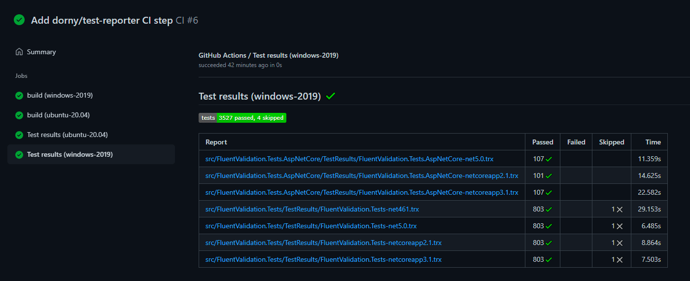
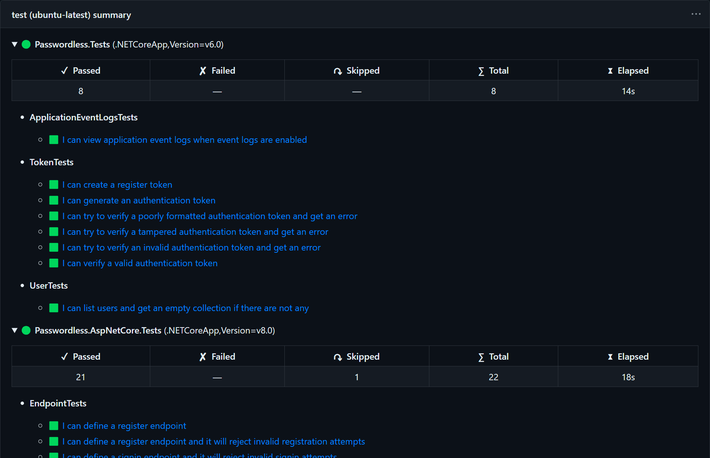
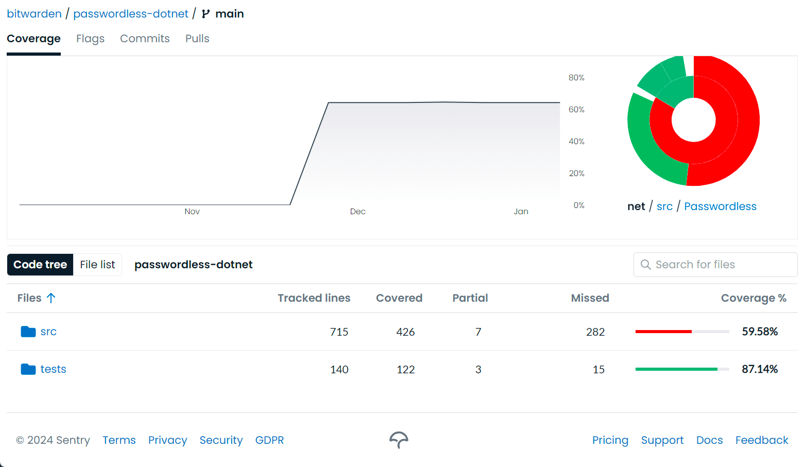
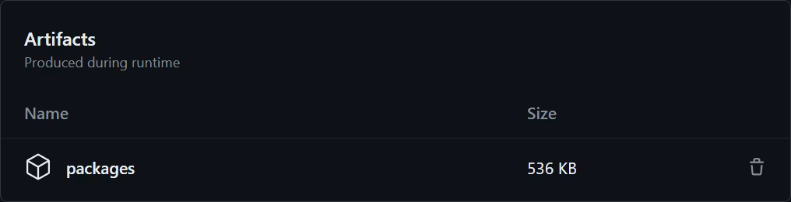
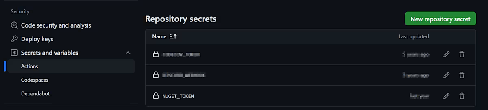
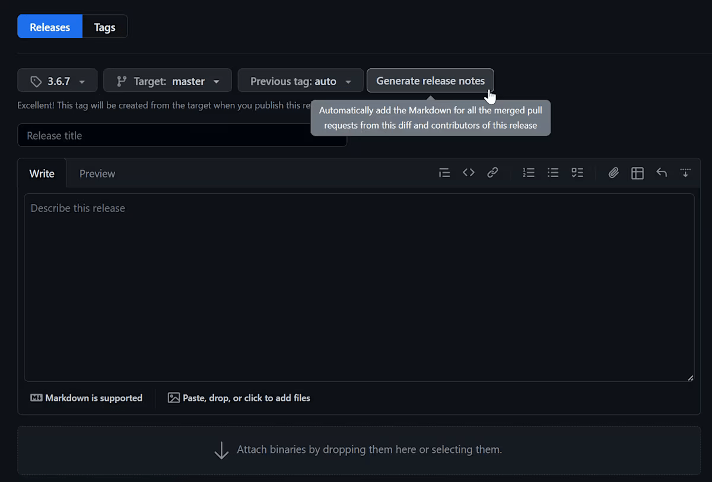

Developing a library involves a lot of moving pieces, and not all of them are just about writing code. Beyond the functionality of the library itself, you also have to consider operational concerns, such as how it is built, tested, and released — and how all these processes can be automated in an efficient and reliable way. These aspects may not be as prominent on the surface, but they still have significant implications for your own productivity as the author, as well as the experience of the library's consumers.

Even in such a mature and opinionated ecosystem as .NET, there is no true one-size-fits-all solution. The tooling landscape — both within the platform and the wider software world — is vast and constantly evolving, so with lots of different knobs to turn and approaches to evaluate, it can be difficult to know where to start.

I have been maintaining [several open-source libraries in .NET](/projects) for over a decade, and through extensive trial and error, I have come to develop a set of practices that I find to be quite effective and sustainable. These practices are not necessarily "best" in any absolute sense, but they have worked well for me and my projects, and I believe they can be a good starting point for many others as well.

In this article, I will outline my typical .NET library setup, covering build settings, productivity extensions, testing and publishing workflows, and the services that help automate and tie everything together. We will go over different strategies, discuss the trade-offs between them, and see how they can be combined to establish a solid foundation for your library project.

## Scaffolding the solution

Much like everything else in life, a .NET codebase has a beginning — and that beginning is the `dotnet new` command. It's safe to assume that, if you're reading this article, you've probably set up a fair share of .NET solutions and don't need any introduction to the process. However, since we'll be relying on certain expectations about the file structure going forward, let's take a moment to establish common ground.

For our example, we'll start with a simple setup: a `MyLibrary` project that houses the library code and a `MyLibrary.Tests` project that contains the corresponding automated tests. Both of them will be referenced by a `MyLibrary.slnx` solution file to provide a centralized entry point for the workspace:

```bash
dotnet new classlib -n MyLibrary -o MyLibrary
dotnet new xunit -n MyLibrary.Tests -o MyLibrary.Tests

dotnet new sln -n MyLibrary -f slnx
dotnet sln add MyLibrary/MyLibrary.csproj
dotnet sln add MyLibrary.Tests/MyLibrary.Tests.csproj
```

Running the above terminal commands will create the two project directories and the solution file at the root. The resulting layout should look something like this:

```diff
+ ├── MyLibrary
+ │   ├── MyLibrary.csproj
+ │   └── (...)
+ ├── MyLibrary.Tests
+ │   ├── MyLibrary.Tests.csproj
+ │   └── (...)
+ └── MyLibrary.slnx
```

Next, we need to integrate our codebase with a version control system and, ideally, a code hosting platform. The former is fairly straightforward: [Git](https://git-scm.com) is the undisputed standard of version control in the software world, and .NET is no exception. However, choosing a platform to host Git repositories is a more nuanced matter, as there are many viable options and they all impose a degree of vendor lock-in if you intend to use them beyond their most basic functionality.

That said, unless you have a specific reason not to, I recommend going with the conventional choice of [GitHub](https://github.com) due to its wide adoption, generous free tier, and rich ecosystem of tools and integrations. This is especially relevant if you are planning to publish your library as an open-source project, since GitHub's large community of developers lends itself to better discoverability and collaboration opportunities.

With that in mind, let's assume that we've created an empty repository at [`https://github.com/Tyrrrz/MyLibrary`](https://github.com/Tyrrrz/MyLibrary). We can now initialize a local repository as well and link it to the remote:

```bash
git init
git branch -M main
git remote add origin https://github.com/Tyrrrz/MyLibrary.git
dotnet new gitignore
```

This sequence creates the `.git` directory containing repository tracking metadata, sets the default branch to `main`, adds a link to our remote `origin` on GitHub, and generates a comprehensive [`.gitignore`](https://git-scm.com/docs/gitignore) file tailored specifically for .NET solutions. Once all the commands are executed, the file structure should resemble the following:

```diff
+ ├── .git
+ │   └── (...)
  ├── MyLibrary
  │   ├── MyLibrary.csproj
  │   └── (...)
  ├── MyLibrary.Tests
  │   ├── MyLibrary.Tests.csproj
  │   └── (...)
+ ├── .gitignore
  └── MyLibrary.slnx
```

At this point, we can consider the initial scaffolding of our solution to be complete. Since we don't really care about the inner workings of the library, we will simply assume that its functionality has been fully implemented, and that the associated tests are also in place and running correctly. To close this part off, let's commit the codebase and push it upstream:

```bash
git add .
git commit -m "Initial commit"
git push -u origin main
```

## Baseline configuration

A .NET project is more than just a collection of source files — it's also a layered set of instructions that tell the toolchain how to parse, compile, and package those files into a consumable artifact. Most of these instructions, however, are not authored manually in the project itself, but are instead supplied through the SDK's implicit `props` and `targets` imports, as well as various ambient settings.

Because much of this machinery is handled automatically, the build process generally requires very little tinkering to work correctly. Still, there are a few settings you may want to configure anyway — not necessarily to change how things work, but rather to make the intended behavior explicit and reproducible across unpredictable environments.

This sort of baseline configuration can be established with the help of these optional files:

- [`global.json`](https://learn.microsoft.com/dotnet/core/tools/global-json) — controls which version of the .NET SDK is used by the tooling.
- [`nuget.config`](https://learn.microsoft.com/nuget/reference/nuget-config-file) — configures the NuGet package manager.
- [`Directory.Build.props`](https://learn.microsoft.com/visualstudio/msbuild/customize-by-directory) — defines MSBuild properties that are applied globally to all projects.

Before we explore each of these files in greater detail, let's first generate the boilerplate for all of them. We can do that by running the corresponding `dotnet new` commands in the root of our solution directory:

```bash
dotnet new globaljson
dotnet new nugetconfig
dotnet new buildprops
```

In doing so, the project structure is updated with the following additions:

```diff
  ├── .git
  │   └── (...)
  ├── MyLibrary
  │   ├── MyLibrary.csproj
  │   └── (...)
  ├── MyLibrary.Tests
  │   ├── MyLibrary.Tests.csproj
  │   └── (...)
  ├── .gitignore
+ ├── Directory.Build.props
+ ├── global.json
  ├── MyLibrary.slnx
+ └── nuget.config
```

### `global.json`

Normally, when you interact with the .NET tooling, it resolves all commands using the latest version of the SDK available in the environment. This behavior is convenient early on, but it can introduce inconsistencies when the development environment inevitably changes. To prevent that drift, `global.json` lets you make the version requirement explicit, thereby communicating it clearly to other collaborators, automation pipelines, and also your future self.

Choosing the right SDK version comes down to ensuring that it provides the capabilities that the codebase depends on, such as access to certain target frameworks, language features, and compiler options. Under the [.NET SDK versioning schema](https://learn.microsoft.com/dotnet/core/versions), these aspects are largely governed by the first two components of the semantic label (e.g., `11.0.***`), while the latter portion distinguishes feature and patch releases (e.g., `*.*.307`).

The boilerplate created by `dotnet new`, however, makes no assumptions about the codebase's needs and simply records the full version of the .NET SDK in use at the time — effectively turning a dynamic resolution into a static one. While it improves reproducibility, such a policy can also be overly rigid when sharing the repository with other developers who might not have the same version of the SDK installed.

To fix this, we can adjust the file to establish a more flexible ruleset, such as this one:

```json
{
  "sdk": {
    "version": "11.0.100",
    "rollForward": "latestFeature"
  }
}
```

At the time of writing, the current iteration of .NET is .NET 11.0, so we set the `version` property to `11.0.100` — the lowest SDK version within the `11.0` line. Combined with the `rollForward` option set to `latestFeature`, this effectively creates a policy that allows the solution to be built by any feature or patch release of the .NET 11.0 SDK, but _not_ by any other major or minor version (e.g., .NET 10.0 or .NET 12.0).

Of course, you can also choose `latestMinor` or `latestMajor` to adopt even newer releases automatically. That may be appropriate when prioritizing long-term flexibility, but `latestFeature` is a common middle ground: it accepts ongoing fixes and improvements within the selected line, while keeping more significant upgrades a deliberate decision. Generally, this strikes a good balance between convenience and stability.

### `nuget.config`

Moving along, we also have the `nuget.config` file, which can be used to configure the NuGet client and, most importantly, the locations it uses to restore and publish packages. By default, NuGet connects to the official [NuGet.org](https://nuget.org) registry, but this may vary due to user- and machine-specific overrides. To ensure a consistent (and slightly more secure) developer experience, we can create this file to pin the desired package sources in our codebase, preventing unintended settings from taking effect.

The `nuget.config` file generated by `dotnet new` provides a good starting point: it resets the list of package sources to only include the official registry. This already takes care of the resolution aspect, but since we're working on a library that will itself be distributed as a package, it's useful to set the default push source as well. To do that, let's edit the configuration file like so:

```xml
<?xml version="1.0" encoding="utf-8"?>
<configuration>

  <packageSources>
    <clear />
    <add key="nuget" value="https://api.nuget.org/v3/index.json" />
  </packageSources>

  <config>
    <add key="defaultPushSource" value="https://api.nuget.org/v3/index.json" />
  </config>

</configuration>
```

Here we have the `<packageSources>` section that lists the feeds from which NuGet should fetch dependencies. It's an additive setting, so we start with a `<clear />` element to remove any previously defined sources, and then insert a single item named `nuget` that points to NuGet.org. Doing so makes sure that all projects in the solution resolve packages from the official registry, regardless of any other locations that may be configured in the environment.

The following `<config>` section is reserved for key-value settings that control various aspects of the NuGet client behavior, and in our case, we use it to set `defaultPushSource` to match the URL specified earlier. Now, when we run the `dotnet nuget push` command to upload our own packages, it will also infer NuGet.org as the destination without requiring any additional instructions.

### `Directory.Build.props`

MSBuild, the engine behind .NET's build orchestration, provides a few [convention-based mechanisms](https://learn.microsoft.com/visualstudio/msbuild/customize-by-directory) that make it easier to customize its behavior for the entire codebase. One such mechanism is `Directory.Build.props` — a specification file that the tooling automatically discovers and imports into every project, offering a natural place for centralizing shared configuration such as compiler options, build settings, and metadata properties.

Running `dotnet new` earlier created a `Directory.Build.props` file, but left it effectively empty. Let's take a look at how we can set it up for our library solution:

```xml
<Project>

  <!-- Compiler options -->
  <PropertyGroup>
    <LangVersion>latest</LangVersion>
    <Nullable>annotations</Nullable>
    <Nullable
      Condition="$([MSBuild]::IsTargetFrameworkCompatible(
        '$(TargetFramework)',
        'netstandard2.1'
      ))"
    >enable</Nullable>
    <TreatWarningsAsErrors>true</TreatWarningsAsErrors>
  </PropertyGroup>

  <!-- Tooling options -->
  <PropertyGroup>
    <CheckEolTargetFramework>false</CheckEolTargetFramework>
    <SuppressTfmSupportBuildWarnings>true</SuppressTfmSupportBuildWarnings>
    <IsPackable>false</IsPackable>
  </PropertyGroup>

  <!-- Assembly & package metadata -->
  <PropertyGroup>
    <Version>0.0.0-dev</Version>
    <Company>YOUR_NAME_HERE</Company>
    <Copyright>Copyright (C) $(Company)</Copyright>
    <Authors>$(Company)</Authors>
    <Description>Sample library</Description>
    <PackageTags>space-separated search keywords go in here</PackageTags>
    <PackageProjectUrl>https://github.com/Tyrrrz/MyLibrary</PackageProjectUrl>
    <PackageReleaseNotes>https://github.com/Tyrrrz/MyLibrary/releases</PackageReleaseNotes>
    <PackageLicenseExpression>MIT</PackageLicenseExpression>
  </PropertyGroup>

</Project>
```

In the snippet above, we have a few different groups of properties that are used to configure various aspects of the build process. Each group is wrapped in a `<PropertyGroup>` element, which allows us to logically separate settings based on their purpose. Such a structure has no functional benefits, but it helps keep things organized and makes reading and maintaining the file easier.

Starting off with the compiler options, we set the **`<LangVersion>`** property to `latest`, instructing the toolchain to use the most recent stable version of C# (or F#, VB). This is contrary to the default behavior, where the language version is instead determined by the target framework of the project, essentially only allowing newer language features when building against frameworks that officially support them.

The default behavior is a sensible safeguard, seeing as language constructs may sometimes depend on certain capabilities provided by the Base Class Library (BCL) to function. However, library projects, unlike applications, cannot afford to simply target the latest version of .NET — they need to maximize compatibility with their potential consumers and that often involves targeting frameworks that are several versions behind the bleeding edge.

Therefore, explicitly setting the language version forces the compiler to ignore the official guidelines and evaluate the availability of each language feature independently from the target framework. Doing so immediately unlocks some of the newest syntactic sugar, while also allowing more complex constructs to be manually backported using [polyfills](<https://en.wikipedia.org/wiki/Polyfill_(programming)>).

Following that, we enable the [**Nullable Reference Types**](https://learn.microsoft.com/dotnet/csharp/nullable-references) feature of the C# compiler (**`<Nullable>`**), as it is a great way to improve the safety of our code and to accurately advertise the capabilities of our APIs. There are two modes in which this feature can be configured: `annotations`, which instructs the compiler to emit nullability annotations for all types and members that we define; and `enable`, which also produces compiler warnings about related violations during development.

Just like many other language and compiler features, Nullable Reference Types is subject to certain availability constraints. In its native form, NRT was introduced with the release of C# 8 and .NET Core 3.0 — and, although it's possible to backport the bits required to annotate our own types, the compiler checks are not going to be very useful when targeting frameworks that don't provide nullability information themselves.

Because of that, we configure this feature in a conditional way: activating the `annotations` mode as the baseline for all targets, while extending to the `enable` mode for the frameworks that fully support it. This way, our assemblies will always include nullability annotations, but we'll only get the corresponding warnings when building against newer frameworks.

Note how the example above relies on the `Condition="..."` attribute to validate framework compatibility. Instead of hard-coding a sequence of separate checks for each specific framework that our projects may target, we can rely on the [`IsTargetFrameworkCompatible(...)`](https://learn.microsoft.com/visualstudio/msbuild/property-functions#msbuild-property-functions) function to establish a version boundary that accounts for different flavors of .NET. In this case, NRT will be fully enabled for .NET Standard 2.1, .NET Core 3.0 (which implements it), as well as any newer version of either.

To round off the first section, we also set the **`<TreatWarningsAsErrors>`** property to `true`, directing the compiler to block the build if any warnings are encountered. In effect, this will force us to address every reported issue in the codebase — either by fixing it or by explicitly suppressing it. Such a strict policy generally works well for library projects as they tend to have higher expectations around code quality.

The second group of properties is dedicated to other toolchain options that are not specifically related to the compilation stage. Here, we set **`<CheckEolTargetFramework>`** to `false` and **`<SuppressTfmSupportBuildWarnings>`** to `true`, disabling various warnings when building for frameworks that have exited their support lifecycle. As mentioned before, libraries do often need to target older frameworks for compatibility reasons, so these warnings are not particularly useful in our context.

Next up is the **`<IsPackable>`** property, which controls whether a given project should be included in the packaging process. The default value is `true`, meaning that every project is treated as packable unless specified otherwise. By inverting the default, we establish a more intentional convention where NuGet packages are only created for projects that deliberately opt in.

With this setup in place, we can blindly run `dotnet pack` followed by `dotnet nuget push **/*.nupkg` on the entire solution to generate and publish all relevant NuGet artifacts in one go. Other assemblies, such as those produced by the test and sample projects, will be inherently excluded from the process — greatly simplifying the release workflow along with its automation.

Finally, we have the third group of properties — these are used to define common metadata for the output assemblies and the corresponding NuGet packages. The **`<Version>`** property in particular plays a crucial role in the package management system, as it's the primary way to distinguish different iterations of the same package. For local development, we set it to a placeholder value of `0.0.0-dev`, which will be overridden with a proper version number during the release process.

The remaining properties, including **`<Authors>`**, **`<Description>`**, and **`<PackageProjectUrl>`**, are purely informational fields that get surfaced in the NuGet gallery and some other user-facing interfaces. The purpose of these fields is to provide context about the package, its author, and where to find more information about it — so make sure to fill them out with accurate values that reflect the identity and nature of your library.

When developing an open-source project, it's also quite important to consider the license under which it is distributed. The **`<PackageLicenseExpression>`** property allows us to specify a [standard SPDX license expression](https://spdx.org/licenses) that indicates the terms of use for our package. Here, we set it to `MIT` — the most popular permissive OSS license — but feel free to explore [other options](https://choosealicense.com) as well to find the best fit for your scenario.

## Library configuration

### Target frameworks

Now that the baseline configuration is established, we can shift our attention from cross-cutting concerns to the specifics of the library project itself. These are the settings that dictate how the library is built, what features it supports, and which frameworks it targets.

The last of the three is particularly important, as the [_target framework_](https://learn.microsoft.com/dotnet/standard/frameworks) defines the set of shared APIs and runtime capabilities that your library can rely on, in turn also determining its overall compatibility. Choosing the right framework to target is therefore a balancing act between feature availability and audience reach — and so it requires a good understanding of the .NET ecosystem as a whole.

Unfortunately, .NET is not exactly the simplest technical landscape to navigate. Decades of evolution have fragmented the platform into different implementations — each with its own purpose, restrictions, development stacks, and convoluted naming conventions. Although most of these implementations have progressively been absorbed or displaced by .NET (Core), they are not entirely irrelevant yet.

Being the author of a library means you need to be aware of the various development contexts in which it may be used. To that end, let's briefly review the main flavors of .NET that you're likely to encounter:

- [.NET (Core)](https://dotnet.microsoft.com) — the modern, open-source, and cross-platform implementation of .NET. It started as a limited subset of .NET Framework called .NET Core, but has since evolved into a unified platform that encompasses almost all workloads, dropping the "Core" moniker in the process. New applications are expected to target this implementation going forward.
- [.NET Framework](https://dotnet.microsoft.com/learn/dotnet/what-is-dotnet-framework) — the original, proprietary, Windows-only implementation of .NET. Legacy technology as of 2019, but still retains a massive user base due to its historical ubiquity.
- [Silverlight](https://learn.microsoft.com/previous-versions/windows/silverlight) — a proprietary, cross-platform implementation of .NET for the web. Based on a subset of .NET Framework, with its runtime delivered through a browser plugin. Legacy technology as of 2021, primarily superseded by Blazor.
- [Universal Windows Platform (UWP)](https://learn.microsoft.com/windows/uwp/get-started/universal-application-platform-guide) — a platform for building sandboxed Windows applications for desktop, mobile, console, and other device types. Its earlier iterations were based on a subset of .NET Framework, which happened to also be called .NET Core. Legacy technology as of 2024, primarily superseded by [Windows App SDK](https://learn.microsoft.com/windows/apps/windows-app-sdk).
- [Mono](https://mono-project.com) — an open-source, cross-platform implementation of .NET Framework, originally created to bring .NET applications to non-Windows systems. It aimed to replicate the .NET Framework API surface in order to serve as a drop-in replacement rather than a separate target. Legacy technology as of 2019, but remains in use by some modern .NET workloads.
- [.NET Standard](https://learn.microsoft.com/dotnet/standard/net-standard) — not an implementation itself, but a specification that defines a set of APIs to which different .NET implementations can conform. It was created to enable code sharing between frameworks, allowing the same compiled assemblies to execute against .NET (Core), .NET Framework, UWP, and Mono. Although still an important compatibility target, it is not expected to receive new versions.
- [Xamarin](https://dotnet.microsoft.com/apps/xamarin) — a set of tools and libraries built on top of Mono to facilitate mobile application development for iOS and Android. Legacy technology as of 2024, but retains a sizable user base as its retirement left developers with non-trivial migration paths. Also, some of its modern successors, such as the .NET iOS workload, continue to rely on Mono.
- [Blazor](https://dotnet.microsoft.com/apps/aspnet/web-apps/blazor) — a frontend web framework that lets developers create rich interactive UIs with C#. It can run on the server or in the browser via WebAssembly, the latter of which is currently powered by Mono.
- [Unity](https://unity.com) — a popular game development engine that runs C# scripts using either a customized implementation of Mono or the IL2CPP backend. Its .NET support is distinct from that of a typical .NET application, so libraries intended for Unity often need special compatibility considerations.

In case the earlier remark about convoluted naming conventions somehow wasn't apparent enough, things get a bit more confusing (and mildly comical) when you introduce the corresponding _framework monikers_ into the mix. For example, in the following list of targets, which two do you think belong to the same family: `netcoreapp3.1`, `netcore45`, `net46`, `net5.0`? This is not a trick question, by the way.

Anyway, in order for a library to be referenced by another project, it must be built against a framework that is compatible with the one used by that project. In most cases, it means that both of them need to target the same implementation of .NET, and the library's target version must be equal to or lower than that of the consuming project.

If the library targets .NET Standard instead of a specific implementation, then the version of that standard must be supported by the project's framework. However, the rules for that are more complex and you need to refer to a [special compatibility table](https://dotnet.microsoft.com/platform/dotnet-standard#versions) to determine how the versions align there.

As you can probably imagine, it's also not enough to just pick a single target framework for your library and call it a day. In order to cover a broad range of clients — and provide the best possible experience for all of them — you often need to target multiple frameworks (and/or their versions) simultaneously. This is where [_multi-targeting_](https://learn.microsoft.com/visualstudio/msbuild/net-sdk-multitargeting) comes into play.

With multi-targeting, the .NET SDK works by building the library independently for each of the specified target frameworks, producing separate assemblies in the process. When creating a NuGet package, these assemblies are then organized in a way that allows the consumer's tooling to automatically select the most appropriate assets based on their project's requirements.

Ultimately, compatibility is always a compromise, and early in the development of your library it may be tricky to gauge how far you should go to support older or niche frameworks. To help you get started, here are a few of my personal recommendations:

- **Always target the latest version of .NET (Core)**. Your library should definitely be compatible with the newest version of .NET (currently `net11.0`) and there is no better way to ensure that than by targeting it directly.
  - This guarantees that the consumers on the bleeding edge will get the most optimized assets of your library.
  - Additionally, this also provides you with an improved development experience — particularly through the SDK's built-in analyzers that only work when targeting the latest framework.
- **Establish a compatibility baseline by targeting .NET Standard 2.0 as well**. By doing so, your library will automatically be supported by a [wide range of relatively modern .NET implementations](https://learn.microsoft.com/dotnet/standard/net-standard?tabs=net-standard-2-0), maximizing your audience without much cherry-picking.
  - .NET Standard 2.0 works with .NET Core 2.0+, .NET Framework 4.6.1+, and UWP 10.0.16299+, as well as specific versions of Mono, Xamarin, and Unity.
  - .NET Standard 2.0 is the most API-rich version of the standard that still supports .NET Framework and UWP, making it a natural lower boundary for most libraries.
  - If this API set is too narrow for your library's needs, consider upgrading to .NET Standard 2.1 but also try to target the lowest version of .NET Framework and/or UWP that you can accommodate. For example, targeting `netstandard2.1` and `net471` expands access to more modern APIs while retaining compatibility with .NET Framework.
  - Avoid targeting older versions of .NET Standard, as their corresponding implementations are too old and significantly restrict the available API surface.
- **Target intermediate versions if you have framework-dependent code paths**. For example, if your library already targets .NET 11.0 and .NET Standard 2.0, but conditionally relies on certain APIs that were introduced in .NET 9.0, then you should separately target `net9.0` as well to ensure that those code paths are available as early as possible.
  - This is similarly relevant if your library uses polyfills to backport newer APIs to older frameworks. In such cases, you want to also include the frameworks that provide those APIs natively, so that polyfills are only used when necessary.
  - If you prefer to keep things lean, you can limit intermediate targets to only those that are [long-term support (LTS) releases](https://versionsof.net), such as .NET 8.0, .NET 10.0, etc.

For the `MyLibrary` example, we'll assume that its code is fairly portable and has modest API requirements. Let's now configure the project's target frameworks to reflect that:

```xml
<Project Sdk="Microsoft.NET.Sdk">

  <PropertyGroup>
    <TargetFrameworks>netstandard2.0;net11.0</TargetFrameworks>
  </PropertyGroup>

</Project>
```

Here we use the **`<TargetFrameworks>`** property (note the plural form) to specify a semicolon-separated list of frameworks that we want our library to support. The combination of `netstandard2.0` and `net11.0` aligns with the earlier recommendations and offers a good balance between broad compatibility and access to modern APIs.

Now, if we run `dotnet build` on our project, the SDK will produce two separate assemblies, placing each in its respective output directory along with any associated artifacts:

```diff
  ├── .git
  │   └── (...)
  ├── MyLibrary
  │   ├── MyLibrary.csproj
+ │   ├── bin
+ │   │   └── Debug
+ │   │       ├── netstandard2.0
+ │   │       │   ├── MyLibrary.dll
+ │   │       │   ├── MyLibrary.deps.json
+ │   │       │   ├── MyLibrary.pdb
+ │   │       │   └── (...)
+ │   │       └── net11.0
+ │   │           ├── MyLibrary.dll
+ │   │           ├── MyLibrary.deps.json
+ │   │           ├── MyLibrary.pdb
+ │   │           └── (...)
  │   └── (...)
  ├── MyLibrary.Tests
  │   ├── MyLibrary.Tests.csproj
  │   └── (...)
  ├── .gitignore
  ├── Directory.Build.props
  ├── global.json
  ├── MyLibrary.slnx
  └── nuget.config
```

### Miscellaneous settings

With the target frameworks in place, the library has its intended compatibility model defined. However, there are a few project-level settings left for us to configure before it's ready for distribution and use. Let's go ahead and update the `MyLibrary.csproj` file to add them:

```xml
<Project Sdk="Microsoft.NET.Sdk">

  <PropertyGroup>
    <TargetFrameworks>netstandard2.0;net6.0;net7.0;net11.0</TargetFrameworks>
    <IsPackable>true</IsPackable>
    <IsTrimmable
      Condition="$([MSBuild]::IsTargetFrameworkCompatible(
        '$(TargetFramework)',
        'net6.0'
      ))"
    >true</IsTrimmable>
    <IsAotCompatible
      Condition="$([MSBuild]::IsTargetFrameworkCompatible(
        '$(TargetFramework)',
        'net7.0'
      ))"
    >true</IsAotCompatible>
    <GenerateDocumentationFile>true</GenerateDocumentationFile>
  </PropertyGroup>

</Project>
```

In the snippet above, we start by setting **`<IsPackable>`** to `true`, which declares our intent to include this project in the packaging process. As you may recall, the baseline configuration in `Directory.Build.props` established `false` as the default value for this property, so we must explicitly opt in to produce NuGet packages.

Following that, we also set **`<IsTrimmable>`** and **`<IsAotCompatible>`** to `true`, signaling to the .NET toolchain that our library is designed to be compatible with [assembly trimming](https://learn.microsoft.com/dotnet/core/deploying/trimming/prepare-libraries-for-trimming) and [native ahead-of-time (AOT) compilation](https://learn.microsoft.com/dotnet/core/deploying/native-aot/#aot-compatibility-analyzers). In effect, these properties activate Roslyn analyzers that impose certain restrictions on the code, helping to ensure that the corresponding features can be applied safely.

Although not formally required, support for static build optimizations is rapidly gaining importance in the .NET ecosystem, especially in the development contexts with significant resource constraints, such as embedded and mobile environments. Enforcing compatibility with these optimizations from the outset can therefore make the library usable in a broader range of applications, while avoiding a potential refactoring effort later on.

Similar to _Nullable Reference Types_, the flow analyzers for trimming and AOT both rely on framework annotations, but there's no equivalent fallback mode to establish a baseline across all targets. As a result, we enable **`<IsTrimmable>`** and **`<IsAotCompatible>`** only for .NET 6.0+ and .NET 7.0+ respectively — where the necessary annotations are available — and also include `net6.0` and `net7.0` as intermediate targets, so the properties take effect on the earliest eligible frameworks.

Finally, we set the **`<GenerateDocumentationFile>`** property to `true` as well, instructing the build process to extract [structured XML comments](https://learn.microsoft.com/dotnet/csharp/programming-guide/xmldoc) from the source code and put them in a dedicated file. This file then gets automatically included in the output NuGet package, providing inline documentation for the consumers of the library right in their IDEs.

Enabling this property in turn also causes the compiler to flag public types and members that lack accompanying documentation comments. Since we've configured warnings as errors in `Directory.Build.props`, this might produce a lot of noise early in the development, so you may want to temporarily [suppress `CS1591`](https://learn.microsoft.com/dotnet/csharp/language-reference/compiler-messages/cs1591) until the project is closer to release.

### Framework polyfills

As our earlier targeting deliberations illustrated, ensuring broad compatibility for a library involves building it against both newer and older iterations of .NET, which restricts the framework APIs and features that we can access uniformly. This presents a challenge in reconciling two competing goals — taking advantage of modern, convenient and performant capabilities where they are available, while retaining portability across frameworks where they're not.

The most straightforward way to address this challenge is by leveraging conditional compilation to accommodate each side of the spectrum via different code paths. C# provides the means for doing that through directives such as [`#if`, `#else`, and `#endif`](https://learn.microsoft.com/dotnet/csharp/language-reference/preprocessor-directives) that can be combined with the SDK-defined [preprocessor symbols](https://learn.microsoft.com/dotnet/csharp/language-reference/preprocessor-directives#conditional-compilation) to determine the current target framework.

For example, consider a relatively common scenario where a program needs to obtain its own process ID. This is trivially achievable using the `Environment.ProcessId` property available since .NET 5.0, but requires instantiating a `Process` object just to retrieve the same value on older platforms:

```csharp
#if NET5_0_OR_GREATER
using System;
#else
using System.Diagnostics;
#endif

int GetProcessId()
{
#if NET5_0_OR_GREATER
    return Environment.ProcessId;
#else
    using var process = Process.GetCurrentProcess();
    return process.Id;
#endif
}
```

Even in this basic scenario, it's clear how conditional compilation can interrupt the flow of the code, making the underlying logic harder to follow. It would be preferable if all the compatibility-related concerns could instead be handled in the background, giving the rest of the library a consistent interface to work with, regardless of the target framework.

[_Polyfilling_](<https://en.wikipedia.org/wiki/Polyfill_(programming)>) is a general programming technique that aims to do exactly that: handle compatibility behind the scenes while presenting a consistent interface to the calling code. It works by supplementing the environment with missing functionality, recreated within that environment's capabilities and constraints.

Of course, the ability to do that heavily depends on the programming language and its capabilities. For example, in JavaScript — where the term originated — polyfills are implemented as standalone scripts that patch the environment or specific object prototypes to add missing functionality at run time. By contrast, C#'s statically typed and compiled nature rules out that style of polyfilling, but the concept itself remains applicable through the following approaches:

- **Type polyfills**, which re-implement missing built-in types from scratch, mimicking their original behavior as closely as possible. These re-implementations are placed in the same namespaces as the official types so that they are picked up by the compiler when the native definitions are not available. Suitable when the desired types are completely missing from the target framework.
- **Member polyfills**, which rely on [extension members](https://learn.microsoft.com/dotnet/csharp/programming-guide/classes-and-structs/extension-methods) to shim missing methods, properties, or operators on existing built-in types. These extensions are usually placed in the global namespace to make them immediately accessible on every applicable type, effectively simulating intrinsic members. Suitable when the desired types exist, but lack certain members from later frameworks.

These approaches can be similarly combined with the SDK-provided preprocessor symbols to ensure that the polyfills are only included in the project when targeting frameworks that don't have the desired APIs. This way, when the library is built for more modern environments, the native implementations are used instead, avoiding any potential conflicts, performance issues, and dead code.

As an example, suppose we wanted to use the [`System.Index`](https://learn.microsoft.com/dotnet/api/system.index) and [`System.Range`](https://learn.microsoft.com/dotnet/api/system.range) types in our library. Since they were introduced in .NET Core 3.0, we'd need to backport them if we wanted to retain compatibility with the .NET Standard 2.0 target that we've established earlier. Here's how we could leverage the type-polyfill approach to achieve that:

```csharp
// Single out frameworks that don't have the desired API natively
#if (NETCOREAPP && !NETCOREAPP3_0_OR_GREATER) || (NETFRAMEWORK) || (NETSTANDARD && !NETSTANDARD2_1_OR_GREATER)

// Put these type shims in the System namespace to match the official types
namespace System;

internal readonly struct Index(int value) : IEquatable<Index>
{
    private readonly int _value = value;

    public Index(int value, bool fromEnd = false)
        : this(fromEnd ? ~value : value)
    {
        if (value < 0)
            throw new ArgumentOutOfRangeException(nameof(value), "Value must be non-negative.");
    }

    public int Value => _value < 0 ? ~_value : _value;

    public bool IsFromEnd => _value < 0;

    public int GetOffset(int length)
    {
        var offset = _value;
        if (IsFromEnd)
            offset += length + 1;

        return offset;
    }

    public override bool Equals(object? value) => value is Index index && _value == index._value;

    public bool Equals(Index other) => _value == other._value;

    public override int GetHashCode() => _value;

    public override string ToString()
    {
        if (IsFromEnd)
            return "^" + (uint)Value;

        return ((uint)Value).ToString();
    }

    public static Index Start => new(0);

    public static Index End => new(~0);

    public static Index FromStart(int value) => new(value, false);

    public static Index FromEnd(int value) => new(value, true);

    public static implicit operator Index(int value) => FromStart(value);
}

internal readonly struct Range(Index start, Index end) : IEquatable<Range>
{
    public Index Start { get; } = start;

    public Index End { get; } = end;

    public (int Offset, int Length) GetOffsetAndLength(int length)
    {
        var start = Start.IsFromEnd ? length - Start.Value : Start.Value;
        var end = End.IsFromEnd ? length - End.Value : End.Value;

        if ((uint)end > (uint)length || (uint)start > (uint)end)
            throw new ArgumentOutOfRangeException(nameof(length));

        return (start, end - start);
    }

    public override bool Equals(object? value) =>
        value is Range r && r.Start.Equals(Start) && r.End.Equals(End);

    public bool Equals(Range other) => other.Start.Equals(Start) && other.End.Equals(End);

    public override int GetHashCode() => Start.GetHashCode() * 31 + End.GetHashCode();

    public override string ToString() => Start + ".." + End;

    public static Range StartAt(Index start) => new(start, Index.End);

    public static Range EndAt(Index end) => new(Index.Start, end);

    public static Range All => new(Index.Start, Index.End);
}
#endif
```

There are a couple of things to note about this snippet. First, we use the `#if` directive to limit where the polyfill code is available by singling out frameworks that don't provide the corresponding types natively. In our case, that includes all of .NET Framework, as well as .NET (Core) versions prior to 3.0 and .NET Standard versions prior to 2.1.

Second, we ensure that the backported types are defined within the `System` namespace, matching the naming patterns of the original types. This way, if the consuming code references `System.Index` or `System.Range`, the compiler will automatically resolve to our own implementations when the native versions are missing.

Finally, we mark these types as `internal`, constraining their visibility to within the same assembly. Doing so prevents the polyfills from leaking to the consumers of our library, which is important as it could otherwise cause confusion and, in some cases, build errors.

The code itself is largely based on the official implementations of `Index` and `Range`, with some minor simplifications. When it comes to authoring polyfills, the primary goal is to replicate the client-facing behavior of the original APIs — so it's generally acceptable to cut corners in other areas, such as performance optimizations, internal factoring, and inline documentation.

With the polyfills now in place, we can use the aforementioned types without worrying about compatibility:

```csharp
using System;

// On newer frameworks, this references the framework-provided types.
// On older frameworks, this references the polyfilled types.
// Same code works everywhere without any changes.
var index = new Index(1, fromEnd: true);
var range = new Range(
    new Index(3),
    new Index(1, true)
);
```

As an additional benefit, re-defining framework APIs this way also enables related language features that build upon them. In our example, thanks to the above polyfills, we may now use C#'s [index (`^`) and range (`..`) operators](https://learn.microsoft.com/dotnet/csharp/tutorials/ranges-indexes) as well, seamlessly across all target frameworks:

```csharp
var str = "Hello world";

// On newer frameworks, these operators rely on the framework-provided types.
// On older frameworks, these operators rely on the polyfilled types.
// Same code works everywhere without any changes.
var last = str[^1];
var part = str[3..^1];
```

For an alternative example, let's say we also wanted to use the newer overloads of the [`string.Contains(...)`](https://learn.microsoft.com/dotnet/api/system.string.contains) method that accept a `StringComparison` parameter. These were introduced in .NET Core 2.1, so supporting a .NET Standard 2.0 target requires polyfilling them as well. Since the `string` type itself exists across all frameworks, we only need to polyfill the missing members, which makes this a good fit for the member-polyfill approach:

```csharp
// Single out frameworks that don't have the desired API natively
#if (NETCOREAPP && !NETCOREAPP2_1_OR_GREATER) || (NETFRAMEWORK) || (NETSTANDARD && !NETSTANDARD2_1_OR_GREATER)

using System;

// No namespace declaration, so that the extension members are available globally
internal static class PolyfillExtensions
{
    // Extension blocks were introduced in C# 14 and, unlike extension methods,
    // they support properties and operators too, as well as both instance and static receivers.
    extension(string str)
    {
        public bool Contains(string sub, StringComparison comparison) =>
            str.IndexOf(sub, comparison) >= 0;

        public bool Contains(char c, StringComparison comparison) =>
            str.Contains(c.ToString(), comparison);
    }
}
#endif
```

Here we define an internal class arbitrarily named `PolyfillExtensions`, which contains two extension methods that mirror the signatures of the original `string.Contains(...)` overloads that we want to backport. The implementations simply delegate to the existing `string.IndexOf(...)` method, which already supports the `StringComparison` parameter.

Similarly to the previous example, we also leverage conditional compilation to ensure that the polyfills are only included when building for frameworks that lack the required method definitions. Both of these APIs were introduced in the same release, so we can use a single `#if` check for the entire file.

Unlike the type shim approach, however, we deliberately omit the `namespace` declaration here. Doing so intentionally places the extensions in the global namespace, making them accessible without additional `using` directives. As a result, any existing or future code that calls the original overloads will transparently bind to the polyfills when the native implementations are unavailable.

Finally, having defined these polyfills, we can safely use the new `string.Contains(...)` methods throughout our library code:

```csharp
var str = "Hello world";

// On newer frameworks, this calls the framework-provided method.
// On older frameworks, this calls the polyfilled (extension) method.
// Same code works everywhere without any changes.
var contains = str.Contains('w', StringComparison.OrdinalIgnoreCase);
```

Of course, just like any other code that you write, polyfills are a liability that needs to be tested and maintained over time. As an experienced developer you will naturally want to avoid that responsibility and instead seek to take advantage of existing solutions wherever possible. Luckily, here you have several options for that.

First of all, many of the built-in types that were introduced in .NET (Core) have backports provided directly by Microsoft. These are distributed as NuGet packages identified by the [`System.*`](https://nuget.org/packages?q=system.*) and [`Microsoft.Bcl.*`](https://nuget.org/packages?q=microsoft.bcl.*) prefixes, and are specifically intended to act as compatibility layers when targeting older frameworks.

Note that the two distinct prefixes are not an accidental naming inconsistency — they reflect the different nature of these offerings. The `System.*` packages usually represent parts of the actual .NET codebase, published separately from the rest of the runtime, while the `Microsoft.Bcl.*` packages are shipped out of band and instead rely on derived (though still official) re-implementations that facilitate wider platform support.

From a practical standpoint, this distinction mainly affects the guarantees you get around behavioral parity and servicing. However, in most cases, the functionality provided by these two groups of packages rarely overlap anyway, so the choice between them is typically driven by the APIs they cover rather than their implementation details.

With that said, let's imagine that our library needs to leverage `Span<T>`, `Memory<T>`, and `IAsyncEnumerable<T>`. Since these types were introduced after .NET Standard 2.0, we'd need to include polyfills to keep that target supported. For that, we can add a reference to [`System.Memory`](https://nuget.org/packages/System.Memory) for `Span<T>` and `Memory<T>`, and [`Microsoft.Bcl.AsyncInterfaces`](https://nuget.org/packages/Microsoft.Bcl.AsyncInterfaces) for `IAsyncEnumerable<T>`:

```xml
<Project Sdk="Microsoft.NET.Sdk">

  <PropertyGroup>
    <TargetFrameworks>netstandard2.0;netstandard2.1;net6.0;net7.0;net11.0</TargetFrameworks>
    <IsPackable>true</IsPackable>
    <IsTrimmable
      Condition="$([MSBuild]::IsTargetFrameworkCompatible(
        '$(TargetFramework)',
        'net6.0'
      ))"
    >true</IsTrimmable>
    <IsAotCompatible
      Condition="$([MSBuild]::IsTargetFrameworkCompatible(
        '$(TargetFramework)',
        'net7.0'
      ))"
    >true</IsAotCompatible>
    <GenerateDocumentationFile>true</GenerateDocumentationFile>
  </PropertyGroup>

  <ItemGroup>
    <!--
        Span<T> and Memory<T> are natively available starting with netstandard2.1 and netcoreapp2.1,
        so we exclude those frameworks from getting this package reference.
     -->
    <PackageReference
      Include="System.Memory"
      Condition="
        !$([MSBuild]::IsTargetFrameworkCompatible(
          '$(TargetFramework)',
          'netstandard2.1'
        ))
        AND
        !$([MSBuild]::IsTargetFrameworkCompatible(
          '$(TargetFramework)',
          'netcoreapp2.1'
        ))
      "
    />

    <!--
        IAsyncEnumerable<T> is natively available starting with netstandard2.1 and netcoreapp3.0,
        so we exclude those frameworks from getting this package reference.
     -->
    <PackageReference
      Include="Microsoft.Bcl.AsyncInterfaces"
      Condition="
        !$([MSBuild]::IsTargetFrameworkCompatible(
          '$(TargetFramework)',
          'netstandard2.1'
        ))
        AND
        !$([MSBuild]::IsTargetFrameworkCompatible(
          '$(TargetFramework)',
          'netcoreapp3.0'
        ))
      "
    />
  </ItemGroup>

</Project>
```

Similarly to the conditional-compilation pattern from before, we use the `Condition="..."` attribute to exclude compatibility packages where they're not required. Since `Span<T>` and `Memory<T>` are available natively in .NET Standard 2.1+ and .NET Core 2.1+, and `IAsyncEnumerable<T>` is available natively in .NET Standard 2.1+ and .NET Core 3.0+, the respective boundaries can be expressed via `IsTargetFrameworkCompatible(...)` as illustrated above.

Also note that we've added `netstandard2.1` as an intermediate target so that our library can be consumed without extra dependencies on a slightly broader range of frameworks. The two other upper thresholds of `netcoreapp2.1` and `netcoreapp3.0` don't need separate targets of their own — the former has long gone out of support, while the latter already implements `netstandard2.1` anyway.

To better understand how these conditional references translate into the final NuGet package, we can inspect its generated `MyLibrary.nuspec` manifest. With the way our library is configured, `System.Memory` and `Microsoft.Bcl.AsyncInterfaces` should only appear as dependencies for a single target:

```xml
<?xml version="1.0" encoding="utf-8"?>
<package xmlns="http://schemas.microsoft.com/packaging/2013/05/nuspec.xsd">
  <metadata>
    <id>MyLibrary</id>
    <version>0.0.0-dev</version>
    <authors>YOUR_NAME_HERE</authors>
    <description>Sample library</description>

    <!-- Other metadata omitted for brevity -->

    <dependencies>
      <!-- Main target (.NET vCurrent) -->
      <group targetFramework="net11.0" />
      <!-- Intermediate targets that provide compatibility breakpoints -->
      <group targetFramework="net6.0" />
      <group targetFramework="net7.0" />
      <group targetFramework=".NETStandard2.1" />
      <!-- Baseline target -->
      <group targetFramework=".NETStandard2.0">
        <dependency id="Microsoft.Bcl.AsyncInterfaces" version="1.1.1" exclude="Build,Analyzers" />
        <dependency id="System.Memory" version="4.6.3" exclude="Build,Analyzers" />
      </group>
    </dependencies>
  </metadata>
</package>
```

Either way, with the compatibility packages filling in the missing pieces on .NET Standard 2.0, we can now leverage the associated APIs seamlessly on all frameworks:

```csharp
using System;
using System.Buffers;
using System.Collections.Generic;
using System.IO;

// On newer frameworks, this uses the framework-provided types.
// On older frameworks, this uses the polyfilled types from the compatibility packages.
// Same code works everywhere without any changes.
async IAsyncEnumerable<ReadOnlyMemory<byte>> ReadChunksAsync(Stream stream)
{
    using var buffer = MemoryPool<byte>.Shared.Rent(8192);

    // System.Memory provides Span<T> and Memory<T>, but doesn't provide
    // Stream overloads that accept them, so our usage needs to work around that.
    var bufferArray = buffer.Memory.ToArray();

    while (true)
    {
        var bytesRead = await stream.ReadAsync(bufferArray, 0, bufferArray.Length);
        if (bytesRead <= 0)
            yield break;

        yield return bufferArray.AsMemory(0, bytesRead);
    }
}
```

Generally speaking, the official compatibility packages should be your first choice when it comes to backporting common platform APIs. They are well-tested, optimized for performance, and support a wide range of .NET versions, making them a reliable default for most scenarios.

Being official, however, also means that their scope is rather conservative — they primarily focus on user-facing areas of the framework and leave out many specialized and low-level types, including those that power language features. Additionally, they don't attempt to provide any member polyfills, as that requires relying on globally scoped extensions, which is somewhat of an unconventional technique.

This naturally brings us to the second solution: community polyfill libraries, such as [PolySharp](https://github.com/Sergio0694/PolySharp), [Polyfill](https://github.com/SimonCropp/Polyfill), and [PolyShim](https://github.com/Tyrrrz/PolyShim). All these projects were born out of independent efforts to plug the gaps left by Microsoft's compatibility packages, gradually evolving into comprehensive collections of shims and backports for a wide spectrum of different APIs.

As community-driven projects, they are not bound by the servicing commitments of Microsoft's offerings, allowing them to be more thorough and aggressive in their coverage. Here you will find polyfills for Nullable Reference Types, Record Types, Union Types, `init` Properties, `Index`, `Range`, `ValueTuple<...>`, `ValueTask<T>`, `ArrayPool<T>`, `Span<T>`, `Memory<T>`, `IEnumerable<T>.Chunk(...)`, `Stream.ReadExactly(...)`, `Environment.ProcessPath`, `Random.Shared`, and almost everything in between.

While the choice between these libraries largely comes down to API coverage and personal preference, their usage is essentially identical. For our example, let's assume we've chosen to go with PolyShim, adding it as a dependency like so:

```xml
<Project Sdk="Microsoft.NET.Sdk">

  <PropertyGroup>
    <TargetFrameworks>netstandard2.0;net6.0;net7.0;net11.0</TargetFrameworks>
    <IsPackable>true</IsPackable>
    <IsTrimmable
      Condition="$([MSBuild]::IsTargetFrameworkCompatible(
        '$(TargetFramework)',
        'net6.0'
      ))"
    >true</IsTrimmable>
    <IsAotCompatible
      Condition="$([MSBuild]::IsTargetFrameworkCompatible(
        '$(TargetFramework)',
        'net7.0'
      ))"
    >true</IsAotCompatible>
    <GenerateDocumentationFile>true</GenerateDocumentationFile>
  </PropertyGroup>

  <ItemGroup>
    <PackageReference
      Include="System.Memory"
      Condition="
        !$([MSBuild]::IsTargetFrameworkCompatible(
          '$(TargetFramework)',
          'netstandard2.1'
        ))
        AND
        !$([MSBuild]::IsTargetFrameworkCompatible(
          '$(TargetFramework)',
          'netcoreapp2.1'
        ))
      "
    />

    <PackageReference
      Include="Microsoft.Bcl.AsyncInterfaces"
      Condition="
        !$([MSBuild]::IsTargetFrameworkCompatible(
          '$(TargetFramework)',
          'netstandard2.1'
        ))
        AND
        !$([MSBuild]::IsTargetFrameworkCompatible(
          '$(TargetFramework)',
          'netcoreapp3.0'
        ))
      "
    />

    <!--
        PrivateAssets="all" ensures that PolyShim is not included as a dependency of our own NuGet package.
        Since PolyShim's polyfills are provided as source files, they get compiled into our assembly directly.
        Condition attribute is not necessary here as PolyShim uses conditional compilation instead.
    -->
    <PackageReference Include="PolyShim" PrivateAssets="all" />
  </ItemGroup>

</Project>
```

Note that PolyShim is added differently from the other two packages. First, no `Condition="..."` attribute is required here, as PolyShim relies on its own conditional directives to filter polyfills based on the project's target framework. Second, the reference is marked with `PrivateAssets="all"` to ensure that it doesn't become a transitive dependency for the consumers of our library.

Both of these differences stem from the fact that PolyShim is distributed as a source-only package — instead of providing its polyfills through a precompiled assembly, they are integrated directly into the referencing project's build process. As such, they behave similarly to handwritten polyfills, which allows them to both leverage preprocessor symbols and keep their implementations internal.

On its own, the following code would not compile against every target framework configured for our library. PolyShim, however, makes it work:

```csharp
using System;

// On newer frameworks, this uses the framework-provided types and members.
// On older frameworks, this uses the polyfilled types and members from PolyShim.
// Same code works everywhere without any changes.
public class User
{
    // Polyfilled feature: Required Members (introduced in C# 11 / .NET 7.0)
    // Polyfilled feature: init Properties (introduced in C# 9 / .NET 5.0)
    public required string Name { get; init; }

    // Polyfilled feature: Nullable Reference Types (introduced in C# 8 / .NET Core 3.0)
    public string? Email { get; init; }

    // Polyfilled feature: SetsRequiredMembers attribute (introduced in .NET 7.0)
    [SetsRequiredMembers]
    public User(string name, string? email = null)
    {
        // Polyfilled feature: ThrowIfNull(...) method (introduced in .NET 6.0)
        ArgumentNullException.ThrowIfNull(name);

        Name = name;
        Email = email;
    }
}
```

Beyond just being a collection of polyfills, PolyShim can also adapt its capabilities when referenced alongside the official compatibility packages. For example, since our project uses `System.Memory`, PolyShim will disable its own implementations of `Span<T>` and `Memory<T>`, but will still provide related member polyfills that complement the package. We can take advantage of that to simplify the earlier `ReadChunksAsync(...)` example:

```csharp
using System;
using System.Buffers;
using System.Collections.Generic;
using System.IO;

// On newer frameworks, this uses the framework-provided types and members.
// On older frameworks, this uses the polyfilled types from the compatibility packages,
// as well as polyfilled members from PolyShim.
// Same code works everywhere without any changes.
async IAsyncEnumerable<ReadOnlyMemory<byte>> ReadChunksAsync(Stream stream)
{
    using var buffer = MemoryPool<byte>.Shared.Rent(8192);

    while (true)
    {
        // System.Memory provides the Span<T> and Memory<T> types,
        // while PolyShim adds the missing Stream method overloads, such as the one below.
        // No need to copy the memory to an array like we did in the previous example.
        var bytesRead = await stream.ReadAsync(buffer.Memory);
        if (bytesRead <= 0)
            yield break;

        yield return buffer.Memory.Slice(0, bytesRead);
    }
}
```

Despite a somewhat overlapping scope, community polyfill packages are not a complete replacement for the official compatibility packages. In fact, you will often find yourself relying on both side by side, leveraging them for their respective strengths:

- **Official compatibility packages** (`System.*` and `Microsoft.Bcl.*`) are best suited for backporting types that form your library's public API.
  - They are well-tested and highly reliable, usually providing one-to-one behavioral parity with native types.
  - Their transitive nature means that the consumer automatically gets the same compatibility surface without having to reference the packages themselves.
  - They are widely adopted, making them likely to appear somewhere in the consumer's dependency graph anyway.
- **Community polyfill packages** (such as PolyShim) are best suited for backporting types and members that are used internally within your library.
  - They are typically distributed through source-only packages, which keeps them a compile-time dependency that doesn't flow to the consumers.
  - They often leverage unconventional techniques, such as global extension members, to provide broader compatibility than would otherwise be possible.
  - They can also be used to decouple support for language and compiler features from the project's target framework.

All that said, despite the flexibility that C# provides, polyfills are not an ultimate solution to the compatibility problem. Some things — such as retroactively modifying type hierarchies (e.g., making `Stream` implement `IAsyncDisposable`) or enabling language features that require explicit runtime support (e.g., [Default Interface Methods](https://learn.microsoft.com/dotnet/csharp/advanced-topics/interface-implementation/default-interface-methods-versions)) — are simply impossible to replicate meaningfully. At the end of the day, supporting older frameworks is always going to be a trade-off, and polyfills can only help offset the cost.

### Dependencies as implementation details

One useful consequence of PolyShim's source-only packaging is that it can remain entirely an implementation detail of our library. Its code gets compiled into our assembly, its types stay internal, and the package itself doesn't flow to consumers. This raises a broader question: could we achieve the same separation for other dependencies that are only used internally and don't participate in our library's public contract?

Normally, when a library declares a NuGet dependency, that package becomes part of what the consumer receives. Beyond supplying code that our library needs, it can also expose types and members that the consumer can access transitively, introduce version constraints, and interact with other packages in their dependency graph. These effects may be desirable when the dependency forms part of our public API, but they are less useful when it only supports logic behind the scenes.

In that sense, keeping a dependency private serves much the same purpose as marking a helper method `internal` instead of `public`: it separates what the library promises to its consumers from how it fulfills that promise. If callers have no reason to interact with a particular dependency, we may prefer not to expose it as part of the package at all.

As we've seen, source-only packages make this relatively straightforward. With compiled dependencies, however, setting `PrivateAssets="all"` is not sufficient. It prevents the package reference from flowing to consumers, but our assembly still references the dependency's assembly at run time. Removing it from the package manifest therefore hides the requirement without actually eliminating it.

One established solution is _IL merging_: combining the compiled code and metadata of several assemblies into a single output assembly. Rather than loading the dependency separately, our library then carries its implementation directly. References to the merged types are rewritten accordingly, so ordinary calls continue to work without the original assembly being present.

[ILRepack](https://github.com/gluck/il-repack), a maintained alternative to the now-discontinued [ILMerge](https://github.com/dotnet/ILMerge), provides a command-line tool for this purpose. It takes a primary assembly, followed by the assemblies to incorporate, and produces a merged result. It also supports _internalization_, which hides imported types that aren't required by the primary assembly's public API:

```bash
dotnet tool install --global dotnet-ilrepack
ilrepack /internalize /out:MyLibrary.Merged.dll MyLibrary.dll SomeDependency.dll
```

Here, `MyLibrary.dll` is the primary assembly whose public API we want to preserve, while `SomeDependency.dll` supplies the implementation we want to absorb. The `/internalize` option prevents its implementation-only types from becoming public types in the merged assembly. Combined with excluding the original package reference from our NuGet dependency list, this lets us distribute the dependency as part of our implementation rather than as a separate consumer-facing package.

Integrating this process into a library build requires some coordination. We need to select the assemblies to merge, resolve their dependencies, and ensure that packaging picks up the merged output instead of the original one. Multi-targeting adds another consideration, since each target produces a separate assembly that needs to be processed independently.

For a more declarative setup, [Binternal](https://github.com/Tyrrrz/Binternal) wraps ILRepack in an MSBuild extension that lets us internalize individual package or project references. After adding the extension, we can mark a dependency with `Internalize="true"` to have it merged automatically:

```xml
<ItemGroup>
  <PackageReference Include="Binternal" PrivateAssets="all" />

  <PackageReference
    Include="SomeDependency"
    Internalize="true"
    PrivateAssets="all"
  />
</ItemGroup>
```

The two attributes on the dependency serve complementary purposes: `Internalize="true"` incorporates its assembly and dependencies into our output, while `PrivateAssets="all"` prevents the original package reference from flowing to consumers. Binternal handles the merging and internalization during the build, avoiding the need to maintain a separate command-line pipeline.

Of course, merging is not appropriate for every dependency. Types that participate in our public contract generally need to retain their original identity, and code that relies on reflection, assembly names, or external resources may require special handling. We also take responsibility for shipping updates to the incorporated code ourselves. For dependencies that are genuinely private implementation details, however, this can be a useful way to keep the library's consumer-facing footprint aligned with its intended API.

### Strong naming

Beyond deciding which dependencies to expose, we also need to consider the identity of the assemblies we distribute. One mechanism for this is _strong naming_, which dates back to the early days of .NET Framework and involves signing an assembly with a public/private key pair. The public key becomes part of the assembly's identity alongside its name, version, and culture, helping distinguish libraries that might otherwise have conflicting names.

Strong naming was designed to help address [DLL Hell](https://en.wikipedia.org/wiki/DLL_hell), where applications would encounter conflicting versions of shared libraries. In particular, it allowed assemblies to be installed in the [Global Assembly Cache (GAC)](https://learn.microsoft.com/dotnet/framework/app-domains/gac), a system-wide store that could hold multiple versions side by side and resolve them by their full identities. It was not, however, intended to establish trust in the publisher or guarantee that the code was safe to execute.

In the modern .NET ecosystem, the relevance of strong naming has diminished considerably. The GAC has no equivalent in .NET (Core), modern runtimes don't enforce strong-name signatures or strict version matching, and NuGet has superseded the GAC as the standard way to distribute and consume libraries. For libraries that only target .NET (Core), strong naming provides very little practical value.

That said, strong naming still matters when supporting .NET Framework, where a strongly named assembly can only reference other strongly named assemblies. Leaving our library unsigned therefore excludes consumers that rely on this mechanism, even if their target framework is otherwise compatible. This is relevant to our .NET Standard 2.0 target, which allows the library to be used by .NET Framework applications. Some organizations also require strong naming for all dependencies as a matter of policy, regardless of the runtime involved.

The conventional way to satisfy this requirement is to generate a public/private key pair using the Windows-only `sn.exe` tool, commit the resulting `.snk` file to the repository, and point the project at it:

```xml
<PropertyGroup>
  <AssemblyOriginatorKeyFile>MyLibrary.snk</AssemblyOriginatorKeyFile>
  <SignAssembly>true</SignAssembly>
</PropertyGroup>
```

For open-source libraries, committing the key pair to the repository is a common practice, allowing contributors to modify and rebuild the code without changing its assembly identity. The private key is then no longer secret, but strong naming is being used here for compatibility rather than as proof of publisher authenticity.

[Snek](https://github.com/Tyrrrz/Snek) automates this setup through an MSBuild extension. Instead of requiring us to generate and maintain a key file, it creates a key pair deterministically during the build and configures the assembly signing automatically. Adding it as a private dependency is enough to enable this behavior:

```xml
<ItemGroup>
  <PackageReference Include="Snek" PrivateAssets="all" />
</ItemGroup>
```

By default, the key-generation seed is derived from the project's `PackageId` or `AssemblyName`. We can also set it explicitly through the `<AssemblyOriginatorKeySeed>` property:

```xml
<PropertyGroup>
  <AssemblyOriginatorKeySeed>MyLibrary</AssemblyOriginatorKeySeed>
</PropertyGroup>
```

Keeping the seed stable preserves the generated key pair across builds. Changing it changes the assembly's strong-name identity, so it should be treated as a compatibility-sensitive decision once the library has been published. The same caution applies when switching an existing library from a manually maintained key or Snek v1's shared key to Snek v2's generated key.

For our multi-targeted library, Snek provides a convenient way to sign all target assemblies consistently without maintaining a separate key file. If we also use IL merging as discussed earlier, the final merged assembly must be signed with the intended key as well, since rewriting an assembly invalidates its original signature.

## Code formatting

Most code gets read way more often than it's written, so it's important to consider readability as one of the core optimization goals. This is no less true for a library than it is for any other type of software, but because code formatting isn't something most .NET developers think much about, I felt it deserved its own section in this article.

.NET tooling provides a built-in code formatter that can be invoked through the [`dotnet format`](https://learn.microsoft.com/dotnet/core/tools/dotnet-format) command. This formatter is highly configurable, allowing you to define your own coding style preferences and enforce them consistently across the entire codebase.

It supports a wide range of formatting options — from basic indentation and spacing rules to more complex C#-specific conventions, such as the placement of braces, the use of expression-bodied members, etc. By defining these preferences in a `.editorconfig` file at the root of your repository, you can ensure that every contributor adheres to the same coding style, regardless of their individual IDE settings.

That said, this extensive configurability is also what drives most people away from using `dotnet format` in their solutions. Most people would rather write code than spend hours bike-shedding over line widths and bracket placements, because inevitably, where there are many options, there will be disagreements.

This is why I personally prefer to use [CSharpier](https://github.com/belav/csharpier) instead. It takes inspiration from JavaScript's [Prettier](https://github.com/prettier/prettier) and builds upon the idea that most developers don't care which formatting style is used, as long as it's consistent and doesn't require manual intervention. As such, CSharpier offers (almost) no configuration options and works out of the box.

You can use CSharpier as a command-line tool or through one of its many IDE extensions, but I think it shines the most when integrated directly into your MSBuild pipeline. To do that, let's add `CSharpier.MSBuild` as a development dependency in our projects:

```xml
<Project Sdk="Microsoft.NET.Sdk">

  <!-- ... -->

  <ItemGroup>
    <PackageReference Include="CSharpier.MSBuild" Version="1.2.6" PrivateAssets="all" />
  </ItemGroup>

</Project>
```

Integrated this way, CSharpier becomes part of the project's MSBuild pipeline and runs automatically whenever the project is built. In Debug builds, it reformats the files in place, while in Release it switches to verification mode and checks that everything is already formatted correctly. In effect, this keeps the codebase in a deterministic state: the same semantics always produce the same source text, sans the trivia.

With this setup in place, formatting effectively becomes a non-concern during local development. You can write code however you find most convenient, without paying too much attention to spacing, line breaks, or indentation, and simply let the formatter normalize the result the next time you build the project. In practice, this means that the shape of the code is no longer something you actively manage, but rather a byproduct of the tooling.

For example, you might start off with a method that looks like this:

```csharp
public static string GetSlug( string title ){
    if (string.IsNullOrWhiteSpace(title))
    { throw new ArgumentException("Title cannot be empty.", nameof(title)); }

    return string.Join("-",
      title.Split(' ', StringSplitOptions.RemoveEmptyEntries).Select(part => part.ToLowerInvariant())
    );
}
```

After a build, it will be reformatted automatically into something like this:

```csharp
public static string GetSlug(string title)
{
    if (string.IsNullOrWhiteSpace(title))
        throw new ArgumentException("Title cannot be empty.", nameof(title));

    return string.Join(
        "-",
        title.Split(' ', StringSplitOptions.RemoveEmptyEntries)
            .Select(part => part.ToLowerInvariant())
    );
}
```

The exact formatting choices are not particularly important here. What matters is that the output is consistent, predictable, and no longer subject to individual preference. As long as the code is valid, the formatter will take care of making it look the way it's supposed to look.

This becomes especially useful when you're working in a team or accepting external contributions in an open-source project. In those scenarios, formatting stops being a convention that contributors are expected to remember and manually follow, and instead turns into an implicit contract that their tooling fulfills automatically. That, in turn, reduces noise in pull requests, avoids pointless style discussions, and helps keep code reviews focused on the actual substance of the change.

More broadly, this is also a small example of a recurring theme in library development: if a repetitive quality-related task can be automated, it probably should be. And once formatting is taken care of, the next obvious step is to automate the rest of the development loop as well — namely building and testing.

## Workflow automation: building & testing

Just like any other software project, developing a library is an iterative process that revolves around the repeated cycle of writing and testing code. The setup we've established so far, along with the tooling provided by .NET, makes this process really simple — we can build and test our entire solution by running a single command:

```bash
$ dotnet test

Microsoft (R) Test Execution Command Line Tool Version 17.8.0 (x64)
Copyright (c) Microsoft Corporation.  All rights reserved.

Starting test execution, please wait...
A total of 1 test files matched the specified pattern.

Passed!  - Failed:     0, Passed:     8, Skipped:     0, Total:     8, Duration: 993 ms - MyLibrary.Tests.dll (net11.0)
Passed!  - Failed:     0, Passed:     8, Skipped:     0, Total:     8, Duration: 913 ms - MyLibrary.Tests.dll (net462)
```

Behind the scenes, the above command works by identifying the projects referenced by the solution file in the current directory, building them, and then executing tests found in appropriately marked test projects against all available target frameworks. If all tests pass, the command exits with a zero exit code, indicating success; otherwise, it exits with a non-zero code, signaling failure. Note how running the command does not put the responsibility of figuring out dependency graphs, build order, or test discovery on us — the project files and tooling takes care of all that automatically.

Now, while it is nice that we can run the build and tests locally, we would ideally want this process to be completely automated — so that it runs on every code change, without us having to do anything manually. This ensures that the code is always in a working state, and that new changes don't introduce any unwanted regressions.

Since we're already using GitHub to host our code repository, we can leverage its built-in automation platform, [GitHub Actions](https://github.com/features/actions) to achieve that. GitHub Actions allows us to define workflows that are triggered by specific events, such as pushing code to the repository or opening a pull request. These workflows can then run a series of jobs, which are essentially scripts that execute commands in a specified environment.

GitHub Actions workflows are conceptually based around events — so you can listen to specific types of events that indicate that something happened in the repository, and then run a series of commands in response to that event. While it's completely free for open-source projects, it also comes with a generous monthly allowance of free minutes for private repositories as well.

### Basic testing workflow

For a typical testing workflow, it is standard to run `dotnet test` on every push to the repository, as well as on every pull request. To that end, you can create a workflow file that looks something like this:

```yml
# Friendly name of the workflow
name: main

# Events that trigger the workflow
# (push and pull_request events with default filters)
on:
  push:
  pull_request:

# Workflow jobs
jobs:
  # ID of the job
  test:
    # Operating system to run the job on
    runs-on: ubuntu-latest

    # Steps to run in the job
    steps:
      # Check out the repository
      - uses: actions/checkout@v4 # ideally pin versions to hashes, read on to learn more

      # Run the dotnet test command
      - run: dotnet test --configuration Release
```

Once this file is committed to the repository, GitHub will automatically detect it and start running the workflow each time the corresponding events occur. Adding it produces the following layout:

```diff
  ├── .git
  │   └── (...)
+ ├── .github
+ │   └── workflows
+ │       └── main.yml
  ├── MyLibrary
  │   ├── MyLibrary.csproj
  │   └── (...)
  ├── MyLibrary.Tests
  │   ├── MyLibrary.Tests.csproj
  │   └── (...)
  ├── .gitignore
  ├── Directory.Build.props
  ├── global.json
  ├── MyLibrary.slnx
  └── nuget.config
```

Just like that, we have a basic CI workflow that will run `dotnet test` on every push and pull request. Once this file is committed to the repository, GitHub will automatically detect it and start running the workflow each time the corresponding events occur.

GitHub-hosted runners already come with a lot of common developer tooling preinstalled, including .NET itself. Still, it makes sense to specify the SDK versions explicitly, if only to make the workflow more reproducible and its expectations more obvious:

```yml
name: main

on:
  push:
  pull_request:

jobs:
  test:
    runs-on: ubuntu-latest

    steps:
      - uses: actions/checkout@v4

      # Setup .NET SDK
      - uses: actions/setup-dotnet@v4
        with:
          dotnet-version: |
            8.0.x
            6.0.x

      - run: dotnet test --configuration Release
```

If your library uses platform-specific APIs, shells out to operating system tools, or otherwise behaves differently depending on the underlying platform, it's also a good idea to run the tests on multiple operating systems. GitHub Actions makes this particularly easy through a job matrix, which expands a single job definition into multiple parallel runs with different arguments:

```yml
name: main

on:
  push:
  pull_request:

jobs:
  test:
    # Matrix defines a list of arguments to run the job with,
    # which will be expanded into multiple jobs by GitHub Actions.
    matrix:
      os:
        - windows-latest
        - ubuntu-latest
        - macos-latest

    # We can reference the matrix arguments using the `matrix` context object
    runs-on: ${{ matrix.os }}

    steps:
      - uses: actions/checkout@v4

      - uses: actions/setup-dotnet@v4
        with:
          dotnet-version: |
            8.0.x
            6.0.x

      - - run: dotnet test --configuration Release
```

### Reporting test results

So far, this works fine, but raw `dotnet test` output is not particularly pleasant to navigate in workflow logs. GitHub Actions also doesn't provide any built-in functionality to parse .NET test results and display them in a more accessible way, so if you want a nicer reporting experience, you need to bring in a third-party solution.

- https://github.com/dorny/test-reporter
- https://github.com/Tyrrrz/GitHubActionsTestLogger

Dorny:

```yml
name: main

on:
  push:
  pull_request:

jobs:
  test:
    matrix:
      os:
        - windows-latest
        - ubuntu-latest
        - macos-latest

    runs-on: ${{ matrix.os }}

    steps:
      - uses: actions/checkout@v4

      - uses: actions/setup-dotnet@v4
        with:
          dotnet-version: |
            8.0.x
            6.0.x

      - run: >
          dotnet test
          --configuration Release
          --logger "trx;LogFileName=test-results.trx"

      - uses: dorny/test-reporter@v1
        # Run this step even if the previous step fails
        if: success() || failure()
        with:
          name: Test results
          path: "**/*.trx"
          reporter: dotnet-trx
          fail-on-error: true
```

This works quite well, but there is one important caveat to keep in mind: `dorny/test-reporter` relies on GitHub's Check API to render its reports. That API requires permissions that are not always available, particularly when the workflow is triggered by an outside contributor through a pull request.

One way to work around this limitation is to split the testing and reporting parts of the pipeline into separate workflows. The first workflow runs the tests and uploads the TRX files as artifacts, while the second one listens for completion of the former and publishes the results with a token that has the required permissions:



```yml
# Testing workflow
name: main

on:
  push:
  pull_request:

jobs:
  test:
    matrix:
      os:
        - windows-latest
        - ubuntu-latest
        - macos-latest

    runs-on: ${{ matrix.os }}

    steps:
      - uses: actions/checkout@v4

      - uses: actions/setup-dotnet@v4
        with:
          dotnet-version: |
            8.0.x
            6.0.x

      - run: >
          dotnet test
          --configuration Release
          --logger "trx;LogFileName=test-results.trx"

      # Upload test result files as artifacts, so they can be fetched by the reporting workflow
      - uses: actions/upload-artifact@v4
        with:
          name: test-results
          path: "**/*.trx"
```

```yml
# Reporting workflow
name: Test results

on:
  # Run this workflow after the testing workflow completes
  workflow_run:
    workflows:
      - main
    types:
      - completed

jobs:
  report:
    runs-on: ubuntu-latest

    steps:
      # Extract the test result files from the artifacts
      - uses: dorny/test-reporter@v1
        with:
          name: Test results
          artifact: test-results
          path: "**/*.trx"
          reporter: dotnet-trx
          fail-on-error: true
```

Although effective, using two separate workflows for testing and reporting is a bit clunky. If you prefer to keep everything in a single file, an alternative is to rely on [GitHubActionsTestLogger](https://github.com/Tyrrrz/GitHubActionsTestLogger), which reports test results through GitHub Actions' Job Summary API and does not require elevated permissions:

GitHub Actions Test Logger:

```yml
name: main

on:
  push:
  pull_request:

jobs:
  test:
    matrix:
      os:
        - windows-latest
        - ubuntu-latest
        - macos-latest

    runs-on: ${{ matrix.os }}

    steps:
      - uses: actions/checkout@v4

      - uses: actions/setup-dotnet@v4
        with:
          dotnet-version: |
            8.0.x
            6.0.x

      - run: >
          dotnet test
          --configuration Release
          --logger GitHubActions
```



### Code coverage

Pass and fail status is only part of the picture. It's also useful to know which parts of the codebase are actually being exercised, which branches are never reached, and where additional tests may be warranted.

On the .NET side, the most popular tool for collecting that data is [Coverlet](https://github.com/coverlet-coverage/coverlet), which integrates directly into the `dotnet test` pipeline and comes preinstalled in most new test project templates. Once the reports are generated, you'll also want somewhere convenient to view them, which is where a service like [Codecov](https://codecov.io/) comes in:

```yml
name: main

on:
  push:
  pull_request:

jobs:
  test:
    matrix:
      os:
        - windows-latest
        - ubuntu-latest
        - macos-latest

    runs-on: ${{ matrix.os }}

    steps:
      - uses: actions/checkout@v4

      - uses: actions/setup-dotnet@v4
        with:
          dotnet-version: |
            8.0.x
            6.0.x

      - run: >
          dotnet test
          --configuration Release
          --logger GitHubActions
          --collect:"XPlat Code Coverage"
          --
          DataCollectionRunSettings.DataCollectors.DataCollector.Configuration.Format=opencover

      # Codecov will automatically merge coverage reports from all jobs
      - uses: codecov/codecov-action@v3
```



With this in place, each CI job will upload its own report and Codecov will merge them automatically into a single view. The percentage itself is not the most important part here; the real value comes from being able to inspect coverage by directory, file, and even individual line.

### Security considerations

GitHub Actions is generally secure, but workflows still deserve the same kind of scrutiny as the rest of your supply chain. Every third-party action you use is effectively code that runs inside your build environment, so it's worth being deliberate about both permissions and provenance.

When it comes to permissions, the easiest win is to scope them down to the minimum a given job actually needs. For the testing workflow we've built so far, `contents: read` is sufficient:

```yml
jobs:
  test:
    permissions:
      contents: read
```

```yml
name: main

on:
  push:
  pull_request:

jobs:
  test:
    matrix:
      os:
        - windows-latest
        - ubuntu-latest
        - macos-latest

    runs-on: ${{ matrix.os }}

    permissions:
      contents: read

    steps:
      - uses: actions/checkout@v4

      - uses: actions/setup-dotnet@v4
        with:
          dotnet-version: |
            8.0.x
            6.0.x

      - run: >
          dotnet test
          --configuration Release
          --logger GitHubActions
          --collect:"XPlat Code Coverage"
          --
          DataCollectionRunSettings.DataCollectors.DataCollector.Configuration.Format=opencover

      - uses: codecov/codecov-action@v3
```

This helps reduce the blast radius of a compromised action, but it doesn't eliminate the risk entirely. Tags can be retargeted and upstream actions can change over time, so after reviewing an action and deciding to trust it, the safest way to reference it is by commit hash instead of a floating tag:

```yml
name: main

on:
  push:
  pull_request:

jobs:
  test:
    matrix:
      os:
        - windows-latest
        - ubuntu-latest
        - macos-latest

    runs-on: ${{ matrix.os }}

    permissions:
      contents: read

    steps:
      - uses: actions/checkout@b4ffde65f46336ab88eb53be808477a3936bae11 # v4.1.1

      - uses: actions/setup-dotnet@4d6c8fcf3c8f7a60068d26b594648e99df24cee3 # v4.0.0
        with:
          dotnet-version: |
            8.0.x
            6.0.x

      - run: >
          dotnet test
          --configuration Release
          --logger GitHubActions
          --collect:"XPlat Code Coverage"
          --
          DataCollectionRunSettings.DataCollectors.DataCollector.Configuration.Format=opencover
      - uses: codecov/codecov-action@eaaf4bedf32dbdc6b720b63067d99c4d77d6047d # v3.1.4
```

With that in place, the testing workflow is reasonably locked down: it runs with read-only repository access and depends on exact revisions of the third-party actions it uses.

### Dependency updates

One aspect of automation that's easy to overlook is dependency maintenance. Once your repository starts relying on a handful of NuGet packages and GitHub Actions, keeping them current by hand becomes tedious. This is especially true if you pin actions by commit hash, as recommended above, because even small upstream updates now require deliberate edits.

The two most popular tools for this are Dependabot and Renovate. Renovate is arguably more powerful and configurable, particularly for large monorepos or repositories with unusual update policies. That said, for a typical GitHub-hosted library, I generally prefer Dependabot. It's built directly into GitHub, requires very little setup, understands both NuGet packages and GitHub Actions, and fits naturally into the same pull-request-based workflow we already use for everything else.

For example, this is roughly the kind of config I use in my own repositories:

```yml
version: 2
updates:
  - package-ecosystem: github-actions
    directory: "/"
    schedule:
      interval: monthly
    labels:
      - enhancement
    groups:
      actions:
        patterns:
          - "*"

  - package-ecosystem: nuget
    directory: "/"
    schedule:
      interval: monthly
    labels:
      - enhancement
    groups:
      nuget:
        patterns:
          - "*"
```

This tells Dependabot to scan the repository root once a month for outdated GitHub Actions revisions and NuGet packages. Instead of opening one pull request per dependency, it groups all action updates into a single `actions` PR and all package updates into a single `nuget` PR, which keeps the noise manageable. The `enhancement` label is also applied automatically, making these pull requests easier to filter and categorize downstream.

In practice, this is usually enough for a library repository. You stay reasonably up to date without being peppered with constant maintenance churn, and every proposed update still goes through the same CI validation before you merge it.

If you outgrow this model later, switching to Renovate is always an option. But for most library repositories, I think Dependabot hits a very good balance between capability and friction, which is why it's the option I normally reach for first.

The configuration file lives at `.github/dependabot.yml`, so after adding it the layout becomes:

```diff
  ├── .git
  │   └── (...)
  ├── .github
+ │   ├── dependabot.yml
  │   └── workflows
  │       └── main.yml
  ├── MyLibrary
  │   ├── MyLibrary.csproj
  │   └── (...)
  ├── MyLibrary.Tests
  │   ├── MyLibrary.Tests.csproj
  │   └── (...)
  ├── .gitignore
  ├── Directory.Build.props
  ├── global.json
  ├── MyLibrary.slnx
  └── nuget.config
```

## Releasing workflow

Once the testing workflow is in place, the next step is to automate delivery as well. In practice, that means packaging the library projects into NuGet artifacts, publishing them to the appropriate feeds, and tying that process back into the same pipeline that already builds and validates the code.

### Basic release workflow

If you run `dotnet pack` from the root of the repository, the SDK will package all projects in the solution that opt into packing via `<IsPackable>true</IsPackable>`. This keeps the release command pleasantly simple, since test and sample projects are automatically ignored.

There are also a few CI-specific MSBuild properties worth passing during packaging, for example to bypass the formatter and produce more complete source-linked symbols:

```
          -p:CSharpier_Bypass=true
          -p:ContinuousIntegrationBuild=true
          -p:PublishRepositoryUrl=true
          -p:EmbedUntrackedSources=true
          -p:DebugType=embedded
```

These options are also a good example of why I prefer to pass certain properties in the workflow rather than hard-coding them in the project file. `CSharpier_Bypass` is useful on CI when formatting is already being verified elsewhere, but making it the default would obviously defeat the point during local development. The remaining flags are primarily concerned with producing deterministic, source-linked release artifacts: `ContinuousIntegrationBuild` enables CI-specific build behavior, `PublishRepositoryUrl` and `EmbedUntrackedSources` feed Source Link, and `DebugType=embedded` keeps the associated symbols self-contained.

All of this makes perfect sense when packing official artifacts on CI, but there is little reason to impose it on every local build or test run. More broadly, different jobs often need slightly different property sets, so keeping these flags at the workflow layer helps preserve a cleaner separation between inner-loop development and actual release production.

To start off, extend the workflow with a new `pack` job. Since packaging is platform-agnostic, Ubuntu-based runners are usually the best default here, being both fast and inexpensive:

```yml
name: main

on:
  push:
  pull_request:

jobs:
  test:
    # Test job remains unchanged, but is omitted for brevity
    # ...

  pack:
    # Operating system doesn't matter here, but Ubuntu-based GitHub Actions
    # runners are both the fastest and the cheapest.
    runs-on: ubuntu-latest

    permissions:
      contents: read

    steps:
      # Clone the repository at current commit
      - uses: actions/checkout@b4ffde65f46336ab88eb53be808477a3936bae11 # v4.1.1

      # Install the .NET SDK
      - uses: actions/setup-dotnet@4d6c8fcf3c8f7a60068d26b594648e99df24cee3 # v4.0.0
        with:
          dotnet-version: 8.0.x

      # Create NuGet packages
      - run: dotnet pack --configuration Release
```

As it stands, this job will run on every push alongside the existing `test` job and verify that all packable projects build into valid `nupkg` files. That alone is useful, but there is not much value in producing packages if you do nothing with them afterward.

To improve on that, you can either publish the packages directly from the `pack` job or keep deployment separate. I generally prefer the latter, as it keeps each job focused and makes failures easier to reason about.

In order to pass the produced `nupkg` files between jobs, use GitHub Actions artifacts. They let you expose selected files from one job and download them later in another, while also giving you a convenient way to inspect the build outputs from the workflow UI:

```yml
name: main

on:
  push:
  pull_request:

jobs:
  test:
    # Test job remains unchanged, but is omitted for brevity
    # ...

  pack:
    runs-on: ubuntu-latest

    permissions:
      actions: write # this is required to upload artifacts
      contents: read

    steps:
      - uses: actions/checkout@b4ffde65f46336ab88eb53be808477a3936bae11 # v4.1.1

      - uses: actions/setup-dotnet@4d6c8fcf3c8f7a60068d26b594648e99df24cee3 # v4.0.0
        with:
          dotnet-version: 8.0.x

      - run: dotnet pack --configuration Release

      # Upload all nupkg files as an artifact blob
      - uses: actions/upload-artifact@26f96dfa697d77e81fd5907df203aa23a56210a8 # v4.3.0
        with:
          name: packages
          path: "**/*.nupkg"
```



With this enhancement, the `pack` job will now produce an artifact named `packages`, containing all the NuGet packages created by the workflow. Besides enabling the deployment step, this can also be handy when you want to inspect the generated packages manually.

With the artifact in place, the actual publication logic can live in a dedicated `deploy` job. This job downloads the packages, waits for both `test` and `pack` to complete successfully, and only runs when a new tag is pushed:

```yml
name: main

on:
  push:
  pull_request:

jobs:
  test:
    # Test job remains unchanged, but is omitted for brevity
    # ...

  pack:
    runs-on: ubuntu-latest

    permissions:
      actions: write
      contents: read

    steps:
      - uses: actions/checkout@b4ffde65f46336ab88eb53be808477a3936bae11 # v4.1.1

      - uses: actions/setup-dotnet@4d6c8fcf3c8f7a60068d26b594648e99df24cee3 # v4.0.0
        with:
          dotnet-version: 8.0.x

      - run: dotnet pack --configuration Release

      - uses: actions/upload-artifact@26f96dfa697d77e81fd5907df203aa23a56210a8 # v4.3.0
        with:
          name: packages
          path: "**/*.nupkg"

  deploy:
    # Only run this job when a new tag is pushed to the repository
    if: ${{ github.event_name == 'push' && github.ref_type == 'tag' }}

    # We only want the deploy stage to run after both the test and pack stages
    # have completed successfully.
    needs:
      - test
      - pack

    runs-on: ubuntu-latest

    permissions:
      actions: read

    steps:
      # Download the packages artifact
      - uses: actions/download-artifact@6b208ae046db98c579e8a3aa621ab581ff575935 # v4.1.1
        with:
          name: packages

      # Install the .NET SDK
      - uses: actions/setup-dotnet@4d6c8fcf3c8f7a60068d26b594648e99df24cee3 # v4.0.0
        with:
          dotnet-version: 8.0.x

      # Upload the packages to NuGet
      - run: >
          dotnet nuget push "**/*.nupkg"
          --source https://api.nuget.org/v3/index.json
          --api-key ${{ secrets.NUGET_API_KEY }}
```



At this stage, the workflow will publish tagged releases to NuGet using an API key stored as a repository secret. Keeping `deploy` separate from `pack` might seem like a small detail, but it has a few practical benefits: each job remains narrow in scope, deployment can be retried independently, permissions can be managed more precisely, and the produced packages remain available as artifacts regardless of whether publication succeeds.

### Splitting workflows into multiple jobs

More generally, splitting a CI/CD pipeline into multiple jobs is mostly a trade-off between clarity and shared state.

Benefits:

- Jobs that don't depend on each other can run in parallel, which can reduce the overall workflow time.
- Smaller, isolated jobs are easier to understand, review, and maintain.
- GitHub Actions lets you retry failed jobs individually, but not failed steps.
- Each job can have its own runner, permissions, logs, and summary, which makes failures easier to isolate and security easier to scope.

Downsides:

- Sharing state between jobs is cumbersome and usually means pushing files through artifacts.
- If the jobs cannot be parallelized, the workflow may actually end up slower because each job pays its own runner startup and setup costs.
- Some work is hard to avoid repeating, such as `checkout`, .NET installation, restore, and other environment setup steps.
- Caching can reduce some of that repetition, but in practice it is not always reliable enough to design the whole workflow around it.

This is also why I generally don't bother trying to promote raw `dotnet build` outputs through the entire pipeline. In theory, it sounds efficient to build once and reuse everything later, but in practice the `test` and `pack` stages often need different project properties, different runtime environments, or different expectations around outputs. Once those differences enter the picture, trying to reuse the same build products usually ends up being more trouble than it is worth.

### Versioning and pre-releases

So far, this takes care of packaging and publishing, but there is still the question of versioning. The most straightforward approach is to treat the `<Version>` property as the source of truth and update it manually whenever you prepare a release:

```xml
<Project>

  <PropertyGroup>
    <!-- ... -->

    <!-- Update this when making a new release -->
    <Version>1.2.3</Version>
  </PropertyGroup>

</Project>
```

This works well enough, but it does mean the version is effectively maintained in two places: the project file and the git tag that triggers the release. That duplication is easy to get wrong, particularly if you ship often.

An alternative is to flip the model around and use the git tag as the only source of truth. In that setup, the project file keeps a placeholder version for local development, while the actual package version is injected during `dotnet pack` via `${{ github.ref_name }}`:

```yml
name: main

on:
  push:
  pull_request:

jobs:
  test:
    # Test job remains unchanged, but is omitted for brevity
    # ...

  pack:
    runs-on: ubuntu-latest

    permissions:
      actions: write
      contents: read

    steps:
      - uses: actions/checkout@b4ffde65f46336ab88eb53be808477a3936bae11 # v4.1.1

      - uses: actions/setup-dotnet@4d6c8fcf3c8f7a60068d26b594648e99df24cee3 # v4.0.0
        with:
          dotnet-version: 8.0.x

      # Set the package version to the tag name (on release)
      # or fall back to a placeholder value (on regular commits).
      - run: >
          dotnet pack
          --configuration Release
          -p:Version=${{ github.ref_name || '0.0.0-ci' }}

      - uses: actions/upload-artifact@26f96dfa697d77e81fd5907df203aa23a56210a8 # v4.3.0
        with:
          name: packages
          path: "**/*.nupkg"

  deploy:
    # Deploy job remains unchanged, but is omitted for brevity
    # ...
```

With this approach, creating a stable release becomes as simple as pushing a new tag. The produced packages will automatically inherit the same version number, without requiring any other edits.

Pre-releases complicate things slightly, because on ordinary commits there is no tag from which to derive the version. Broadly speaking, I find that there are two practical strategies worth considering here: publish preview builds on demand, or publish them continuously on every commit.

The first option is a manually triggered preview workflow, usually powered by `workflow_dispatch`. In that setup, you invoke the workflow explicitly and provide the intended package version as an input:

```yml
on:
  workflow_dispatch:
    inputs:
      version:
        description: Package version to publish
        required: true
```

This is a good middle ground when you want pre-releases to be deliberate, relatively infrequent, and easy to reason about. For example, you might use it to publish `1.2.3-preview.1` to a private feed for external testers without creating a proper stable tag.

The other end of the spectrum is to generate a preview package on every commit. In that case, the simplest approach is to fall back to a synthetic version that incorporates the current commit hash:

```yml
name: main

on:
  push:
  pull_request:

jobs:
  test:
    # Test job remains unchanged, but is omitted for brevity
    # ...

  pack:
    runs-on: ubuntu-latest

    permissions:
      actions: write
      contents: read

    steps:
      - uses: actions/checkout@b4ffde65f46336ab88eb53be808477a3936bae11 # v4.1.1

      - uses: actions/setup-dotnet@4d6c8fcf3c8f7a60068d26b594648e99df24cee3 # v4.0.0
        with:
          dotnet-version: 8.0.x

      # Set the package version to the tag name (on release)
      # or fall back to an auto-generated value (on regular commits).
      - run: >
          dotnet pack
          --configuration Release
          -p:Version=${{ (github.ref_type == 'tag' && github.ref_name) || format('0.0.0-ci-{0}', github.sha) }}

      - uses: actions/upload-artifact@26f96dfa697d77e81fd5907df203aa23a56210a8 # v4.3.0
        with:
          name: packages
          path: "**/*.nupkg"

  # Deploy on all commits this time, not just tags
  deploy:
    needs:
      - test
      - pack

    runs-on: ubuntu-latest

    permissions:
      actions: read

    steps:
      - uses: actions/download-artifact@6b208ae046db98c579e8a3aa621ab581ff575935 # v4.1.1
        with:
          name: packages

      - uses: actions/setup-dotnet@4d6c8fcf3c8f7a60068d26b594648e99df24cee3 # v4.0.0
        with:
          dotnet-version: 8.0.x

      - run: >
          dotnet nuget push "**/*.nupkg"
          --source https://api.nuget.org/v3/index.json
          --api-key ${{ secrets.NUGET_API_KEY }}
```

This gives every CI build a unique, traceable version number while leaving the stable release path unchanged. That said, I would generally avoid publishing every one of these builds to NuGet.org itself; a private feed is usually a better fit for high-volume pre-releases.

To account for that, you can publish tagged releases to NuGet.org, while also publishing preview builds to a private feed such as GitHub Packages or MyGet. The example below uses GitHub Packages:

```yml
name: main

on:
  push:
  pull_request:

jobs:
  test:
    # Test job remains unchanged, but is omitted for brevity
    # ...

  pack:
    # Pack job remains unchanged, but is omitted for brevity
    # ...

  deploy:
    needs:
      - test
      - pack

    runs-on: ubuntu-latest

    permissions:
      actions: read

    steps:
      - uses: actions/download-artifact@6b208ae046db98c579e8a3aa621ab581ff575935 # v4.1.1
        with:
          name: packages

      - uses: actions/setup-dotnet@4d6c8fcf3c8f7a60068d26b594648e99df24cee3 # v4.0.0
        with:
          dotnet-version: 8.0.x

      # Deploy to NuGet.org (only tagged releases)
      - if: ${{ github.ref_type == 'tag' }}
        run: >
          dotnet nuget push "**/*.nupkg"
          --source https://api.nuget.org/v3/index.json
          --api-key ${{ secrets.NUGET_API_KEY }}

      # Deploy to GitHub Packages (all commits and releases)
      - run: >
          dotnet nuget push "**/*.nupkg"
          --source https://nuget.pkg.github.com/${{ github.repository_owner }}/index.json
          --api-key ${{ secrets.GITHUB_TOKEN }}
```

### Automated changelog

Another aspect of the release process that's easy to overlook is documenting what actually changed. The traditional approach is to maintain a `CHANGELOG.md` file by hand, which is perfectly reasonable, but if you already funnel meaningful changes through pull requests, GitHub's auto-generated release notes are often good enough and much less effort to maintain.

The simplest version of this is still manual: create a release on GitHub for the tag you just pushed and let GitHub generate the notes for you:



```console
$ gh release create 1.2.3 --repo my/repo --generate-notes
```

If you'd rather avoid that manual step, the same process can be automated through the GitHub CLI, which is already available on GitHub-hosted runners. All we need to do is extend the `deploy` job with one more step:

```yml
name: main

on:
  push:
  pull_request:

jobs:
  test:
    # Test job remains unchanged, but is omitted for brevity
    # ...

  pack:
    # Pack job remains unchanged, but is omitted for brevity
    # ...

  deploy:
    needs:
      - test
      - pack

    runs-on: ubuntu-latest

    permissions:
      actions: read
      contents: write # this is required to create releases

    steps:
      - uses: actions/download-artifact@6b208ae046db98c579e8a3aa621ab581ff575935 # v4.1.1
        with:
          name: packages

      - uses: actions/setup-dotnet@4d6c8fcf3c8f7a60068d26b594648e99df24cee3 # v4.0.0
        with:
          dotnet-version: 8.0.x

      - if: ${{ github.ref_type == 'tag' }}
        run: >
          dotnet nuget push "**/*.nupkg"
          --source https://api.nuget.org/v3/index.json
          --api-key ${{ secrets.NUGET_API_KEY }}

      - run: >
          dotnet nuget push "**/*.nupkg"
          --source https://nuget.pkg.github.com/${{ github.repository_owner }}/index.json
          --api-key ${{ secrets.GITHUB_TOKEN }}

      # Create a GitHub release with auto-generated release notes, and upload the packages as assets
      - if: ${{ github.ref_type == 'tag' }}
        run: >
          gh release create ${{ github.ref_name }}
          $(find . -type f -wholename **/*.nupkg -exec echo {} \; | tr '\n' ' ')
          --repo ${{ github.event.repository.full_name }}
          --title ${{ github.ref_name }}
          --generate-notes
          --verify-tag
```

With that in place, each tagged release can publish the packages, create a GitHub release, and attach both the artifacts and auto-generated release notes in one go. It does assume that meaningful changes are captured through pull requests, but if that's already how you work, it's a very low-friction way to keep release history discoverable.

If you want a bit more control over those notes, GitHub also lets you customize them through a `.github/release.yml` file. This is particularly useful for keeping dependency maintenance out of the human-facing changelog. For example, because Dependabot pull requests are usually just routine version bumps, I prefer to exclude them entirely:

```yml
changelog:
  exclude:
    authors:
      - dependabot
      - dependabot[bot]

  categories:
    - title: Enhancements
      labels:
        - enhancement

    - title: Bugs
      labels:
        - bug

    - title: Other
      labels:
        - "*"
```

This config does two things. First, it maps pull requests into release note categories based on their labels, which makes the generated notes easier to scan. Second, it filters out Dependabot-authored changes, preventing the changelog from being padded with dependency bumps that are useful in commit history but rarely interesting to end users.

The configuration file lives at `.github/release.yml`, giving us the final layout of the repository:

```diff
  ├── .git
  │   └── (...)
  ├── .github
  │   ├── dependabot.yml
+ │   ├── release.yml
  │   └── workflows
  │       └── main.yml
  ├── MyLibrary
  │   ├── MyLibrary.csproj
  │   └── (...)
  ├── MyLibrary.Tests
  │   ├── MyLibrary.Tests.csproj
  │   └── (...)
  ├── .gitignore
  ├── Directory.Build.props
  ├── global.json
  ├── MyLibrary.slnx
  └── nuget.config
```

At that point, the release process is more or less complete: new versions can be packaged, published, and documented with very little manual involvement. And once all of that machinery is in place, the day-to-day work of maintaining the library becomes a lot less about operational overhead and a lot more about the library itself.

## Summary

Between the testing and releasing workflows, we now have a fairly complete automation setup for a .NET library. The exact details will naturally vary depending on your project, but the general idea stays the same: build and test on every change, keep dependencies current, package deterministically, publish through a deliberate release flow, and automate the repetitive parts wherever practical.

You can reference [`https://github.com/Tyrrrz/MyLibrary`](https://github.com/Tyrrrz/MyLibrary) to see the complete solution that we have built throughout this article. You can also use it as a repository template to quickly bootstrap your own library project.
