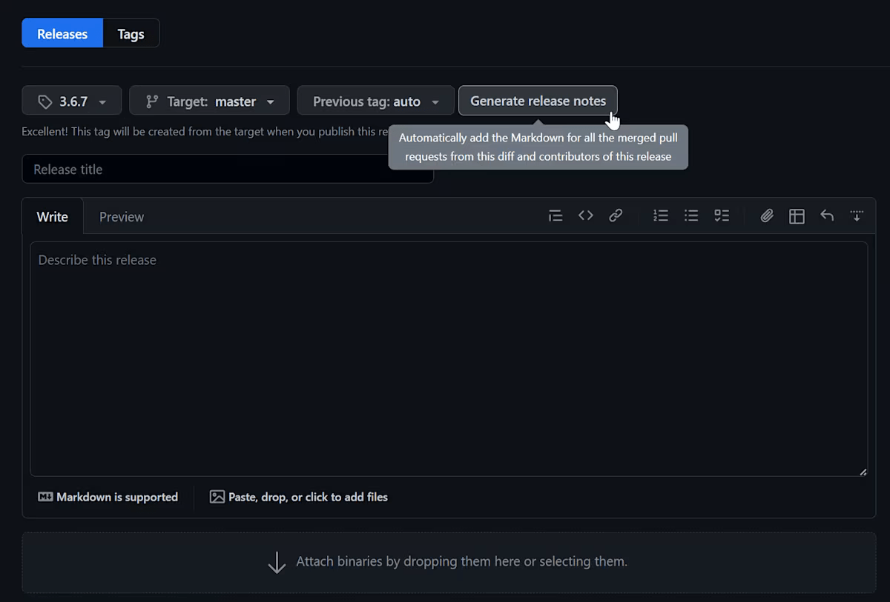

Developing a library involves a lot of moving pieces, and not all of them are just about writing code. Beyond the functionality of the library itself, you also have to consider many operational concerns, such as how it is built, tested, and released — and how those processes should be automated in an efficient and reliable way. These aspects may not be as prominent on the surface, but they still have significant implications both on your own productivity as the author, as well as the experience of the library's consumers.

Even in such a mature and opinionated ecosystem as .NET, there is no true one-size-fits-all solution. The tooling landscape — both within the platform and the wider software world — is vast and constantly evolving, so with lots of different knobs to turn and approaches to evaluate, it can be difficult to know where to start.

I have been maintaining [several open-source libraries in .NET](/projects) for over a decade, and through extensive trial and error, I have come to develop a set of practices that I find to be both effective and sustainable. These practices are not necessarily "best" in any absolute sense, but they have worked well for me and my projects, and I believe they can be a good starting point for others as well.

In this article, I will outline a typical .NET library setup, covering build settings, productivity extensions, testing and publishing workflows, and the services that help automate and tie everything together. We will go over different strategies, discuss the trade-offs between them, and see how they can be combined to establish a solid foundation for your library project.

## Scaffolding the project

Much like everything else in life, a .NET project has a beginning — and that beginning is the `dotnet new` command. It's safe to assume that, if you're reading this article, you've probably set up a fair share of .NET solutions and don't need any introduction to the process. However, since we'll be relying on certain expectations about the file structure going forward, let's use this opportunity to establish a common ground.

Generally speaking, there are two main ways to organize a solution in .NET: _the simpler way_ — where all projects are placed in their respective directories in the root of the codebase, and _the more scalable way_ — where projects are further grouped by their type and nested within the corresponding directories (`src/`, `tests/`, `samples/`, etc.). Both approaches are valid and have their place, but since we'll not be focusing on the actual codebase in this article, we'll go with the first option to keep things simple:

```
├── MyLibrary
│   ├── MyLibrary.csproj
│   └── (...)
├── MyLibrary.Tests
│   ├── MyLibrary.Tests.csproj
│   └── (...)
└── MyLibrary.sln
```

Here we have a bare-bones setup, consisting of the `MyLibrary` project that houses the library code, and the `MyLibrary.Tests` project which contains the corresponding automated tests. Both of them are unified within a single solution scope using a file named `MyLibrary.sln`, which provides a centralized entry point for the .NET tooling to discover and manage these projects.

To achieve the structure visualized above, you can either create the solution from an IDE of choice, or simply run the following `dotnet` commands in the terminal:

```bash
dotnet new classlib -n MyLibrary -o MyLibrary
dotnet new xunit -n MyLibrary.Tests -o MyLibrary.Tests
dotnet new sln -n MyLibrary
dotnet sln add MyLibrary/MyLibrary.csproj MyLibrary.Tests/MyLibrary.Tests.csproj
```

Besides that, our solution also needs to be integrated with a version control system and, ideally, a code hosting platform. When it comes to the former, the choice is fairly simple: [Git](https://git-scm.com) is the absolute standard of version control in the software world, and .NET is no exception. However, choosing a platform to host your Git repositories is a bit more nuanced, as there are many viable options available and — if you are planning to use them beyond their basic functionality — they all come with some form of vendor lock-in.

That said, unless you have a specific reason to use something else, I strongly recommend going with the obvious combination of Git and [GitHub](https://github.com) due to its wide adoption, generous free tier, and rich ecosystem of tools and integrations. This is especially relevant if you are planning to publish your library as an open-source project, as GitHub's large community of developers lends to better discoverability and collaboration opportunities.

With all that in mind, let's assume we've created a new remote repository over at `https://github.com/Tyrrrz/MyLibrary`. Now we can also initialize the repository locally and synchronize the two together:

```bash
git init
git remote add origin https://github.com/Tyrrrz/MyLibrary.git
dotnet new gitignore
```

This set of commands does a few things: it creates the `.git` directory with all the repository-specific metadata, adds a remote named `origin` pointing to the GitHub repository we've created earlier, and generates a comprehensive [`.gitignore`](https://git-scm.com/docs/gitignore) file tailored for common file and directory patterns used within the .NET ecosystem. Once all the commands are executed, the resulting file structure should look like this:

```
├── .git
│   └── (...)
├── MyLibrary
│   ├── MyLibrary.csproj
│   └── (...)
├── MyLibrary.Tests
│   ├── MyLibrary.Tests.csproj
│   └── (...)
├── .gitignore
└── MyLibrary.sln
```

At this point, we can consider the initial scaffolding of our solution to be complete. Since we don't really care about the inner workings of the library, we will simply assume that its functionality has been fully implemented, and that the associated tests are also in place and running correctly. To close this part off, let's commit our existing codebase and push it to the remote repository:

```bash
git add .
git commit -m "Initial commit"
git push -u origin main
```

## Baseline configuration

Any individual .NET project is essentially a (massive) set of instructions that direct the toolchain how to parse, compile, and package the code contained within it. These instructions are inherited through various internal `props` and `targets` files and, for the most part, pose no particular interest to you as the developer. However, there are a few aspects of the build process that you may want to configure — even if solely to establish a set of reasonable defaults.

I call these defaults the "baseline configuration", as their purpose is not to significantly alter the behavior of the build, but rather to ensure its consistency across unpredictable environments. This can be achieved with the help of the following three optional files:

- [`global.json`](https://learn.microsoft.com/dotnet/core/tools/global-json) — specifies the version of the .NET SDK that should be used for the solution and optionally instructs how to roll forward to higher versions.
- [`nuget.config`](https://learn.microsoft.com/nuget/reference/nuget-config-file) — configures settings related to the NuGet package manager, including the sources from which it should resolve package dependencies.
- [`Directory.Build.props`](https://learn.microsoft.com/visualstudio/msbuild/customize-by-directory) — defines custom MSBuild properties that are automatically applied to all projects in the solution.

Before we explore each of these files in detail, let's get started by generating boilerplates for all of them. We can do that by running the following `dotnet new` commands in the root of our solution directory:

```bash
dotnet new globaljson
dotnet new nugetconfig
dotnet new buildprops
```

### `global.json`

First off, we have the `global.json` file, whose purpose is to declare which version of the .NET SDK the solution is intended to work with. Normally, this information is not encoded in the solution file or anywhere else, so the .NET tooling relies on the default behavior of simply resolving the latest SDK that is available in the environment. This behavior is fine for local development — since you can reasonably guarantee that a compatible version of the SDK is installed on your machine — but it's a good idea to make that requirement explicit to communicate it clearly to other collaborators (and your future self) as well.

Naturally, in order to be considered compatible, the SDK must provide the capabilities that the codebase depends on, such as access to certain target frameworks, language features, compiler options, and so on. When it comes to the [.NET SDK versioning schema](https://learn.microsoft.com/dotnet/core/versions), these aspects are typically governed by the first two components of the version label (i.e. `9.0.***`), while the rest of the numbers indicate bug fixes and minor improvements (i.e. `*.*.307`). In other words, if a project is written with the C# 13 syntax and targets `net9.0`, you'd need the .NET 9.0 SDK in order to build it — but the exact version is not that important.

When you generate a `global.json` file via `dotnet new`, however, it defaults to the full version of the latest .NET SDK available on your machine. It means that anyone who wants to build the solution will also be required to have that _exact same_ SDK version installed, which is way too restrictive. To fix that, let's modify the file to look like this instead:

```json
{
  "sdk": {
    "version": "9.0.100",
    "rollForward": "latestFeature"
  }
}
```

At the time of writing, the current iteration of .NET is .NET 9.0, so we set the `version` property to `9.0.100` — the lowest SDK version within the `9.0` band. Together with the `rollForward` option set to `latestFeature`, this effectively creates a rule that allows the solution to be built by any feature or patch version of the .NET 9.0 SDK, but not by an SDK of another major or minor version (e.g. .NET 8.0 or .NET 10.0).

The reason for specifically choosing `latestFeature` instead of `latestMinor` or even `latestMajor` is to ensure runtime compatibility for executable projects in the solution, such as tests. Although .NET SDKs are generally backward-compatible between different major and minor versions, each SDK includes its corresponding version of the runtime, which is not. As a result, while a project targeting `net9.0` can still be built with the .NET 10.0 SDK, it can only be executed with the .NET 9.0 runtime — making the matching SDK version more preferable.

### `nuget.config`

Moving along, we also have `nuget.config` — a file that can configure how the NuGet package manager integrates with the build process and, most importantly, the locations it uses to restore and publish packages. By default, NuGet connects to the official [NuGet.org](https://nuget.org) registry, but this may vary between different environments due to user- and machine-specific overrides. To ensure a consistent (and secure) developer experience, we can create a solution-level configuration file that explicitly enforces the intended behavior and prevents other settings from interfering with it.

The `nuget.config` file generated by `dotnet new` provides a great starting point: it resets the list of allowed package sources to only include the official registry. This takes care of the package resolution aspect, but since we're working on a library project that we want to publish as a NuGet package as well, it's also useful to set up the default push source too. To do that, let's edit the configuration file like so:

```xml
<?xml version="1.0" encoding="utf-8"?>
<configuration>

  <packageSources>
    <clear />
    <add key="nuget" value="https://api.nuget.org/v3/index.json" />
  </packageSources>

  <config>
    <add key="defaultPushSource" value="https://api.nuget.org/v3/index.json" />
  </config>

</configuration>
```

Here we have the `<packageSources>` section that specifies the feeds from which NuGet should fetch dependencies. It's a list-based setting, so we start with the `<clear />` element to remove any previously defined sources, and then add a single item named `nuget` that points to the NuGet.org catalog. Doing so makes sure that all projects in the solution resolve packages from the official registry, regardless of any other sources that may be configured on the machine.

The following `<config>` section is reserved for key-value settings that control various aspects of the NuGet client behavior, and in our case, we use it to set `defaultPushSource` to match the package source defined earlier. Now, when we run the `dotnet nuget push` command to upload our own packages, it will also infer NuGet.org as the target location without requiring any additional arguments.

### `Directory.Build.props`

Finally, we have the `Directory.Build.props` file, which lets us define arbitrary MSBuild properties that should be applied to all projects in the solution. When running the build, the tooling automatically looks for this file (and `Directory.Build.targets`, if available) within the directory hierarchy, and implicitly includes its contents in each project specification. This convention makes `Directory.Build.props` a great place to configure common cross-cutting concerns, such as compiler options, build settings, and various metadata.

The file generated by `dotnet new` makes no assumptions about your intentions, so it simply starts off empty. Here's how I typically set it up for my library projects:

```xml
<Project>

  <!-- Compiler options -->
  <PropertyGroup>
    <LangVersion>latest</LangVersion>
    <Nullable>annotations</Nullable>
    <Nullable Condition="$([MSBuild]::IsTargetFrameworkCompatible('$(TargetFramework)', 'netstandard2.1'))">enable</Nullable>
    <TreatWarningsAsErrors>true</TreatWarningsAsErrors>
  </PropertyGroup>

  <!-- Tooling options -->
  <PropertyGroup>
    <CheckEolTargetFramework>false</CheckEolTargetFramework>
    <SuppressTfmSupportBuildWarnings>true</SuppressTfmSupportBuildWarnings>
    <IsPackable>false</IsPackable>
  </PropertyGroup>

  <!-- Assembly & package metadata -->
  <PropertyGroup>
    <Version>0.0.0-dev</Version>
    <Company>YOUR_NAME_HERE</Company>
    <Copyright>Copyright (C) $(Company)</Copyright>
    <Authors>$(Company)</Authors>
    <Description>Sample library</Description>
    <PackageTags>space-separated search keyword go in here</PackageTags>
    <PackageProjectUrl>https://github.com/Tyrrrz/MyLibrary</PackageProjectUrl>
    <PackageReleaseNotes>https://github.com/Tyrrrz/MyLibrary/releases</PackageReleaseNotes>
    <PackageLicenseExpression>MIT</PackageLicenseExpression>
  </PropertyGroup>

</Project>
```

In the above snippet, we have a few different groups of properties that are used to configure various aspects of the build process. Each group is wrapped in a `<PropertyGroup>` element, which allows us to logically separate the properties based on their purpose. Such structure has no functional benefits, but it helps keep things organized and makes reading and maintaining the file easier.

Starting off with the first group of options, we set the **`<LangVersion>`** property to `latest`, instructing the C# (or F#, VB) compiler to use the most recent stable version of the language. This is contrary to the default behavior, where the language version is instead determined by the target framework of the project, essentially only allowing newer language features when building against frameworks that officially support them.

The default behavior is a sensible safeguard, seeing as language constructs may sometimes depend on certain runtime capabilities to work correctly. However, library projects, unlike applications, cannot afford to simply target the latest version of .NET — they need to maximize compatibility with their potential consumers and that often involves targeting frameworks that are several versions behind the bleeding edge.

Therefore, setting the language version explicitly forces the compiler to ignore the official guidelines and evaluate the availability of each language feature independently from the target framework. Doing so immediately unlocks some of the newest syntax that doesn't have any runtime dependencies, while also allowing other features to be backported manually to older frameworks using [polyfills](<https://en.wikipedia.org/wiki/Polyfill_(programming)>).

Following that, we enable the [**Nullable Reference Types**](https://learn.microsoft.com/dotnet/csharp/nullable-references) feature of the C# compiler (**`<Nullable>`**), as it is a great way to improve the safety of our code and to more accurately advertise the capabilities of our APIs. There are two modes in which this feature can be configured: `annotations`, which instructs the compiler to emit nullability annotations for all types and members that we define; and `enable`, which also produces compiler warnings about related violations during development.

Just like many other language and compiler features, Nullable Reference Types is subject to certain availability constraints as well. In its native form, NRT was introduced with the release of C# 8 and .NET Core 3.0 — and, although it's possible to backport the bits required to annotate our own types, the compiler checks are not going to be very useful when targeting older frameworks that don't provide nullability information themselves.

Because of that, we configure this feature in a conditional way: activating the `annotations` mode as the baseline for all targets, while extending to the `enable` mode for the frameworks that fully support it. This way, our assemblies will always include nullability annotations, but we'll only get warnings about violations in our own code when building against newer frameworks.

Note how the example above relies on the `Condition="..."` attribute to validate framework compatibility. Instead of hard-codding a sequence of separate checks for each specific framework that our projects may target, we can rely on the [`IsTargetFrameworkCompatible`](https://learn.microsoft.com/visualstudio/msbuild/property-functions#msbuild-property-functions) function to establish a version boundary that accounts for different flavors of .NET. In this scenario, NRT will be fully enabled for both .NET Standard 2.1, .NET Core 3.0, as well as any newer implementations of .NET.

To round off the first section, we also set the **`<TreatWarningsAsErrors>`** property to `true`, directing the compiler to block the build if any warnings are encountered. In effect, this forces developers to address every potential issue in the codebase — either by fixing it or by explicitly declaring it as non-problematic. Although not required, it's generally a good idea to enable this setting for library projects as they tend to have somewhat higher expectations when it comes to code quality.

The second group of properties is dedicated to other toolchain options that are not specifically related to the compilation stage. Here, we set the **`<CheckEolTargetFramework>`** property to `false` and **`<SuppressTfmSupportBuildWarnings>`** to `true`, disabling various warnings when building for frameworks that have exited their support lifecycle. As mentioned before, libraries do often need to target older frameworks for compatibility reasons, so these warnings are not particularly useful in our context.

Next, we get to the **`<IsPackable>`** property, which controls whether a given project should be included in the packaging process. The default value is `true`, meaning that every project is treated as packable unless specified otherwise. By inverting the default, we establish a more intentional convention where NuGet packages are only created for projects that deliberately opt in.

With this setup in place, we can blindly run `dotnet pack` followed by `dotnet nuget push **/*.nupkg` on the entire solution to generate and publish all relevant NuGet artifacts in one go. Other assemblies, such as those produced by the tests and sample projects, will be automatically excluded from the process — greatly simplifying the release workflow along with its automation.

Finally, we have the third group of properties — these are used to define common metadata that gets embedded into the output assemblies and the corresponding NuGet packages. The **`<Version>`** property in particular plays a crucial role in the package management system, as it's the primary way to distinguish different iterations of the same package. For local development, we set it to a placeholder value of `0.0.0-dev`, which will be overridden with a proper version number during the release process.

The remaining fields, including **`<Company>`**, **`<Description>`**, and **`<PackageProjectUrl>`**, are purely informational properties that get surfaced in various places, such as assembly and NuGet package details. The purpose of these fields is to provide context about the package, its author, and where to find more information about it — so make sure to fill them out with accurate values that reflect the identity and nature of your library.

Most importantly, when developing a library, we also need to consider the license under which it will be distributed. The **`<PackageLicenseExpression>`** property allows us to specify a [standard SPDX license identifier](https://spdx.org/licenses) that indicates the terms of use for our package. Here, we set it to `MIT`, arguably the most popular permissive open-source license, but feel free to explore [other options](https://choosealicense.com) as well to find the best fit for your project.

Although all these metadata properties are only relevant to the packable projects in our solution, there is no harm in applying them globally through `Directory.Build.props`. In the scenario that we have multiple NuGet packages that we want to publish from the same repository, this setup allows us to maintain a single source of truth for all metadata, while still being able to override specific fields on a per-project basis if necessary.

## Library configuration

### Target frameworks

With the baseline configuration in place, we can now shift our attention from cross-cutting concerns to the specifics of the library project itself. These are the settings that dictate how the library is built, what features it supports, and which frameworks it targets.

The last of the three is particularly important, as the [_target framework_](https://learn.microsoft.com/dotnet/standard/frameworks) defines the set of shared APIs and runtime capabilities that your library can rely on, in turn also determining its overall compatibility. Choosing the right framework to target is therefore a balancing act between feature availability and audience reach — and so it requires a good understanding of the .NET ecosystem as a whole.

Unfortunately, .NET is not exactly the simplest technical landscape to navigate. Decades of evolution have fragmented the platform into different implementations — each with its own purpose, restrictions, development stacks, and convoluted naming conventions. Although most of these implementations have progressively been absorbed or displaced by .NET (Core), they are not entirely irrelevant yet.

Being the author of a library means you need to be aware of the various development contexts in which it may be used. To that end, let's briefly review the main flavors of .NET that you're likely to encounter:

- [.NET (Core)](https://dotnet.microsoft.com) — the modern, open-source, and cross-platform implementation of .NET. It started as a limited subset of .NET Framework (called .NET Core), but has since turned into a unified platform that encompasses all workloads (dropping the "Core"). All new applications are expected to target this implementation going forward.
- [.NET Framework](https://dotnet.microsoft.com/learn/dotnet/what-is-dotnet-framework) — the original, proprietary, Windows-only implementation of .NET. Legacy technology as of 2019, with no new major releases planned. Still has a massive user base due to its long history. Superseded by .NET (Core).
- [Mono](https://mono-project.com) — an older open-source and cross-platform implementation of .NET Framework that was created to seamlessly bring .NET applications to non-Windows systems. Legacy technology as of 2019, with no new major releases planned. Superseded by .NET (Core).
- [Xamarin](https://dotnet.microsoft.com/apps/xamarin) — a set of tools and libraries built on top of Mono to facilitate mobile application development for iOS and Android. Legacy technology as of 2024, with no new major releases planned. Superseded by .NET MAUI and .NET (Core).
- [Universal Windows Platform (UWP)](https://learn.microsoft.com/windows/uwp/get-started/universal-application-platform-guide) — a platform for building modern Windows applications that can run across various device types. Based on a subset of .NET Framework (ironically, also called .NET Core, though unrelated), but with its own set of APIs and restrictions. Legacy technology as of 2024, with no new major releases planned. Superseded by WinUI and .NET (Core).
- [Unity](https://unity.com) — a popular game development engine that uses a customized version of Mono to run C# scripts. As of 2025, Unity does not yet support .NET (Core), making it the only modern technology that still primarily relies on Mono.
- [.NET Standard](https://learn.microsoft.com/dotnet/standard/net-standard) — not an actual implementation, but rather a specification that defines a set of APIs that different .NET implementations can conform to. It was created to facilitate code sharing between different frameworks, but has since become less impactful due to the unification brought by .NET (Core).

In case the earlier remark about convoluted naming conventions wasn't apparent enough, things get a bit more confusing (and mildly comical) when you introduce the corresponding _framework monikers_ into the mix. For example, among the following list of targets, which two do you think belong to the same family: `netcoreapp3.1`, `netcore45`, `net46`, `net5.0`? This is not a trick question, by the way.

Anyway, in order for a library to be referenced by another project, it must be built against a framework that is compatible with the one used by that project. In most cases, it means that both of them need to target the same implementation of .NET, and the library's target version must be equal to or lower than that of the other project.

If the library targets .NET Standard instead of a specific implementation, then the version of that standard must be supported by the project's framework. However, the rules for that are slightly more complex and you need to refer to the [compatibility table](https://dotnet.microsoft.com/platform/dotnet-standard#versions) to determine how the versions align with each other.

As you may probably imagine, it's also not enough to just pick a single target framework for your library and call it a day. In order to cover a broad range of clients — and provide the best possible experience across that range — you often need to target multiple frameworks (and/or their versions) simultaneously. This is where [_multi-targeting_](https://learn.microsoft.com/visualstudio/msbuild/net-sdk-multitargeting) comes into play.

With multi-targeting, the .NET SDK works by building the project independently for each of the specified target frameworks, producing separate assemblies in the process. When the library is packed into a NuGet package, these assemblies are then organized in such a way that the consuming project can automatically pick the most appropriate assets based on its own requirements.

Regardless, compatibility is always a compromise and early in the development of your library it may be tricky to gauge how far you should go to support older or niche frameworks. That said, here are a few of my personal recommendations that can help you get started:

- **Always target the latest version of .NET (Core)**. Your library should definitely be compatible with the newest version of .NET (currently `net9.0`) and there is no better way to ensure that than by targeting it directly.
  - Additionally, this also provides you with an improved development experience — particularly through built-in analyzers that only work when targeting the latest framework.
- **Establish a compatibility baseline by targeting .NET Standard 2.0 as well**. By doing so, your library will automatically be supported by a [wide range of relatively modern .NET implementations](https://learn.microsoft.com/dotnet/standard/net-standard?tabs=net-standard-2-0), maximizing your audience without much cherry-picking.
  - This version of the standard offers a good balance between compatibility and API availability, making it a solid lower boundary for most libraries.
  - Targeting `netstandard2.0` is more or less equivalent to multi-targeting `netcoreapp2.0`, `net461`, and `uap10.0`, which covers .NET (Core), .NET Framework, and UWP, along with related development platforms, such as Mono, Xamarin, and Unity.
  - If `netstandard2.0`'s API set is too narrow for your library's needs, consider targeting higher versions of the individual implementations that you want to support instead. For example, targeting `net5.0` and `net462` will still cover a decent range of platforms, while giving you access to more modern APIs.
  - Avoid targeting `netstandard2.1`, as it's not supported by .NET Framework and UWP, largely diminishing its usefulness as a compatibility layer.
  - Avoid targeting `netstandard1.x`, as the corresponding implementations are too old and have very limited API sets.
  - Avoid targeting individual .NET implementations that don't follow the .NET Standard 2.0 specification (e.g. `netcoreapp1.1`, `net45`, `sl5`, etc.), as they are all outdated technologies.
- **Target intermediate versions if you have framework-dependent code paths**. For example, if your library already targets .NET 9.0 and .NET Standard 2.0, but conditionally relies on certain APIs that were introduced in .NET 5.0, then you should separately target `net5.0` as well to ensure that those code paths are available as early as possible.
  - This is similarly relevant if your library uses polyfills to backport newer APIs to older frameworks. In such cases, you want to also include the frameworks that provide those APIs natively, so that polyfills are only used when necessary.
  - If you prefer to keep things lean, you can limit intermediate targets to only those that are [long-term support (LTS) releases](https://versionsof.net), such as .NET 6.0, .NET 8.0, etc.
- In the worst case, **it's acceptable if your library can only reasonably target .NET (Core) and not other implementations**. Sometimes it's impossible or simply not worth the effort to support legacy frameworks, so it's fine to focus solely on the modern .NET family.

For the `MyLibrary` example, we'll assume that our code is fairly portable and allows us to target both .NET 9.0 and .NET Standard 2.0 without too many issues. Let's now edit the project file (`MyLibrary.csproj`) to reflect that:

```xml
<Project Sdk="Microsoft.NET.Sdk">

  <PropertyGroup>
    <TargetFrameworks>netstandard2.0;net9.0</TargetFrameworks>
  </PropertyGroup>

</Project>
```

Here, we use the **`<TargetFrameworks>`** property (note the plural form) to specify a semicolon-separated list of target frameworks that our library should be built for. In this case, we have `netstandard2.0` and `net9.0`, which aligns with the earlier recommendations and provides a good balance between compatibility and modern features.

If we were to now run the `dotnet build` command on this project, the tooling would create two separate outputs: one at `bin/Debug/netstandard2.0/*` and another at `bin/Debug/net9.0/*`. Each of these directories would contain the compiled assemblies along with any other artifacts relevant to that specific target framework.

### Miscellaneous settings

While we took care of the most important aspect of the library configuration by defining the target frameworks, there are a few other settings that are worth mentioning as well. Let's expand our project file to include them:

```xml
<Project Sdk="Microsoft.NET.Sdk">

  <PropertyGroup>
    <TargetFrameworks>netstandard2.0;net6.0;net7.0;net9.0</TargetFrameworks>
    <IsPackable>true</IsPackable>
    <IsTrimmable Condition="$([MSBuild]::IsTargetFrameworkCompatible('$(TargetFramework)', 'net6.0'))">true</IsTrimmable>
    <IsAotCompatible Condition="$([MSBuild]::IsTargetFrameworkCompatible('$(TargetFramework)', 'net7.0'))">true</IsAotCompatible>
    <GenerateDocumentationFile>true</GenerateDocumentationFile>
  </PropertyGroup>

</Project>
```

In the updated snippet above, we start off by setting **`<IsPackable>`** to `true`, which declares our intent to include this project in the packaging process. As you may recall, the baseline configuration in `Directory.Build.props` established `false` as the default value for this property, so we need to explicitly override it here to make sure that a NuGet package is generated for our library.

Following that, we also add **`<IsTrimmable>`** and **`<IsAotCompatible>`**, conditionally enabling them both for the supported target frameworks. These properties signal to the .NET toolchain that our library is designed to be compatible with [assembly trimming](https://learn.microsoft.com/dotnet/core/deploying/trimming/prepare-libraries-for-trimming) and [ahead-of-time (AOT) compilation](https://learn.microsoft.com/dotnet/core/deploying/native-aot/#aot-compatibility-analyzers), imposing certain constraints on the code to ensure that it can be safely processed by these optimizations.

While not strictly required, these features are becoming increasingly prevalent in the .NET ecosystem, especially in development contexts where performance and binary size are critical. As long as you don't heavily rely on reflection and run-time code generation, you should always enable trimming and AOT compatibility to make your library more versatile and future-proof.

You may have also noticed that we extended the list of target frameworks too. The above-mentioned optimizations rely on framework annotations that are provided starting with .NET 6.0 and .NET 7.0 respectively, so we included them as intermediate targets to make those features available as early as possible.

Finally, we get to the **`<GenerateDocumentationFile>`** property, which we enable to instruct the build process to produce a documentation file alongside the compiled assemblies. This file contains the [structured XML comments](https://learn.microsoft.com/dotnet/csharp/programming-guide/xmldoc) extracted from the source code and is automatically included in the NuGet package, making them available to consumers directly within their IDEs.

### Polyfills and backports

Throughout this article, there were several mentions of a concept called [_polyfill_](<https://en.wikipedia.org/wiki/Polyfill_(programming)>) — a general programming technique that allows developers to replicate the behavior of newer APIs on older platforms that don't support them natively. When building libraries, this technique is particularly useful as it allows us to leverage modern features while still maintaining compatibility with legacy frameworks.

Polyfills are authored and applied differently depending on the programming language and its capabilities. In JavaScript, for example, they are typically implemented as standalone scripts that augment the global environment or prototype chains of built-in types. In C#, however, the process is a bit awkward due to the statically typed and compiled nature of the language.

To create a polyfill in C#, you are limited to two main approaches:

- **Method polyfills**, which are provided through extension methods that substitute missing instance methods on existing built-in types. By defining them in the global namespace, they become available throughout the entire codebase without requiring explicit `using` directives.
- **Type polyfills**, which are provided through custom shims that mimic the behavior of the built-in types by reimplementing their functionality from scratch. They have the same name and namespace as the originals, allowing them to serve as seamless drop-in replacements when the official types are completely unavailable.

These approaches can be combined with the SDK-defined [_preprocessor symbols_](https://learn.microsoft.com/dotnet/csharp/language-reference/preprocessor-directives#conditional-compilation) to ensure that polyfills are only included in the project when targeting frameworks that lack the desired APIs. This way, when the library is built for modern frameworks, the native implementations are used instead, avoiding any potential conflicts, performance issues, or dead code.

As an example, let's say we wanted to polyfill the `string.Contains(char, StringComparison)` and `string.Contains(string, StringComparison)` methods, which were introduced in .NET Core 2.1. Since the `string` type itself is available across all frameworks, we can implement polyfills for the missing members using the extension method approach described above:

```csharp
// The polyfill code below is shown for illustrative purposes only.
// In a real-world scenario, you would typically rely on a polyfill library
// and won't have to implement these bits yourself.

// Single out frameworks that don't have the desired API natively
#if (NETCOREAPP && !NETCOREAPP2_1_OR_GREATER) || (NETFRAMEWORK) || (NETSTANDARD && !NETSTANDARD2_1_OR_GREATER)

using System;

// No namespace declaration, so that the extension methods are available globally
internal static class PolyfillExtensions
{
    public static bool Contains(this string str, char c, StringComparison comparison) =>
        str.Contains(c.ToString(), comparison);

    public static bool Contains(this string str, string sub, StringComparison comparison) =>
        str.IndexOf(sub, comparison) >= 0;
}
#endif
```

There are a couple things to note about this snippet. First, we use the `#if` directive to limit where the polyfill code is provided by singling out frameworks that don't have the `string.Contains(...)` methods natively. In our case, that includes all of .NET Framework, as well as .NET Standard and .NET Core versions prior to 2.1.

Second, we omit the `namespace` declaration to define the extension methods in the global namespace, making them immediately accessible on every applicable type. By doing so, any code that calls `string.Contains(...)` will automatically pick up our polyfill methods when the native implementations are not available.

Finally, we mark the class that defines the extension methods as `internal`, constraining its visibility to within the same assembly. This is important, as it prevents exposing these polyfill methods to the consumers of our library, avoiding potential naming conflicts and confusion.

With the polyfills in place, we can now use the above `string.Contains(...)` methods in our library code without worrying about compatibility issues:

```csharp
var str = "Hello world";

// On newer frameworks, this call uses the native implementation.
// On older frameworks, this call is implemented by the polyfills.
// Same code works everywhere without any changes.
var contains = str.Contains('w', StringComparison.OrdinalIgnoreCase);
```

On the other hand, for example, if we wanted to polyfill the entirety of `System.Index` and `System.Range` types, which were introduced in .NET Core 3.0, we would need to use the type shim approach instead. Here's how that would look:

```csharp
// The polyfill code below is shown for illustrative purposes only.
// In a real-world scenario, you would typically rely on a polyfill library
// and won't have to implement these bits yourself.

// Single out frameworks that don't have the desired API natively
#if (NETCOREAPP && !NETCOREAPP3_0_OR_GREATER) || (NETFRAMEWORK) || (NETSTANDARD && !NETSTANDARD2_1_OR_GREATER)

// Put this type shim in the System namespace to match the official type
namespace System;

internal readonly struct Index(int value) : IEquatable<Index>
{
    private readonly int _value = value;

    public Index(int value, bool fromEnd = false)
        : this(fromEnd ? ~value : value)
    {
        if (value < 0)
            throw new ArgumentOutOfRangeException(nameof(value), "value must be non-negative");
    }

    public int Value => _value < 0 ? ~_value : _value;

    public bool IsFromEnd => _value < 0;

    public int GetOffset(int length)
    {
        var offset = _value;
        if (IsFromEnd)
            offset += length + 1;

        return offset;
    }

    public override bool Equals(object? value) => value is Index index && _value == index._value;

    public bool Equals(Index other) => _value == other._value;

    public override int GetHashCode() => _value;

    public override string ToString()
    {
        if (IsFromEnd)
            return "^" + (uint)Value;

        return ((uint)Value).ToString();
    }

    public static Index Start => new(0);

    public static Index End => new(~0);

    public static Index FromStart(int value) =>
        value >= 0
            ? new Index(value)
            : throw new ArgumentOutOfRangeException(nameof(value), "Value must be non-negative.");

    public static Index FromEnd(int value) =>
        value >= 0
            ? new Index(~value)
            : throw new ArgumentOutOfRangeException(nameof(value), "Value must be non-negative.");

    public static implicit operator Index(int value) => FromStart(value);
}

internal readonly struct Range(Index start, Index end)
{
    // ... omitted for brevity ...
}
#endif
```

Unlike the previous example, rather than defining these polyfills globally, we place them in the `System` namespace to match the official types. This way, when the consuming code references `System.Index` or `System.Range`, the compiler will automatically resolve to our polyfill types when the native implementations are missing:

```csharp
using System;

// On newer frameworks, this relies on the native implementations.
// On older frameworks, this relies on the polyfills.
// Same code works everywhere without any changes.
var index = new Index(1, fromEnd: true);
var range = new Range(
    new Index(3),
    new Index(1, true)
);
```

By re-defining framework APIs this way, any language features that rely on them will become available as well. In our example, thanks to the `Index` and `Range` polyfills, we can now use C#'s [index (`^`) and range (`..`) operators](https://learn.microsoft.com/dotnet/csharp/tutorials/ranges-indexes) seamlessly across all target frameworks:

```csharp
var array = new[] { 1, 2, 3, 4, 5, 6, 7, 8, 9, 10 };

// On newer frameworks, this relies on the native implementations.
// On older frameworks, this relies on the polyfills.
// Same code works everywhere without any changes.
var last = array[^1];
var part = array[3..^1];
```

Of course, most of the time you wouldn't want to implement polyfills yourself. Instead, you would typically rely on existing polyfill libraries that have already done the heavy lifting for you — and here you have several options to consider.

First of all, many of the built-in types that were introduced in .NET (Core) have backports provided directly by Microsoft. For example, you can install the official [`System.Memory`](https://nuget.org/packages/System.Memory) package if your project needs to leverage `Span<T>`, `Memory<T>`, or other related types while targeting older frameworks.

You can search for [`System.*`](https://nuget.org/packages?q=system.*) or [`Microsoft.Bcl.*`](https://nuget.org/packages?q=microsoft.*) on NuGet.org to find more of these official compatibility packages that cover a variety of APIs. Do note that they all come as run-time dependencies, so make sure to use conditional references in the project file to only include them when targeting frameworks that actually need them:

```xml
<Project Sdk="Microsoft.NET.Sdk">

  <PropertyGroup>
    <TargetFrameworks>netstandard2.0;net6.0;net7.0;net9.0</TargetFrameworks>
    <IsPackable>true</IsPackable>
    <IsTrimmable Condition="$([MSBuild]::IsTargetFrameworkCompatible('$(TargetFramework)', 'net6.0'))">true</IsTrimmable>
    <IsAotCompatible Condition="$([MSBuild]::IsTargetFrameworkCompatible('$(TargetFramework)', 'net7.0'))">true</IsAotCompatible>
    <GenerateDocumentationFile>true</GenerateDocumentationFile>
  </PropertyGroup>

  <!-- System.Memory and related types are natively available starting with netstandard2.1 and netcoreapp2.1. -->
  <!-- You may also consider updating the <TargetFrameworks> list to add them as intermediate targets. -->
  <ItemGroup Condition="$(![MSBuild]::IsTargetFrameworkCompatible('$(TargetFramework)', 'netstandard2.1')) AND ![MSBuild]::IsTargetFrameworkCompatible('$(TargetFramework)', 'netcoreapp2.1'))">
    <PackageReference Include="System.Memory" Version="4.6.3"  />
  </ItemGroup>

</Project>
```

Besides the official packages, there are also many community-driven polyfill libraries. These are typically more sophisticated and cover a wider range of APIs and scenarios, including both method and type polyfills. Here are a few popular options:

- [PolyShim](https://github.com/Tyrrrz/PolyShim) (by me)
- [Polyfill](https://github.com/SimonCropp/Polyfill) (by Simon Cropp)
- [PolySharp](https://github.com/Sergio0694/PolySharp) (by Sergio Pedri)

All of the above libraries are published as source-only packages, meaning that they deliver their code directly through code files instead of compiled assemblies. This approach allows the polyfill code to be seamlessly integrated into your library during the build process, enabling conditional compilation and inlining optimizations — and without imposing additional run-time dependencies on your consumers.

As such, you can simply add them as compile-time dependencies in your project file, without worrying about conditions:

```xml
<Project Sdk="Microsoft.NET.Sdk">

  <PropertyGroup>
    <TargetFrameworks>netstandard2.0;net6.0;net7.0;net9.0</TargetFrameworks>
    <IsPackable>true</IsPackable>
    <IsTrimmable Condition="$([MSBuild]::IsTargetFrameworkCompatible('$(TargetFramework)', 'net6.0'))">true</IsTrimmable>
    <IsAotCompatible Condition="$([MSBuild]::IsTargetFrameworkCompatible('$(TargetFramework)', 'net7.0'))">true</IsAotCompatible>
    <GenerateDocumentationFile>true</GenerateDocumentationFile>
  </PropertyGroup>

  <ItemGroup>
    <PackageReference Include="PolyShim" Version="1.15.0" PrivateAssets="all" />
  </ItemGroup>

</Project>
```

Most of the time, as a library author, you'll find yourself relying on a combination of official and community-driven polyfill packages to cover the APIs that you need. This way, you can focus on writing your library code without having to worry about compatibility issues across different frameworks.

Do note that while polyfills defined this way are incredibly useful, they can't replicate every kind of API. For example, at least at the time of writing, it's not possible to polyfill instance properties, static members, array indexers, and interface implementations.

## Code formatting

CSharpier, dotnet format

## Workflow automation: building & testing

Just like any other software project, developing a library is an iterative process that revolves around the repeated cycle of writing and testing code. The setup we've established so far, along with the tooling provided by .NET, makes this process really simple — we can build and test our entire solution by running a single command:

```bash
$ dotnet test

Microsoft (R) Test Execution Command Line Tool Version 17.8.0 (x64)
Copyright (c) Microsoft Corporation.  All rights reserved.

Starting test execution, please wait...
A total of 1 test files matched the specified pattern.

Passed!  - Failed:     0, Passed:     8, Skipped:     0, Total:     8, Duration: 993 ms - MyLibrary.Tests.dll (net9.0)
Passed!  - Failed:     0, Passed:     8, Skipped:     0, Total:     8, Duration: 913 ms - MyLibrary.Tests.dll (net462)
```

Behind the scenes, the above command works by identifying the projects referenced by the solution file in the current directory, building them, and then executing tests found in appropriately marked test projects against all available target frameworks. If all tests pass, the command exits with a zero exit code, indicating success; otherwise, it exits with a non-zero code, signaling failure. Note how running the command does not put the responsibility of figuring out dependency graphs, build order, or test discovery on us — the project files and tooling takes care of all that automatically.

Now, while it is nice that we can run the build and tests locally, we would ideally want this process to be completely automated — so that it runs on every code change, without us having to do anything manually. This ensures that the code is always in a working state, and that new changes don't introduce any unwanted regressions.

Since we're already using GitHub to host our code repository, we can leverage its built-in automation platform, [GitHub Actions](https://github.com/features/actions) to achieve that. GitHub Actions allows us to define workflows that are triggered by specific events, such as pushing code to the repository or opening a pull request. These workflows can then run a series of jobs, which are essentially scripts that execute commands in a specified environment.

GitHub Actions workflows are conceptually based around events — so you can listen to specific types of events that indicate that something happened in the repository, and then run a series of commands in response to that event. While it's completely free for open-source projects, it also comes with a generous monthly allowance of free minutes for private repositories as well.

For a typical testing workflow, it is standard to run dotnet test on every push to the repository, as well as on every pull request. To that end, you can create a workflow file that looks something like this:

```yml
# Friendly name of the workflow
name: main

# Events that trigger the workflow
# (push and pull_request events with default filters)
on:
  push:
  pull_request:

# Workflow jobs
jobs:
  # ID of the job
  test:
    # Operating system to run the job on
    runs-on: ubuntu-latest

    # Steps to run in the job
    steps:
      # Check out the repository
      - uses: actions/checkout@v4 # ideally pin versions to hashes, read on to learn more

      # Run the dotnet test command
      - run: dotnet test --configuration Release
```

```yml
name: main

on:
  push:
  pull_request:

jobs:
  test:
    runs-on: ubuntu-latest

    steps:
      - uses: actions/checkout@v4

      # Setup .NET SDK
      - uses: actions/setup-dotnet@v4
        with:
          dotnet-version: |
            8.0.x
            6.0.x

      - run: dotnet test --configuration Release
```

```yml
name: main

on:
  push:
  pull_request:

jobs:
  test:
    # Matrix defines a list of arguments to run the job with,
    # which will be expanded into multiple jobs by GitHub Actions.
    matrix:
      os:
        - windows-latest
        - ubuntu-latest
        - macos-latest

    # We can reference the matrix arguments using the `matrix` context object
    runs-on: ${{ matrix.os }}

    steps:
      - uses: actions/checkout@v4

      - uses: actions/setup-dotnet@v4
        with:
          dotnet-version: |
            8.0.x
            6.0.x

      - - run: dotnet test --configuration Release
```

Reporting test results

- https://github.com/dorny/test-reporter
- https://github.com/Tyrrrz/GitHubActionsTestLogger

Dorny:

```yml
name: main

on:
  push:
  pull_request:

jobs:
  test:
    matrix:
      os:
        - windows-latest
        - ubuntu-latest
        - macos-latest

    runs-on: ${{ matrix.os }}

    steps:
      - uses: actions/checkout@v4

      - uses: actions/setup-dotnet@v4
        with:
          dotnet-version: |
            8.0.x
            6.0.x

      - run: >
          dotnet test
          --configuration Release
          --logger "trx;LogFileName=test-results.trx"

      - uses: dorny/test-reporter@v1
        # Run this step even if the previous step fails
        if: success() || failure()
        with:
          name: Test results
          path: '**/*.trx'
          reporter: dotnet-trx
          fail-on-error: true
```


```yml
# Testing workflow
name: main

on:
  push:
  pull_request:

jobs:
  test:
    matrix:
      os:
        - windows-latest
        - ubuntu-latest
        - macos-latest

    runs-on: ${{ matrix.os }}

    steps:
      - uses: actions/checkout@v4

      - uses: actions/setup-dotnet@v4
        with:
          dotnet-version: |
            8.0.x
            6.0.x

      - run: >
          dotnet test
          --configuration Release
          --logger "trx;LogFileName=test-results.trx"

      # Upload test result files as artifacts, so they can be fetched by the reporting workflow
      - uses: actions/upload-artifact@v4
        with:
          name: test-results
          path: '**/*.trx'
```

```yml
# Reporting workflow
name: Test results

on:
  # Run this workflow after the testing workflow completes
  workflow_run:
    workflows:
      - main
    types:
      - completed

jobs:
  report:
    runs-on: ubuntu-latest

    steps:
      # Extract the test result files from the artifacts
      - uses: dorny/test-reporter@v1
        with:
          name: Test results
          artifact: test-results
          path: '**/*.trx'
          reporter: dotnet-trx
          fail-on-error: true
```

GitHub Actions Test Logger:

```yml
name: main

on:
  push:
  pull_request:

jobs:
  test:
    matrix:
      os:
        - windows-latest
        - ubuntu-latest
        - macos-latest

    runs-on: ${{ matrix.os }}

    steps:
      - uses: actions/checkout@v4

      - uses: actions/setup-dotnet@v4
        with:
          dotnet-version: |
            8.0.x
            6.0.x

      - run: >
          dotnet test
          --configuration Release
          --logger GitHubActions
```


Coverage

```yml
name: main

on:
  push:
  pull_request:

jobs:
  test:
    matrix:
      os:
        - windows-latest
        - ubuntu-latest
        - macos-latest

    runs-on: ${{ matrix.os }}

    steps:
      - uses: actions/checkout@v4

      - uses: actions/setup-dotnet@v4
        with:
          dotnet-version: |
            8.0.x
            6.0.x

      - run: >
          dotnet test
          --configuration Release
          --logger GitHubActions
          --collect:"XPlat Code Coverage"
          --
          DataCollectionRunSettings.DataCollectors.DataCollector.Configuration.Format=opencover

      # Codecov will automatically merge coverage reports from all jobs
      - uses: codecov/codecov-action@v3
```


## Security considerations

```yml
jobs:
  test:
    permissions:
      contents: read
```

```yml
name: main

on:
  push:
  pull_request:

jobs:
  test:
    matrix:
      os:
        - windows-latest
        - ubuntu-latest
        - macos-latest

    runs-on: ${{ matrix.os }}

    permissions:
      contents: read

    steps:
      - uses: actions/checkout@v4

      - uses: actions/setup-dotnet@v4
        with:
          dotnet-version: |
            8.0.x
            6.0.x

      - run: >
          dotnet test
          --configuration Release
          --logger GitHubActions
          --collect:"XPlat Code Coverage"
          --
          DataCollectionRunSettings.DataCollectors.DataCollector.Configuration.Format=opencover

      - uses: codecov/codecov-action@v3
```

```yml
name: main

on:
  push:
  pull_request:

jobs:
  test:
    matrix:
      os:
        - windows-latest
        - ubuntu-latest
        - macos-latest

    runs-on: ${{ matrix.os }}

    permissions:
      contents: read

    steps:
      - uses: actions/checkout@b4ffde65f46336ab88eb53be808477a3936bae11 # v4.1.1

      - uses: actions/setup-dotnet@4d6c8fcf3c8f7a60068d26b594648e99df24cee3 # v4.0.0
        with:
          dotnet-version: |
            8.0.x
            6.0.x

      - run: >
          dotnet test
          --configuration Release
          --logger GitHubActions
          --collect:"XPlat Code Coverage"
          --
          DataCollectionRunSettings.DataCollectors.DataCollector.Configuration.Format=opencover
      - uses: codecov/codecov-action@eaaf4bedf32dbdc6b720b63067d99c4d77d6047d # v3.1.4
```

## Releasing workflow

```
          -p:CSharpier_Bypass=true
          -p:ContinuousIntegrationBuild=true
          -p:PublishRepositoryUrl=true
          -p:EmbedUntrackedSources=true
          -p:DebugType=embedded
```

Don't resolve `<ContinuousIntegrationBuild>` in the props files directly.

```yml
name: main

on:
  push:
  pull_request:

jobs:
  test:
    # Test job remains unchanged, but is omitted for brevity
    # ...

  pack:
    # Operating system doesn't matter here, but Ubuntu-based GitHub Actions
    # runners are both the fastest and the cheapest.
    runs-on: ubuntu-latest

    permissions:
      contents: read

    steps:
      # Clone the repository at current commit
      - uses: actions/checkout@b4ffde65f46336ab88eb53be808477a3936bae11 # v4.1.1

      # Install the .NET SDK
      - uses: actions/setup-dotnet@4d6c8fcf3c8f7a60068d26b594648e99df24cee3 # v4.0.0
        with:
          dotnet-version: 8.0.x

      # Create NuGet packages
      - run: dotnet pack --configuration Release
```

```yml
name: main

on:
  push:
  pull_request:

jobs:
  test:
    # Test job remains unchanged, but is omitted for brevity
    # ...

  pack:
    runs-on: ubuntu-latest

    permissions:
      actions: write # this is required to upload artifacts
      contents: read

    steps:
      - uses: actions/checkout@b4ffde65f46336ab88eb53be808477a3936bae11 # v4.1.1

      - uses: actions/setup-dotnet@4d6c8fcf3c8f7a60068d26b594648e99df24cee3 # v4.0.0
        with:
          dotnet-version: 8.0.x

      - run: dotnet pack --configuration Release

      # Upload all nupkg files as an artifact blob
      - uses: actions/upload-artifact@26f96dfa697d77e81fd5907df203aa23a56210a8 # v4.3.0
        with:
          name: packages
          path: '**/*.nupkg'
```


```yml
name: main

on:
  push:
  pull_request:

jobs:
  test:
    # Test job remains unchanged, but is omitted for brevity
    # ...

  pack:
    runs-on: ubuntu-latest

    permissions:
      actions: write
      contents: read

    steps:
      - uses: actions/checkout@b4ffde65f46336ab88eb53be808477a3936bae11 # v4.1.1

      - uses: actions/setup-dotnet@4d6c8fcf3c8f7a60068d26b594648e99df24cee3 # v4.0.0
        with:
          dotnet-version: 8.0.x

      - run: dotnet pack --configuration Release

      - uses: actions/upload-artifact@26f96dfa697d77e81fd5907df203aa23a56210a8 # v4.3.0
        with:
          name: packages
          path: '**/*.nupkg'

  deploy:
    # Only run this job when a new tag is pushed to the repository
    if: ${{ github.event_name == 'push' && github.ref_type == 'tag' }}

    # We only want the deploy stage to run after both the test and pack stages
    # have completed successfully.
    needs:
      - test
      - pack

    runs-on: ubuntu-latest

    permissions:
      actions: read

    steps:
      # Download the packages artifact
      - uses: actions/download-artifact@6b208ae046db98c579e8a3aa621ab581ff575935 # v4.1.1
        with:
          name: packages

      # Install the .NET SDK
      - uses: actions/setup-dotnet@4d6c8fcf3c8f7a60068d26b594648e99df24cee3 # v4.0.0
        with:
          dotnet-version: 8.0.x

      # Upload the packages to NuGet
      - run: >
          dotnet nuget push "**/*.nupkg"
          --source https://api.nuget.org/v3/index.json
          --api-key ${{ secrets.NUGET_API_KEY }}
```


```xml
<Project>

  <PropertyGroup>
    <!-- ... -->

    <!-- Update this when making a new release -->
    <Version>1.2.3</Version>
  </PropertyGroup>

</Project>
```

```yml
name: main

on:
  push:
  pull_request:

jobs:
  test:
    # Test job remains unchanged, but is omitted for brevity
    # ...

  pack:
    runs-on: ubuntu-latest

    permissions:
      actions: write
      contents: read

    steps:
      - uses: actions/checkout@b4ffde65f46336ab88eb53be808477a3936bae11 # v4.1.1

      - uses: actions/setup-dotnet@4d6c8fcf3c8f7a60068d26b594648e99df24cee3 # v4.0.0
        with:
          dotnet-version: 8.0.x

      # Set the package version to the tag name (on release)
      # or fall back to a placeholder value (on regular commits).
      - run: >
          dotnet pack
          --configuration Release
          -p:Version=${{ github.ref_name || '0.0.0-ci' }}

      - uses: actions/upload-artifact@26f96dfa697d77e81fd5907df203aa23a56210a8 # v4.3.0
        with:
          name: packages
          path: '**/*.nupkg'

  deploy:
    # Deploy job remains unchanged, but is omitted for brevity
    # ...
```

```yml
name: main

on:
  push:
  pull_request:

jobs:
  test:
    # Test job remains unchanged, but is omitted for brevity
    # ...

  pack:
    runs-on: ubuntu-latest

    permissions:
      actions: write
      contents: read

    steps:
      - uses: actions/checkout@b4ffde65f46336ab88eb53be808477a3936bae11 # v4.1.1

      - uses: actions/setup-dotnet@4d6c8fcf3c8f7a60068d26b594648e99df24cee3 # v4.0.0
        with:
          dotnet-version: 8.0.x

      # Set the package version to the tag name (on release)
      # or fall back to an auto-generated value (on regular commits).
      - run: >
          dotnet pack
          --configuration Release
          -p:Version=${{ (github.ref_type == 'tag' && github.ref_name) || format('0.0.0-ci-{0}', github.sha) }}

      - uses: actions/upload-artifact@26f96dfa697d77e81fd5907df203aa23a56210a8 # v4.3.0
        with:
          name: packages
          path: '**/*.nupkg'

  # Deploy on all commits this time, not just tags
  deploy:
    needs:
      - test
      - pack

    runs-on: ubuntu-latest

    permissions:
      actions: read

    steps:
      - uses: actions/download-artifact@6b208ae046db98c579e8a3aa621ab581ff575935 # v4.1.1
        with:
          name: packages

      - uses: actions/setup-dotnet@4d6c8fcf3c8f7a60068d26b594648e99df24cee3 # v4.0.0
        with:
          dotnet-version: 8.0.x

      - run: >
          dotnet nuget push "**/*.nupkg"
          --source https://api.nuget.org/v3/index.json
          --api-key ${{ secrets.NUGET_API_KEY }}
```

```yml
name: main

on:
  push:
  pull_request:

jobs:
  test:
    # Test job remains unchanged, but is omitted for brevity
    # ...

  pack:
    # Pack job remains unchanged, but is omitted for brevity
    # ...

  deploy:
    needs:
      - test
      - pack

    runs-on: ubuntu-latest

    permissions:
      actions: read

    steps:
      - uses: actions/download-artifact@6b208ae046db98c579e8a3aa621ab581ff575935 # v4.1.1
        with:
          name: packages

      - uses: actions/setup-dotnet@4d6c8fcf3c8f7a60068d26b594648e99df24cee3 # v4.0.0
        with:
          dotnet-version: 8.0.x

      # Deploy to NuGet.org (only tagged releases)
      - if: ${{ github.ref_type == 'tag' }}
        run: >
          dotnet nuget push "**/*.nupkg"
          --source https://api.nuget.org/v3/index.json
          --api-key ${{ secrets.NUGET_API_KEY }}

      # Deploy to GitHub Packages (all commits and releases)
      - run: >
          dotnet nuget push "**/*.nupkg"
          --source https://nuget.pkg.github.com/${{ github.repository_owner }}/index.json
          --api-key ${{ secrets.GITHUB_TOKEN }}
```



```console
$ gh release create 1.2.3 --repo my/repo --generate-notes
```

```yml
name: main

on:
  push:
  pull_request:

jobs:
  test:
    # Test job remains unchanged, but is omitted for brevity
    # ...

  pack:
    # Pack job remains unchanged, but is omitted for brevity
    # ...

  deploy:
    needs:
      - test
      - pack

    runs-on: ubuntu-latest

    permissions:
      actions: read
      contents: write # this is required to create releases

    steps:
      - uses: actions/download-artifact@6b208ae046db98c579e8a3aa621ab581ff575935 # v4.1.1
        with:
          name: packages

      - uses: actions/setup-dotnet@4d6c8fcf3c8f7a60068d26b594648e99df24cee3 # v4.0.0
        with:
          dotnet-version: 8.0.x

      - if: ${{ github.ref_type == 'tag' }}
        run: >
          dotnet nuget push "**/*.nupkg"
          --source https://api.nuget.org/v3/index.json
          --api-key ${{ secrets.NUGET_API_KEY }}

      - run: >
          dotnet nuget push "**/*.nupkg"
          --source https://nuget.pkg.github.com/${{ github.repository_owner }}/index.json
          --api-key ${{ secrets.GITHUB_TOKEN }}

      # Create a GitHub release with auto-generated release notes, and upload the packages as assets
      - if: ${{ github.ref_type == 'tag' }}
        run: >
          gh release create ${{ github.ref_name }}
          $(find . -type f -wholename **/*.nupkg -exec echo {} \; | tr '\n' ' ')
          --repo ${{ github.event.repository.full_name }}
          --title ${{ github.ref_name }}
          --generate-notes
          --verify-tag
```

## Changelog

## Formatting

CSharpier

## GitHub issue forms

## Summary

You can reference [`https://github.com/Tyrrrz/MyLibrary`](https://github.com/Tyrrrz/MyLibrary) to see the complete solution that we have built throughout this article. You can also use it a repository template to quickly bootstrap your own library project.
