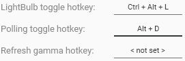

GUI applications sometimes offer a way for users to configure hotkeys, typically using a textbox that records a combination of keys pressed inside it. Such control doesn't come out of the box in WPF, but we can implement it ourselves.

## Hotkey class

WPF has two useful enumerations for this task — `System.Windows.Input.Key` and `System.Windows.Input.ModifierKeys`. Let's make a class that encapsulates the values of those enums and call it `Hotkey`.

```csharp
public class Hotkey
{
    public Key Key { get; }

    public ModifierKeys Modifiers { get; }

    public Hotkey(Key key, ModifierKeys modifiers)
    {
        Key = key;
        Modifiers = modifiers;
    }

    public override string ToString()
    {
        var str = new StringBuilder();

        if (Modifiers.HasFlag(ModifierKeys.Control))
            str.Append("Ctrl + ");
        if (Modifiers.HasFlag(ModifierKeys.Shift))
            str.Append("Shift + ");
        if (Modifiers.HasFlag(ModifierKeys.Alt))
            str.Append("Alt + ");
        if (Modifiers.HasFlag(ModifierKeys.Windows))
            str.Append("Win + ");

        str.Append(Key);

        return str.ToString();
    }
}
```

An instance of this class is created by specifying a key along with a combination of modifiers (if any) that need to be pressed to execute a shortcut.

`ToString()` method will be called by WPF to display an instance of the class inside a textbox if there's no converter set. It's also used by Visual Studio when debugging, which makes it more convenient. This method will generate a string that represents the current hotkey, for example `Ctrl + Alt + K`.

## WPF user control

To make the actual WPF control, you can either derive from `TextBox` or wrap it in your own `UserControl`. I chose the latter, mainly for two reasons:

- It's possible to hide all the inherent textbox properties that aren't applicable for my control
- There are fewer limitations in case I need to replace the textbox with a different control or add something on top of it

```xml
<UserControl x:Class="Your.Namespace.HotkeyEditorControl"
             xmlns="http://schemas.microsoft.com/winfx/2006/xaml/presentation"
             xmlns:x="http://schemas.microsoft.com/winfx/2006/xaml"
             xmlns:d="http://schemas.microsoft.com/expression/blend/2008"
             xmlns:mc="http://schemas.openxmlformats.org/markup-compatibility/2006"
             x:Name="UserControl"
             d:DesignHeight="300"
             d:DesignWidth="300"
             mc:Ignorable="d">
    <TextBox x:Name="HotkeyTextBox"
             HorizontalContentAlignment="Center"
             VerticalContentAlignment="Center"
             IsReadOnly="True"
             IsReadOnlyCaretVisible="False"
             IsUndoEnabled="False"
             PreviewKeyDown="HotkeyTextBox_PreviewKeyDown"
             Text="{Binding Hotkey, ElementName=UserControl, Mode=OneWay, TargetNullValue=&lt; not set &gt;}">
        <TextBox.ContextMenu>
            <ContextMenu Visibility="Collapsed" />
        </TextBox.ContextMenu>
    </TextBox>
</UserControl>
```

There are a few important things we need to configure in our internal `TextBox`. First, it shouldn't allow manual text input, so I set `IsReadOnly` to `true`.

Second, it'd be best to remove the caret since it isn't useful in any way. Setting `IsReadOnlyCaretVisible` to `false` takes care of that.

We also don't want it to keep the undo/redo history so let's disable `IsUndoEnabled` as well.

Finally, WPF textboxes have a default context menu with buttons like copy, cut, paste, etc. which we don't need either. We can disable it by setting the visibility of the menu to `Collapsed`.

The text property is bound to the `Hotkey` property using the `OneWay` mode. The latter is important because we are setting the value of `Hotkey` from code-behind. This binding is only used to update the text inside the textbox.

As for the code-behind, it looks like this:

```csharp
public partial class HotkeyEditorControl
{
    public static readonly DependencyProperty HotkeyProperty =
        DependencyProperty.Register(
            nameof(Hotkey),
            typeof(Hotkey),
            typeof(HotkeyEditorControl),
            new FrameworkPropertyMetadata(
                default(Hotkey),
                FrameworkPropertyMetadataOptions.BindsTwoWayByDefault
            )
        );

    public Hotkey Hotkey
    {
        get => (Hotkey) GetValue(HotkeyProperty);
        set => SetValue(HotkeyProperty, value);
    }

    public HotkeyEditorControl()
    {
        InitializeComponent();
    }

    private void HotkeyTextBox_PreviewKeyDown(object sender, KeyEventArgs e)
    {
        // Don't let the event pass further because we don't want
        // standard textbox shortcuts to work.
        e.Handled = true;

        // Get modifiers and key data
        var modifiers = Keyboard.Modifiers;
        var key = e.Key;

        // When Alt is pressed, SystemKey is used instead
        if (key == Key.System)
        {
            key = e.SystemKey;
        }

        // Pressing delete, backspace or escape without modifiers clears the current value
        if (modifiers == ModifierKeys.None &&
            (key == Key.Delete || key == Key.Back || key == Key.Escape))
        {
            Hotkey = null;
            return;
        }

        // If no actual key was pressed - return
        if (key == Key.LeftCtrl ||
            key == Key.RightCtrl ||
            key == Key.LeftAlt ||
            key == Key.RightAlt ||
            key == Key.LeftShift ||
            key == Key.RightShift ||
            key == Key.LWin ||
            key == Key.RWin ||
            key == Key.Clear ||
            key == Key.OemClear ||
            key == Key.Apps))
        {
            return;
        }

        // Update the value
        Hotkey = new Hotkey(key, modifiers);
    }
}
```

To capture keystrokes we're processing the `PreviewKeyDown` event because it also lets us disable standard textbox shortcuts such as copy, cut, paste, etc.

1. It sets `e.Handled` to `true` so that the events don't pass further down the chain
2. It extracts information about the key that was pressed
3. It checks if either Delete, Backspace or Escape were pressed and clears the input if so

Finally, here's how the control looks in my app, [LightBulb](https://github.com/Tyrrrz/LightBulb):


