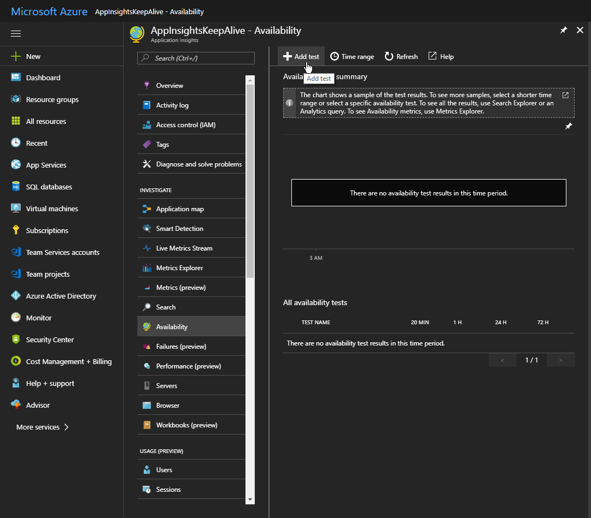
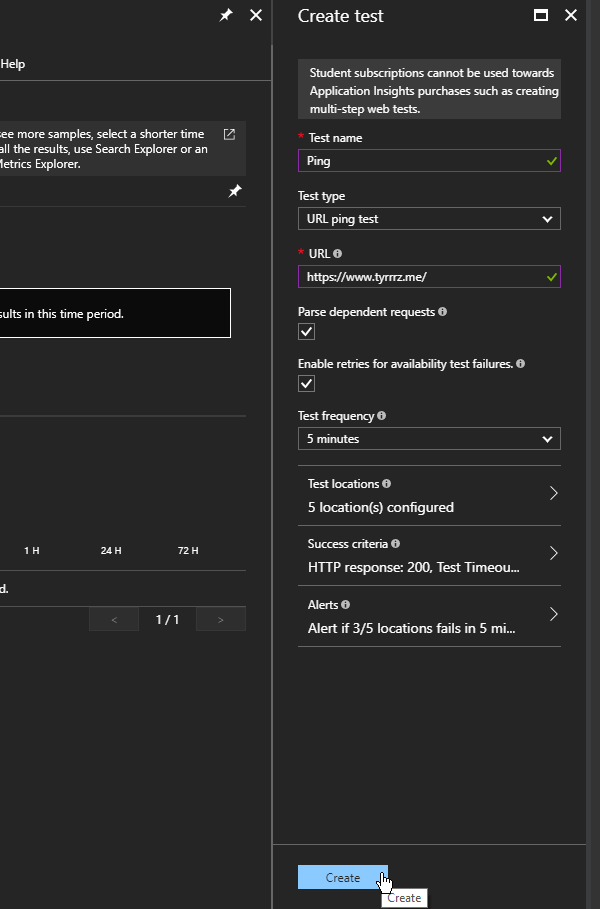

Web applications hosted in IIS adhere to the _Idle Timeout_ setting. It defines a time period of inactivity after which an application is shut down. Subsequent requests will trigger the application to start up again, but it usually takes a while — this rather small ASP.net Core website takes around 10 seconds to start and respond to the first request.

If you have access to the IIS Manager, it's possible to change the timeout or disable it altogether, but this is not an option for those using shared hosting.

The workaround seems pretty obvious — we just need to keep sending requests to prevent IIS from killing our application. Default idle timeout is 20 minutes, so you would need to send requests at least this often, although some hosting providers might have different settings.

Problem is, however, simply pinging the host is not enough to keep it alive, we need to send actual HTTP requests. I've tried many uptime monitors and the only one that satisfied these criteria was Application Insight and its _Availability_ feature.

## Using Application Insights to poll a website

Application Insights offers a very useful feature called _Availability_ — it lets you create tests that check your web app's availability and have them run as often as every 5 minutes. Unlike other uptime monitors, these tests actually send `GET` requests to your app instead of simply pinging the host.

The best part is that you can create an Application Insights resource on a free Azure account, and you don't even need to have it properly configured. In fact, we won't even be using the rest of Application Insights, only the _Availability_ feature.

To set up availability tests, go to [Azure Portal](https://portal.azure.com) and add a new Application Insights resource.

Navigate to **Availability** under **Investigate** section. Find the **Add test** button to create a new test.

Configure the test with your URL and click **Create**.

Once it's set up, Azure will poll your website every few minutes, keeping it alive and sending you alerts if it goes down.
