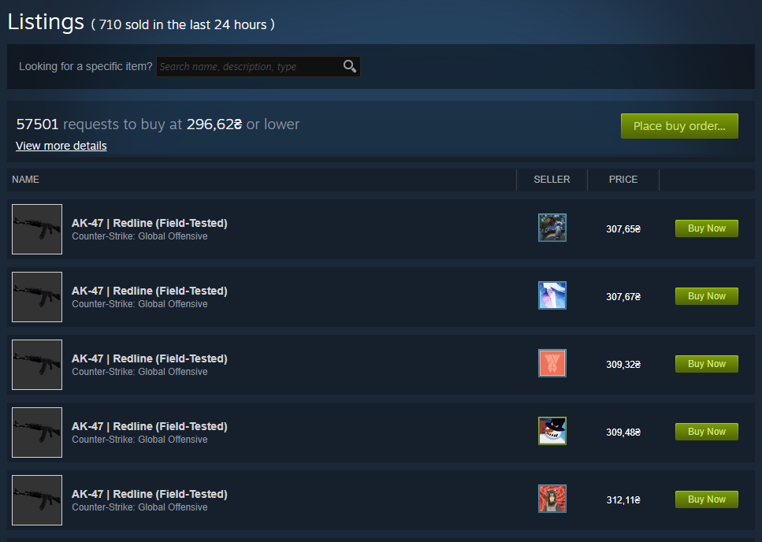
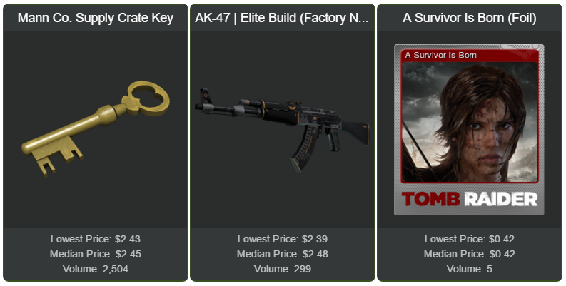

At some point, I was contracted to make a WordPress plugin that displays some basic information on an item from Steam Market. It had to show its name, image and the current lowest price.

I was initially hoping that there would be some sort of API for this, but unfortunately there isn't. Probably because it would make developing bots a bit too easy.

Having spent some time inspecting the listing pages with Chrome Developer Tools, I’ve discovered that all the pricing information is pulled using a single AJAX request which can be easily reverse-engineered. Let’s take a look at how it works.

## Getting the pricing info

Here's the request that Steam's frontend uses to get the latest pricing info:

```php
$url =
    'https://steamcommunity.com/market/priceoverview/'.
    '?market_hash_name='.rawurlencode($name).
    '&appid='.$game.
    '&currency='.$currency;
```

It has 3 required parameters:

- `market_hash_name` — full name of the item as it appears on the market (URL-encoded)
- `appid` — ID of the app (game) where this item can be found
- `currency` — ID of the currency in which we want our prices to be shown

You can get the values for the first two parameters straight from the item's URL. For example, if we were interested in [AK-47 | Redline](https://steamcommunity.com/market/listings/730/AK-47%20%7C%20Redline%20%28Field-Tested%29), we'd be able to inspect the URL and see that the value of `appid` is `730` while `market_hash_name` is equal to `AK-47%20%7C%20Redline%20%28Field-Tested%29`.


We still need to set the value for the third required parameter, `currency`. I'm not sure what is the full list of supported currencies and their IDs, but the value of `1` seems to correspond to USD, so we'll use that.

Our final URL with all the parameters set should look like this:

```
https://steamcommunity.com/market/priceoverview/?market_hash_name=AK-47%20%7C%20Redline%20%28Field-Tested%29&appid=730&currency=1
```

If we send a `GET` request with this URL we will get a response such as this one:

```json
{
  "success": true,
  "lowest_price": "$13.07",
  "volume": "710",
  "median_price": "$12.74"
}
```

As you can see, it doesn't provide a lot of data, but it does contain the aggregated pricing information, which is exactly what we need.

It's also worth noting that sometimes the response may not contain `median_price` and `volume`. I'm not sure why it happens but make sure to handle such cases too.

Besides that, I've found that Steam may start throttling you if you send too many requests, so it's a good idea to cache responses for at least 10 minutes.

## Getting the image

So far we were able to get the price of an item but not its image. Unfortunately, it seems that there's no obvious correlation between `market_hash_name` and the corresponding image URL, so we won't be able to infer it.

To make matters worse, a big portion of the page, including the image, is rendered server-side, making it impossible to reverse-engineer.

Luckily, the listings at the bottom of the page also contain the image, and they are rendered asynchronously using another AJAX request.



The aforementioned request looks like this:

```php
$url =
    'https://steamcommunity.com/market/listings/'.$game.'/'.rawurlencode($name).'/render'.
    '?start=0'.
    '&count=1'.
    '&currency='.$currency.
    '&format=json';
```

It's a bit different from the previous one but takes the same parameters. In fact, the base of this request is the item's listing URL we've inspected earlier.

By setting `start` to `0` and `count` to `1` we are limiting the response to a single listing since we are only interested in the image, which is the same for all the listings anyway.

Finally, the fully formed URL should look something like this:

```
https://steamcommunity.com/market/listings/730/AK-47%20%7C%20Redline%20%28Field-Tested%29/render?start=0&count=1&currency=1&format=json
```

A `GET` request with this URL will return a rather large JSON response that contains raw HTML inside (I truncated most of it for brevity):

```json
{
  "success": true,
  "start": 0,
  "pagesize": "1",
  "total_count": 2302,
  "results_html": "<div class=\"market_listing_table_header\">...</div>"
}
```

To get the image, we need to parse the HTML inside of `results_html` and find an `` element of class `market_listing_item_img`. We can do that by querying the DOM with a CSS selector. The URL, which is the value of the corresponding `src` attribute, should look like this:

```
https://steamcommunity-a.akamaihd.net/economy/image/-9a81dlWLwJ2UUGcVs_nsVtzdOEdtWwKGZZLQHTxDZ7I56KU0Zwwo4NUX4oFJZEHLbXH5ApeO4YmlhxYQknCRvCo04DEVlxkKgpot7HxfDhjxszJemkV09-5lpKKqPrxN7LEmyVQ7MEpiLuSrYmnjQO3-UdsZGHyd4_Bd1RvNQ7T_FDrw-_ng5Pu75iY1zI97bhLsvQz/62fx62f/
```


If you take a look at the end of the URL, you can see the portion where it specifies desired image dimensions, which is set to `62fx62f` in this case. We can change these to anything we want, and the server will return an image of that size. However, if you specify a size which is too big, the image will be centered and remain at its maximum size while the rest of the canvas will be transparent.

## Source code

The code for the WordPress plugin that I wrote is open source, you can [check it out here](https://github.com/Tyrrrz/WPSteamMarketExcerpt). Here's how it looks in action:


