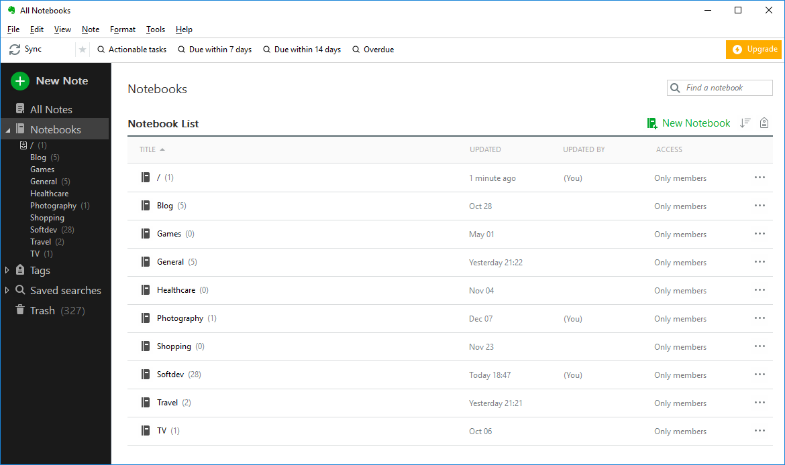
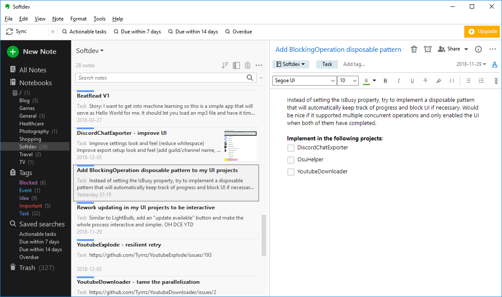
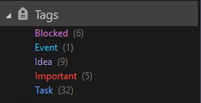
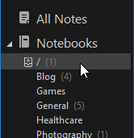
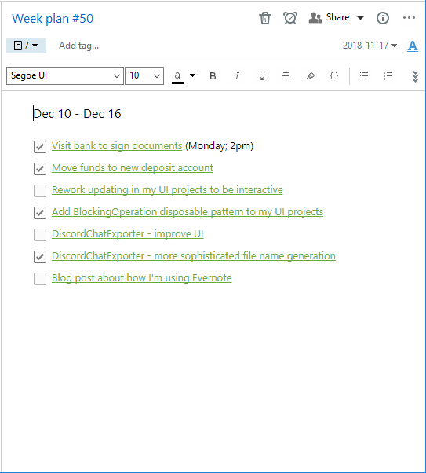

I have always been trying to be a well-organized person, but for the most part I was doing it wrong. I was lacking in ability to plan and stay focused, which made it seem like I was productive, despite not having any tangible progress towards the goals that _really_ matter.

It can be very difficult to stay on top of things and have a clearly defined path. I've struggled for some time to find an optimal routine that would not only help me get things done, but also get the _right_ things done.

Through trying out many mediums and approaches -- from to-do apps to bullet journals -- I eventually developed a workflow that helps me separate planning from execution, in a way that lets me effectively focus on a smaller subset of tasks at a time. To implement it, I'm using Evernote which is a productivity app I like for the customizability it offers.

## The Evernote routine

### Noting down

Evernote is a general-purpose note-taking app which can serve as a more efficient replacement for classic physical notebooks. Every separate piece of information here is stored as a "note", each belonging to a specific notebook.

Since notes can only belong to one notebook, I decided to create a notebook for each "category" of my life. For example, I have "Softdev" for my personal software projects, "Travel" for trip planning, "Healthcare" for doctor appointments, and some other notebooks in the same vein. I also have "General" which is for everything that doesn't have its own category.

Whenever something comes up, I create a note and assign it to the corresponding category-notebook. If the note doesn't seem to match with anything -- I just put it in "General".

The note's title concisely explains what needs to be done or achieved, this way I can quickly remind myself what it is about.

Any extra information, details and context go inside the note itself. This is where Evernote's powerful text editor comes in handy to make a visually pleasing presentation.

To make my notes even more informative at a glance, I make use of tags. They can be assigned to notes to organize them similarly to notebooks, except a note can have an unlimited number of tags.

Unlike notebooks, tags are used to categorize notes based on one or multiple traits. Currently, I'm using the following 5 tags I created:

- **Task** -- something that can be done if acted upon. Example: "_Buy a new camera_".
- **Event** -- something that can only be acted upon on a specific date and time, not sooner or later. Example: "_Dentist appointment at 2pm on Monday_".
- **Idea** -- something that is too vague to be acted upon, but can be a source of new tasks. Example: "_List of books I want to read_".
- **Blocked** -- something that cannot be acted upon until the blocker is cleared. Example: "_Buy a new camera_" cannot be acted upon until _salary day_.
- **Important** -- something marginally more important than everything else and should be considered first when planning.

This setup splits the notes into three logical types -- tasks, events and ideas. Every note should have either one of these assigned to it.

### Planning and execution

Although creating new notes can be done at any time, they should not be acted upon until they are drafted for a week plan. A week plan is a subset of tasks and events, manually selected for completion during a specific week.

Before the start of a new week, usually on a Sunday, I make a plan for the upcoming seven days by creating a new note in a special notebook titled "/" -- a weird name, but I chose it to make this notebook appear at the very top of the list.

When making a week plan, I begin by creating a note and naming it in accordance with the week number, e.g. "_Week plan #50_". It doesn't make sense to assign any tags to it, so I just leave it as it is. I also write down the starting and ending dates of the week inside the note for a bit of extra context, e.g. "Dec 10 - Dec 16".

Then, to fill it with items, I start with events because it's the simplest. I look through all events that are planned for that week and insert them into the plan by copy-pasting their links. This can be done by right-clicking on each note and selecting "_Copy internal link_". It also helps if the events inside the plan are listed in a chronological order, with date/time displayed next to them for convenience.

To make it easier to find events based on their dates, I always configure reminders for this type of notes -- this adds an extra field that I can use to filter and search by. For example, I have a couple of saved search queries that are very useful when planning events:

- Due within 7 days: `remindertime:day -remindertime:day+7`
- Due within 14 days: `remindertime:day -remindertime:day+14`
- Overdue: `remindertime:day-9999999999 -remindertime:day`

After the events are in, I move on to tasks. For this I use another saved search to filter by actionable tasks -- which is all tasks that are not blocked: `tag:Task -tag:Blocked`.

Which tasks I choose to draft for the week comes down to their importance and my personal preference, accounting for the time they take so that I don't end up planning more than I can handle.

Once the week plan is made, it becomes the only note I look at throughout the week. I don't have to care about anything else because all the information I need is consolidated within this plan. Should I want to know more about a specific task or event I planned -- I can click on the internal link I inserted and it will take me to the corresponding note.

As I routinely come back to the week plan, I cross out the items I have completed and move the corresponding notes to trash so that they don't appear in the next planning phase.

Having only one single place I need to look at frees up my consciousness and lets me properly focus on the important things, without worrying that I may have forgotten or overlooked something. The effort I put during the planning phase makes me confident in what I'm doing during the execution phase.
