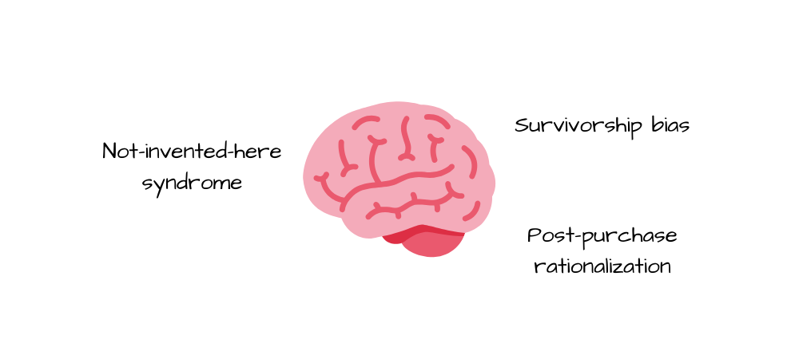

Cognitive biases impact our perception of reality, driving us into making incorrect conclusions and irrational decisions. The topic's relevancy to software development has already been covered in many places ([one](https://medium.com/@Mareks_082/biases-in-software-development-1f79ba840cc1), [two](https://hackernoon.com/cognitive-biases-in-programming-5e937707c27b), [three](http://www.jonathanklein.net/2013/06/cognitive-biases-in-software-engineering.html)) but I would like to add on by discussing a few cases that haven't been mentioned before.

## Survivorship bias

> Survivorship bias is the logical error of concentrating on the people or things that made it past some selection process and overlooking those that did not, typically because of their lack of visibility. ([wiki](https://en.wikipedia.org/wiki/Survivorship_bias))

When it comes to software development, this cognitive bias mainly applies to the tendency to subconsciously analyze user satisfaction based on naturally skewed feedback. There is an unspoken notion that good software is expected to work, while great software should work so well it's practically unnoticeable. Following this notion, users tend to contact developers only when something, in fact, doesn't work.

If you have no other means of assessing user feedback besides bug reports, it might seem that everyone who has ever used your software has experienced issues with it. This is especially common, for example, in open source development, where using proper telemetry is frowned upon, and the only user interaction is typically done through issue tickets.

Needless to say, the effects of this bias can negatively impact motivation. Similar to [bombers that make it home](https://en.wikipedia.org/wiki/Survivorship_bias#In_the_military), bug reports don't tell the full story. In order to avoid being the victim of lost motivation, it is important to keep in mind that the happiest users are also usually the quietest.

## Post-purchase rationalization

> Post-purchase rationalization is the tendency to retroactively ascribe positive attributes to an option one has selected. ([wiki](https://en.wikipedia.org/wiki/Choice-supportive_bias))

I've found this bias reflected well in how developers defend their decisions far more vigorously when their changes were already pushed and merged to master. The regret associated with making revert commits is something we all prefer to avoid, due to the induced shame of having made bad choices and spending efforts on what ultimately didn't bring the desired value.

I can often find myself standing by something I've done, not noticing that I'm simply trying to justify my decision making, instead of focusing on what's best for the project in the long run. At the time the action was taken, it may have made perfect sense, but some months later the circumstances could be different -- yet your brain is conditioned to remember it only for being the best option, instead of the thought process that brought you to that conclusion.

In situations like this, it helps to think of each incremental change as an improvement over the previous, without overindulging in how a particular issue was introduced in the first place.

## Not-invented-here syndrome

> Not-invented-here syndrome is the tendency towards reinventing the wheel based on the belief that in-house developments are inherently better suited, more secure, more controlled, quicker to develop, and incur lower overall cost than using existing implementations. ([wiki](https://en.wikipedia.org/wiki/Not_invented_here))

It can often be hard to judge whether adding an external dependency or rolling your own solution is a better option for a particular situation. On one hand, having full control of the code makes it possible to customize it for whatever needs you may have, on the other, you are effectively re-inventing the wheel by doing that.

Statistically, it appears that companies and individual developers prefer to avoid using 3rd party tools and libraries more often than it is worth it. Things like test coverage and maintenance get overlooked and not accounted for, resulting in an unexpected waste of developer resources.

I've once heard a person advise against referencing an external library because "it would take an average developer 4 days to recreate", without being able to explain why that's a problem. Sure, a lot of times existing solutions might be lacking or inadequate for some task, in which case using them is not an option, but discarding something only because it wasn't invented here is a bias you should be on a lookout for.

## Negativity bias

> The negativity bias refers to the notion that, even when of equal intensity, things of a more negative nature have a greater effect on one's psychological state and processes than do neutral or positive things. ([wiki](https://en.wikipedia.org/wiki/Negativity_bias))

Negativity bias is ubiquitous enough that it can be attributed to almost everything in life. In software development, among other things, it's rather prominent in the tendency to overemphasize bad parts of the code.

Sometimes a few hacks here and there, broken dependency isolation or implementation-aware tests can save a release from missing a deadline, but will definitely leave a bad aftertaste in your mouth. Working with such code triggers negative emotions, easily overshadowing the bigger picture and the goals your project is meant to meet. What makes it worse is that you're usually not at liberty to allocate time for refactoring, which, objectively speaking, might not even be worth doing at all.

I'm definitely not advocating that such issues should be completely ignored -- technical debt can be very detrimental to the development process, once it piles up. That said, more often than not we're subconsciously making a bigger deal out of it than it really is. A lot of times you can eliminate such thoughts by switching from "why is something bad" to "how can I make it better" -- maybe there's no real solution that is worth the effort.

## Bottom line

Some people claim that being resilient to cognitive biases when performing a job is what makes the difference between an amateur and a professional. While I don't think being insusceptible to biases is possible, it definitely helps if you can identify them and properly adjust your perception.
