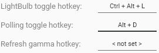

GUI applications often offer a way for users to configure hotkeys, typically using a textbox that records combination of key presses inside of it. Such control doesn't come out of the box with WPF so you'll have to implement it yourself.

## Hotkey class

WPF has two useful enumerations for this task -- `System.Windows.Input.Key` and `System.Windows.Input.ModifierKeys`. You'll want to make a class that encapsulates values of those enums and call it `Hotkey`.

```csharp
public class Hotkey
{
    public Key Key { get; }

    public ModifierKeys Modifiers { get; }

    public Hotkey(Key key, ModifierKeys modifiers)
    {
        Key = key;
        Modifiers = modifiers;
    }

    public override string ToString()
    {
        var str = new StringBuilder();

        if (Modifiers.HasFlag(ModifierKeys.Control))
            str.Append("Ctrl + ");
        if (Modifiers.HasFlag(ModifierKeys.Shift))
            str.Append("Shift + ");
        if (Modifiers.HasFlag(ModifierKeys.Alt))
            str.Append("Alt + ");
        if (Modifiers.HasFlag(ModifierKeys.Windows))
            str.Append("Win + ");

        str.Append(Key);

        return str.ToString();
    }
}
```

An instance of this class is created by specifying a key along with a combination of modifiers (if any) that need to be pressed to execute a shortcut.

`ToString()` method will be called by WPF to display an instance of the class inside a textbox if there's no converter set. It's also used by Visual Studio when debugging, which makes it more convenient. This method will generate a string that represents the current hotkey, for example `Ctrl + Alt + K`.

## WPF user control

### View layer

For making the actual WPF control you can either derive from `TextBox` or make your own `UserControl`. I chose the latter, mainly for two reasons:

- I can hide all the inherent textbox properties that aren't applicable for my control.
- I have less limitations in case I need to replace textbox with a different control or add something on top of it.

```xml
<UserControl x:Class="Your.Namespace.HotkeyEditorControl"
             xmlns="http://schemas.microsoft.com/winfx/2006/xaml/presentation"
             xmlns:x="http://schemas.microsoft.com/winfx/2006/xaml"
             xmlns:d="http://schemas.microsoft.com/expression/blend/2008"
             xmlns:mc="http://schemas.openxmlformats.org/markup-compatibility/2006"
             x:Name="UserControl"
             d:DesignHeight="300"
             d:DesignWidth="300"
             mc:Ignorable="d">
    <TextBox x:Name="HotkeyTextBox"
             HorizontalContentAlignment="Center"
             VerticalContentAlignment="Center"
             IsReadOnly="True"
             IsReadOnlyCaretVisible="False"
             IsUndoEnabled="False"
             PreviewKeyDown="HotkeyTextBox_PreviewKeyDown"
             Text="{Binding Hotkey, ElementName=UserControl, Mode=OneWay, TargetNullValue=&lt; not set &gt;}">
        <TextBox.ContextMenu>
            <ContextMenu Visibility="Collapsed" />
        </TextBox.ContextMenu>
    </TextBox>
</UserControl>
```

When configuring the internal `TextBox`, there are a few important things to mention straight away. First of all, it shouldn't allow manual text input, so I set `IsReadOnly` to `true`. Second of all, it'd be best to remove the caret since it isn't useful in any way -- setting `IsReadOnlyCaretVisible` to `false` takes cares of that. We also don't want it to keep the undo/redo history so let's disable `IsUndoEnabled` as well. Finally, WPF textboxes have an inherent context menu with buttons like copy, cut, paste, etc -- that's not needed either. The only way to disable the context menu however is to hide it -- setting it to `null` doesn't seem to do anything.

### Code-behind

To capture keystrokes I'm processing the `PreviewKeyDown` event because it also lets us disable standard textbox shortcuts such as copy, cut, paste, etc. The text property is bound to the `Hotkey` property using `OneWay` mode. The latter is important because we are setting the value of `Hotkey` from code-behind, the binding is only used to update the text inside the textbox.

```csharp
public partial class HotkeyEditorControl
{
    public static readonly DependencyProperty HotkeyProperty =
        DependencyProperty.Register(nameof(Hotkey), typeof(Hotkey), typeof(HotkeyEditorControl),
            new FrameworkPropertyMetadata(default(Hotkey), FrameworkPropertyMetadataOptions.BindsTwoWayByDefault));

    public Hotkey Hotkey
    {
        get => (Hotkey) GetValue(HotkeyProperty);
        set => SetValue(HotkeyProperty, value);
    }

    public HotkeyEditorControl()
    {
        InitializeComponent();
    }

    private void HotkeyTextBox_PreviewKeyDown(object sender, KeyEventArgs e)
    {
        // Don't let the event pass further
        // because we don't want standard textbox shortcuts working
        e.Handled = true;

        // Get modifiers and key data
        var modifiers = Keyboard.Modifiers;
        var key = e.Key;

        // When Alt is pressed, SystemKey is used instead
        if (key == Key.System)
        {
            key = e.SystemKey;
        }

        // Pressing delete, backspace or escape without modifiers clears the current value
        if (modifiers == ModifierKeys.None && key.IsEither(Key.Delete, Key.Back, Key.Escape))
        {
            Hotkey = null;
            return;
        }

        // If no actual key was pressed - return
        if (key.IsEither(
            Key.LeftCtrl, Key.RightCtrl, Key.LeftAlt, Key.RightAlt,
            Key.LeftShift, Key.RightShift, Key.LWin, Key.RWin,
            Key.Clear, Key.OemClear, Key.Apps))
        {
            return;
        }

        // Set values
        Hotkey = new Hotkey(key, modifiers);
    }
}
```

Input processing happens in the `HotkeyTextBox_PreviewKeyDown` method:

1. It sets `e.Handled` to `true` so that the events don't pass further down the chain.
2. It extracts information about what key is pressed, along with what modifiers. Due to the role of the Alt key in Windows, when it's the only modifier, the actual key will have to be extracted from `SystemKey` property instead.
3. It checks if either Delete, Backspace or Escape was pressed and clears the input if so.

## Preview

Finally, here's how the control looks in [one of my applications](/Projects/LightBulb):


