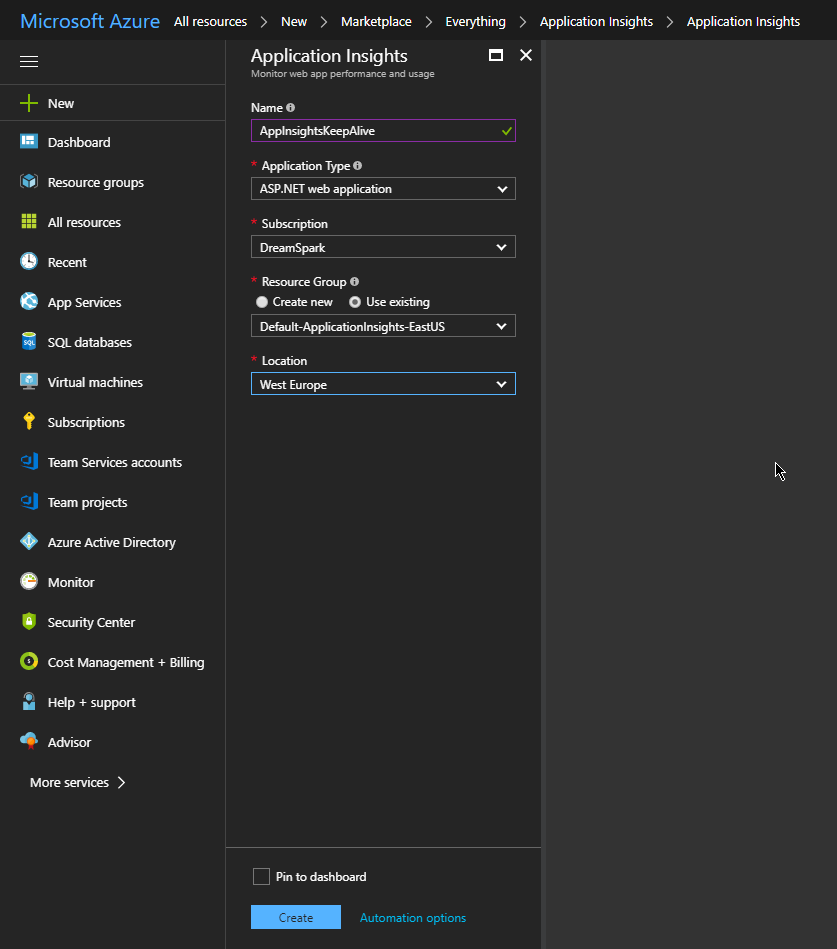
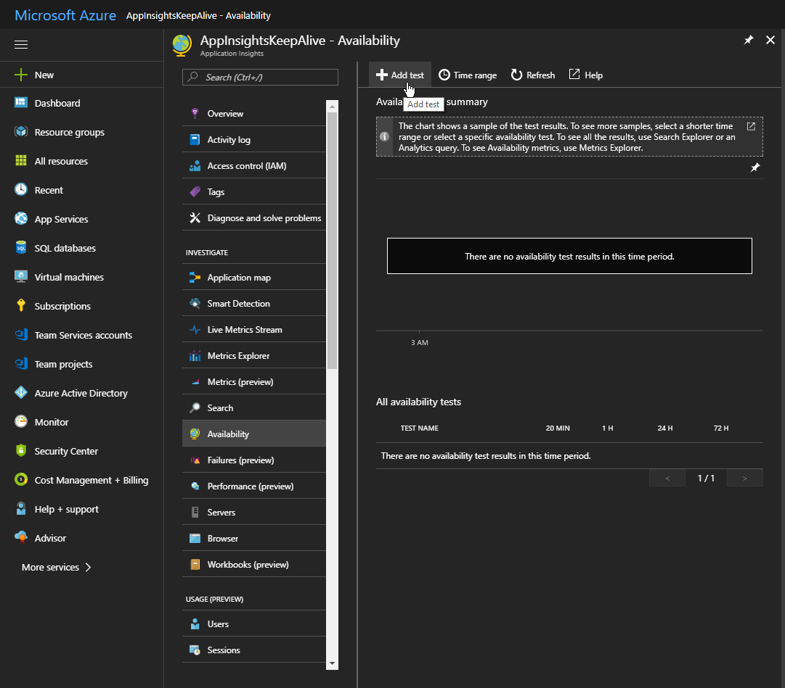
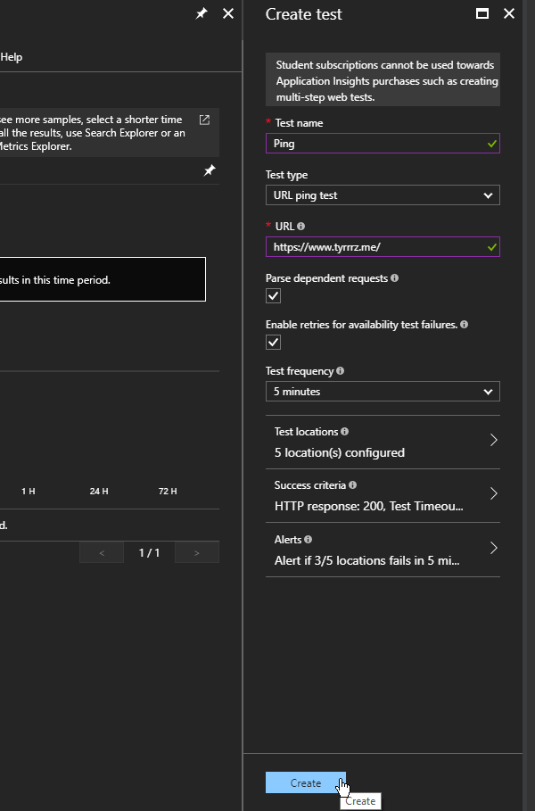

Web applications hosted in IIS adhere to the _Idle Timeout_ setting, which defines a time period of inactivity after which an application is shut down. Subsequent requests will trigger the application to start up again, but it usually takes a while -- this rather small ASP.net Core website takes around 10 seconds to start and respond to first request.

If you have access to the IIS Manager, it's possible to change the timeout or disable it altogether, but this is not an option for those using shared hosting.

## Sending requests to keep application alive

The workaround is pretty obvious -- the application needs to keep receiving requests to prevent IIS from killing it. Default idle timeout is 20 minutes so you would need to send requests at least this often, although some hosting providers might have different settings.

I decided to find something that would keep sending requests to my website, on a never-ending recurring basis.

## Using Application Insights to poll your website

Application Insights offers a very useful feature called _Availability_ -- it lets you create tests that check your web app's availability and have them run as often as every 5 minutes. Unlike other uptime monitors, these tests actually send `GET` requests to your app which is enough to keep it alive. The best part is that you can create an Application Insights resource on a free Azure account, and you don't even need to have it properly configured.

### Setting up availability tests

Go to [Azure Portal](https://portal.azure.com/) and add a new Application Insights resource.

Navigate to **Availability** under **Investigate** section. Find the **Add test** button to create a new test.

Configure the test with your URL and click **Create**.

Once it's set up, Azure will poll your website every few minutes, keeping it alive and sending you alerts if it goes down.
