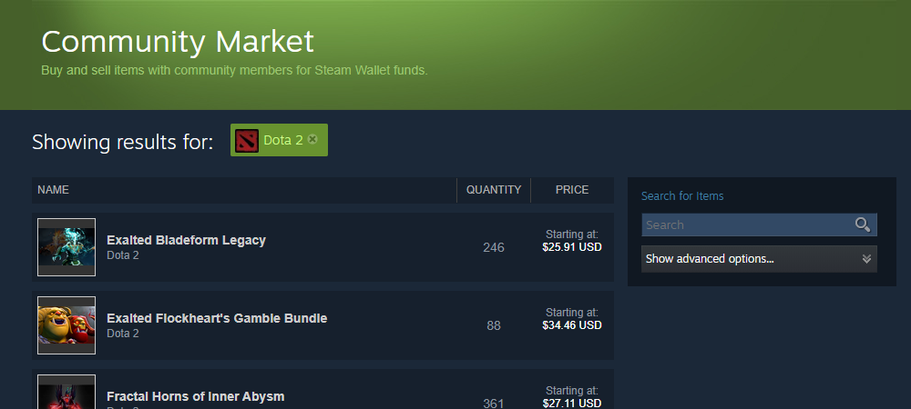
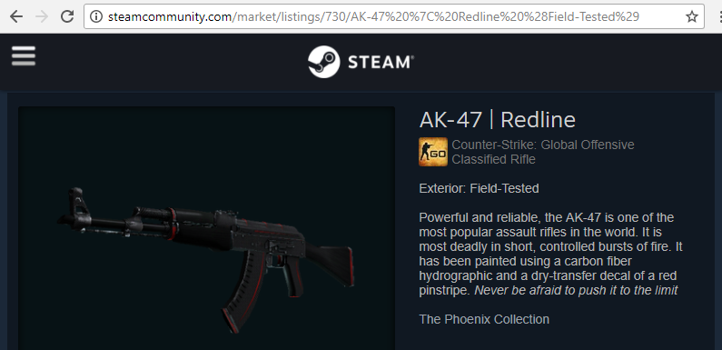

At some point I was contracted to make a WordPress plugin that displays some basic Steam Market information on an item -- its name, image, price, etc. It turned out a bit less trivial than I thought because the Steam API doesn't offer any endpoints related to the Steam Market, probably to make developing bots slightly harder.

After inspecting the listing pages with Chrome Developer Console, I found that all of the pricing information is pulled using an AJAX request, which is very helpful as it can be easily reverse-engineered.

Things are more difficult when it comes to getting item image -- there is no obvious pattern to determine the image URL from the item's name or anything like that. However, there is another AJAX request used to render chunks of HTML for other listings of the same item, which also includes images.

## Getting general listing info

### Request format

Steam's frontend uses the following AJAX request to get basic listing information:

```php
$url =
    'http://steamcommunity.com/market/priceoverview/'.
    '?appid='.$game.
    '&currency='.$currency.
    '&market_hash_name='.rawurlencode($name);
```

It has 3 required parameters:

- `appid` -- ID of the Steam game, to which the item belongs.
- `currency` -- ID of the currency, in which the prices are shown.
- `market_hash_name` -- URL-encoded full name of the item.

### Parameter values

The values for two main parameters, `appid` and `market_hash_name` can be extracted directly from the URL of any existing item listing, as shown in the following screenshot:



In this case the values are:

- `appid` is equal to `730`.
- `market_hash_name` is equal to `AK-47%20%7C%20Redline%20%28Field-Tested%29`.

I'm not sure what is the full list of valid `currency` values, however US dollar has the ID of `1`.

Having put the correct parameter values, this is how the request URL should look for this example: <http://steamcommunity.com/market/priceoverview/?appid=730&currency=1&market_hash_name=AK-47%20%7C%20Redline%20%28Field-Tested%29>

### Response

Executing that request will yield the following JSON response:

```json
{
  "success": true,
  "volume": "434",
  "median_price": "$26.50",
  "lowest_price": "$26.39"
}
```

It can contain up to 4 values:

- `success` -- whether the request was successful.
- `volume` -- total number of listings for this item.
- `median_price` -- the median price of this item.
- `lowest_price` -- the lowest price of this item.

If `success` is not equal to `true`, it usually means that the parameters were not set correctly.

It's also worth noting that `median_price` and `volume` are sometimes not present in the response, I'm not sure why.

## Getting item image

### Request format

This request also uses the same set of parameters as the last one:

```php
$market_page_url = 'http://steamcommunity.com/market/listings/'.$game.'/'.rawurlencode($name);
$url = $market_page_url.'/render?start=0&count=1&currency='.$currency.'&format=json';
```

Setting `count` to `1` in the request makes it return results for only one listing, reducing the content length of the response.

Request URL for the item in question looks like this: http://steamcommunity.com/market/listings/730/AK-47%20%7C%20Redline%20%28Field-Tested%29/render?start=0&count=1&currency=1&format=json

### Response

```json
{
  "success": true,
  "start": 0,
  "pagesize": "1",
  "total_count": 2302,
  "results_html": "<div class=\"market_listing_table_header\">\r\n\t<div class=\"market_listing_price_listings_block\">\r\n\t\t<span class=\"market_listing_right_cell market_listing_action_buttons\"></span>\r\n\t\t<span class=\"market_listing_right_cell market_listing_their_price\">PRICE</span>\r\n\t</div>\r\n\t<span class=\"market_listing_right_cell market_listing_seller\">SELLER</span>\r\n\t<div><span class=\"market_listing_header_namespacer\"></span>NAME</div>\r\n</div>\r\n\r\n<div class=\"market_listing_row market_recent_listing_row listing_2428992060878056432\" id=\"listing_2428992060878056432\">\r\n\t\r\n\t<div class=\"market_listing_item_img_container\">\t\t\t</div>\r\n\t\t<div class=\"market_listing_price_listings_block\">\r\n\t\t\t\t\t<div class=\"market_listing_right_cell market_listing_action_buttons\">\r\n\t\t\t\t\t\t\t\t\t<div class=\"market_listing_buy_button\">\r\n\t\t\t\t\t\t\t\t\t\t\t\t\t<a href=\"javascript:BuyMarketListing('listing', '2428992060878056432', 730, '2', '12735545843')\" class=\"item_market_action_button btn_green_white_innerfade btn_small\">\r\n\t\t\t\t\t\t\t\t<span>\r\n\t\t\t\t\t\t\t\t\tBuy Now\t\t\t\t\t\t\t\t</span>\r\n\t\t\t\t\t\t\t</a>\r\n\t\t\t\t\t\t\t\t\t\t\t</div>\r\n\t\t\t\t\t\t\t</div>\r\n\t\t\t\t<div class=\"market_listing_right_cell market_listing_their_price\">\r\n\t\t\t<span class=\"market_table_value\">\r\n\t\t\t\t\t\t\t\t\t\t\t\t\t\t<span class=\"market_listing_price market_listing_price_with_fee\">\r\n\t\t\t\t\t\t$6.72\t\t\t\t\t</span>\r\n\t\t\t\t\t<span class=\"market_listing_price market_listing_price_with_publisher_fee_only\">\r\n\t\t\t\t\t\t$6.43\t\t\t\t\t</span>\r\n\t\t\t\t\t<span class=\"market_listing_price market_listing_price_without_fee\">\r\n\t\t\t\t\t\t$5.85\t\t\t\t\t</span>\r\n\t\t\t\t\t\t\t\t<br/>\r\n\t\t\t\t\t\t\t</span>\r\n\t\t</div>\r\n\t</div>\r\n\t<div class=\"market_listing_right_cell market_listing_seller\">\r\n\t\t<span class=\"market_listing_owner_avatar\">\r\n\t\t\t<span class=\"playerAvatar in-game\" >\r\n\t\t\t\t\r\n\t\t\t</span>\r\n\t\t</span>\r\n\t</div>\r\n\r\n\t\t<div class=\"market_listing_item_name_block\">\r\n\t\t<span id=\"listing_2428992060878056432_name\" class=\"market_listing_item_name\" style=\"color: #D2D2D2;\">AK-47 | Redline (Field-Tested)</span>\r\n\t\t<br/>\r\n\t\t<span class=\"market_listing_game_name\">Counter-Strike: Global Offensive</span>\r\n\t</div>\r\n\t<div style=\"clear: both;\"></div>\r\n</div>\r\n"

  // The rest is removed for brevity because the response is actually quite big
  // ...
}
```

This JSON object has a `results_html` node which contains the full formatted HTML code used to render item listings. Inside of it, there should be an `` node with class `market_listing_item_img`, the value of its `src` attribute is the item's image URL.

### Image resolution

Typical image URL will look like this:

http://steamcommunity-a.akamaihd.net/economy/image/-9a81dlWLwJ2UUGcVs_nsVtzdOEdtWwKGZZLQHTxDZ7I56KU0Zwwo4NUX4oFJZEHLbXH5ApeO4YmlhxYQknCRvCo04DEVlxkKgpot7HxfDhjxszJemkV09-5lpKKqPrxN7LEmyVQ7MEpiLuSrYmnjQO3-UdsZGHyd4_Bd1RvNQ7T_FDrw-_ng5Pu75iY1zI97bhLsvQz/62fx62f/

In the end of that URL the requested image dimensions are specified, in this case it's set to `62fx62f`. Changing these values will make the server return images of any given size, however the image will always remain proportional and will not scale above its maximum size -- the empty space will be transparent and the actual image will be centered.

## Notes

If too many requests are made in a short time span, Steam will start returning `null` instead of a proper response. I'm not sure what the actual limits are, but I'm handling this in my plugin by caching all responses for 15 minutes.

## My implementation

I implemented the WordPress plugin using shortcode pattern which is convenient for passing parameters and specifying options.

```php
[steam_market_excerpt game="440" name="Mann Co. Supply Crate Key"]
[steam_market_excerpt game="730" name="AK-47 | Elite Build (Factory New)"]
[steam_market_excerpt game="753" name="203160-A Survivor Is Born (Foil Trading Card)" displayname="A Survivor Is Born (Foil)"]
```

More info and source code can be found [here](https://github.com/Tyrrrz/WPSteamMarketExcerpt).
