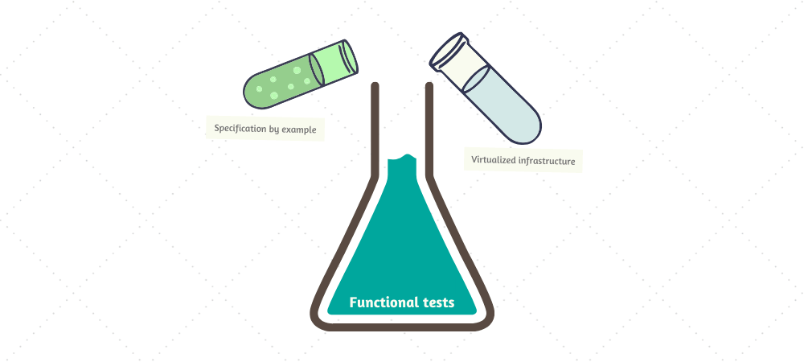

Humans are extremely efficient creatures. We are able to evolve our intelligence quickly by adopting the knowledge of previous generations, without necessarily questioning it too much. This lets us pool our collective minds and rely on smarter people to have figured out all the boring stuff, while we can focus our [slow-thinking system"](https://en.wikipedia.org/wiki/Thinking,_Fast_and_Slow) on what matters most.

In the world of software development, these shards of indisputable knowledge are what we call _best practices_. Two words to start or end code review arguments, to put junior developers out of their comfort zone and to inflate the ego of senior developers. After all, software design, architecture, processes is mostly a solved problem. Or is it?

As a developer working full-time at a company I rarely ever care whether I'm working efficiently or not. After all, I'm getting paid for my time, not my intelligence, why would I try to find a way to do things faster? That seems counterproductive.

However, that's by day. By night I'm an open source developer, maintaining a dozen fairly well-used projects, fixing bugs, adding new features, making new releases. This is where I actually benefit from being more efficient. I don't want to hunt regressions in my code, deal with technical debt, or get locked in because of poor design decisions. Since no one is paying for my time, I want to optimize how I spend it. After all, I'd prefer to sleep at night instead of fixing bugs.

Sometimes it makes sense to question best practices, for example when they don't work out. This has been my experience with unit testing for almost as long as I can remember. Although I didn't know what it was caused until much later.

The current reality of software development is that automated testing is absolutely essential. At this point, I'm pretty sure that even every business analyst or product owner understands that it's not possible to have a consistent and reliable production flow of any software product without automated testing. Although I'm sure I will get disputed on that by someone, who's incidentally currently working on integrating SharePoint 2010 with the Perforce client, all running on .NET Framework 3.5. I haven't worked in a company that doesn't consider testing as part of the development process, but maybe I'm just a choosy picker.

Interestingly enough, whenever someone mentions automated testing in the context of developers, most people instantly assume _unit testing_. The industry somehow developed this stereotype that the only test a developer is capable of writing is a unit test. To the point that these two things became so synonymous, they are used almost interchangeably, ultimately hurting the credibility and usefulness of both terms in the process.

In this article I will show you why unit testing inherently makes sense but fails to deliver on the promise. I will also explain how I'm testing code myself and the approaches I've arrived at.

## Fallacy of unit testing

Unit testing is a popular term in software development and, as such, is void of any useful meaning. So before we continue any further, let's establish what exactly I mean when I say "unit testing".

A unit test is a piece of code that verifies that an individual, **logically-independent** and **smallest possible** part of software **behaves as intended**. In most contexts, this _part_, also known as a _unit_, refers to an interface such as a class or a function. If the unit we intend to test interacts with other parts of the program, these dependencies are replaced with stubs or mocks, in order to facilitate testing in complete isolation. The idea is that, if we ensure that all individual atomic pieces of a system work correctly, the probability of finding a defect in general is greatly reduced.

With that out of the way, let's look at some of the benefits that unit tests provide, further referenced as _unit testing fallacies_:

- Unit tests help find problems quickly and early.
- Unit tests detect regressions and provide confidence in refactoring.
- Unit tests are easier and faster to write because they are small and independent.
- Unit tests enforce good design principles.
- Unit tests provide a form of living documentation of the system.

## Summary

Whenever you say "testing" in a room full of software developers, it is immediately assumed that you're talking about unit testing. I believe it's really unfortunate the industry arrived at this stereotype.

I think unit testing is inefficient and most of the time not worth doing at all. You're almost always better of writing wider-scope tests that cover a larger set of interactions, such as functional tests. Functional tests should match specifications that describe how the user can interact with the system and what they can observe in the process.

Unit testing should be prioritized lower, ultimately considering it only as last resort. Instead of spending time trying to make your code more "unit-testable", it's more beneficial to make it more "functionally-testable" instead.

Some other articles on the topic of unit testing that I personally found interesting:

- [Fallacy of Unit Testing (Aaron W. Hsu)](https://www.sacrideo.us/the-fallacy-of-unit-testing)
- [Slow database test fallacy (David Heinemeier Hansson)](https://dhh.dk/2014/slow-database-test-fallacy.html)
- [Test-induced design damage (David Heinemeier Hansson)](https://dhh.dk/2014/test-induced-design-damage.html)
- [Write tests. Not too many. Mostly integration (Kent C. Dodds)](https://kentcdodds.com/blog/write-tests)
- [Why Most Unit Testing is Waste (James O. Coplien)](https://rbcs-us.com/documents/Why-Most-Unit-Testing-is-Waste.pdf)
- [Mocking is a Code Smell (Eric Elliott)](https://medium.com/javascript-scene/mocking-is-a-code-smell-944a70c90a6a)
