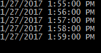
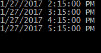

Applications commonly employ recurring tasks that need to execute at specific times, irrelevant of when the application started. For example, you might be developing a Windows service that queries a Web API every day at 18:35, processes the data and then saves it locally.

There are some libraries that provide a nice interface to register and configure recurring tasks, such as [FluentScheduler](https://github.com/fluentscheduler/FluentScheduler), however sometimes you don't want the overhead of extra dependencies. Based on the complexity of the use case, it might be better to roll your own solution.

## Custom timer

I wanted to extended one of the existing timers provided by the framework, adding the ability to specify time snapping. My use cases included on-the-minute and on-the-hour timers that would tick at the closest minute/hour and then follow the given interval, but I also wanted it to be easily configurable for more specific cases.

After some experimenting, I found that the easiest way to do it was to specify the time of the first tick and an interval -- the timer would initially wait the remaining time until first tick, and then just work normally after that. If the first tick was configured to have happened in the past, the timer would determine when is the closest next tick supposed to happen based on interval.

### Implementation

```csharp
public class SyncedTimer : IDisposable
{
    private readonly Timer _internalTimer;

    private bool _isEnabled;
    private DateTime _firstTickDateTime;
    private TimeSpan _interval;

    public bool IsEnabled
    {
        get => _isEnabled;
        set
        {
            _isEnabled = value;
            SyncInterval();
            _internalTimer.Enabled = value;
        }
    }

    public DateTime FirstTickDateTime
    {
        get => _firstTickDateTime;
        set
        {
            _firstTickDateTime = value;
            SyncInterval();
        }
    }

    public TimeSpan Interval
    {
        get => _interval;
        set
        {
            _interval = value;
            SyncInterval();
        }
    }

    public event EventHandler Tick;

    public SyncedTimer()
    {
        // Using System.Timers.Timer, but can be replaced with a different one
        _internalTimer = new System.Timers.Timer
        {
            AutoReset = true
        };
        _internalTimer.Elapsed += (sender, args) => TimerTickInternal();

        FirstTickDateTime = DateTime.Today;
        Interval = TimeSpan.FromMilliseconds(100);
    }

    public SyncedTimer(DateTime firstTickDateTime, TimeSpan interval)
    {
        FirstTickDateTime = firstTickDateTime;
        Interval = interval;
    }

    public SyncedTimer(TimeSpan interval)
        : this(DateTime.Today, interval)
    {
    }

    private void SyncInterval()
    {
        var now = DateTime.Now;

        // First tick isn't supposed to happen yet
        if (now < FirstTickDateTime)
        {
            // Set the interval to whatever time is left
            _internalTimer.Interval = (FirstTickDateTime - now).TotalMilliseconds;
        }
        // Past first tick already
        else
        {
            // How much time has passed?
            var timePassed = now - FirstTickDateTime;

            // How many ticks were already triggered (or were supposed to)?
            var ticks = timePassed.TotalMilliseconds / Interval.TotalMilliseconds;

            // How much time left until the next tick time?
            var msUntilNextTick = (Math.Ceiling(totalTicks) - totalTicks) * Interval.TotalMilliseconds;

            // Make sure it's at least 1 ms
            if (msUntilNextTick < 1)
                msUntilNextTick = 1;

            // Use that as the interval
            _internalTimer.Interval = msUntilNextTick;
        }
    }

    private void TimerTickInternal()
    {
        TimerTick();
        SyncInterval();
    }

    protected virtual void TimerTick()
    {
        Tick?.Invoke(this, EventArgs.Empty);
    }

    public void Dispose()
    {
        _internalTimer.Dispose();
    }
}
```

`FirstTickDateTime` and `Interval` are the properties that control the timer's workflow. The first one specifies when the first tick is or was expected to happen, the second one specifies the interval in time between each tick, after the very first one.

This timer synchronizes itself whenever `SyncInterval()` method is called. If the first planned tick hasn't happened yet, it sets the interval equal to however much time is left until then. Otherwise, it counts how many ticks have already happened (or had to, in theory) and calculates how much time is left until the next one, setting its internal interval to that value.

### Usage

Since `FirstTickDateTime` defaults to `DateTime.Today` (which is the past midnight), simple cases like on-the-minute and on-the-hour recurring tasks don't require setting it. Instead just initialize the timer like you normally would.

```csharp
// Ticks every minute, on the minute
var timer = new SyncedTimer(TimeSpan.FromMinutes(1));
timer.Tick += (sender, args) => Console.WriteLine(DateTime.Now);
timer.IsEnabled = true;
```

You will notice that, no matter when the program is started, the timer ticks exactly on the minute.



For a more complicated example, we can set the first tick time to 00:15, with an interval of one hour.

```csharp
// Ticks every hour, at :15 of the hour
var timer = new SyncedTimer(DateTime.Today.AddMinutes(15), TimeSpan.FromHours(1));
timer.Tick += (sender, args) => Console.WriteLine(DateTime.Now);
timer.IsEnabled = true;
```

This example will output the current time to console every hour, but on the :15 minute mark instead.


