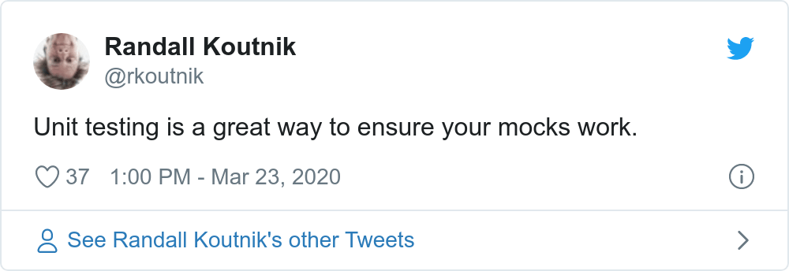

The importance of testing in modern software development is really hard to overstate. Delivering a successful product is not something you do once and forget about, but is rather a continuous recurring process. With every line of code that changes, software has to remain in a functional state, which implies the need for rigorous testing.

Over time, as the software industry evolved, testing practices have matured as well. Gradually moving towards automation, testing approaches have also influenced software design itself, spawning mantras like test-driven development, emphasizing patterns such as dependency inversion, and popularizing high-level architectures that are built around it.

Nowadays, automated testing is embedded so deeply within our perception of software development, it's hard to imagine one without the other. And since that ultimately enables us to produce software quickly without sacrificing quality, it's hard to argue that it's not a good thing.

However, despite there being many different approaches, modern "best practices" primarily push developers specifically towards *unit testing*. Tests, whose scope lies higher on [Martin Fowler's pyramid](https://martinfowler.com/articles/practical-test-pyramid.html#TheTestPyramid) are either written as part of a wider suite (often by completely different people) or even disregarded entirely.

The benefit of this approach is often supported by the argument that unit tests provide the most value during development because they're able to catch errors quickly and help enforce design patterns that facilitate modularity. This idea has become so widely accepted that the term "unit testing" is now somewhat conflated with automated testing in general, losing part of its meaning and contributing to confusion.

When I was a less experienced developer, I believed in following these "best practices" to the letter, as I thought that would make my code better. I didn't particularly enjoy writing unit tests because of all the ceremony involved with abstractions and mocking, but it was the recommended approach after all, so who am I to know better.

It was only later, as I've experimented more and built more projects, that I started to realize that there are much better ways to approach testing and that **focusing on unit tests is**, in most cases, **a complete waste of time**.

Aggressively-popularized "best practices" often have a tendency of manifesting cargo cults around them, enticing developers to apply design patterns or use specific approaches without giving them a much needed second thought. In the context of automated testing, I find this prevalent when it comes to our industry's unhealthy obsession with unit testing.

In this article I will share my observations about this testing technique and explain why I believe it to be inefficient. I'll also explain which approaches I'm currently using instead to test my code, both in open source projects and day-to-day work.

*Note: this article contains code examples which are written in C#, but the language itself is not (too) important to the points I'm making.*

## Designing with unit tests in mind

Unit tests, as evident by the name, revolve around the concept of a "unit", which denotes a very small isolated part of a larger system. There is no formal definition of what a unit is or how small it should be, but it's mostly accepted that it corresponds to an individual function of a module (or method of an object).

Normally, when the code isn't written with unit tests in mind, it may be impossible to test some functions in complete isolation because they can have external dependencies. In order to _work around_ this issue, we can apply the dependency inversion principle and replace concrete dependencies with abstractions. These abstractions can then be substituted with real or fake implementations, depending on whether the code is executing normally or as part of a test.

Besides that, unit tests are expected to be pure. For example, if a function contains code that writes data to the file system, that part needs to be abstracted away as well, otherwise the test that verifies such behavior will be considered an integration test instead, since its coverage extends to the unit's integration with the file system.

Considering the factors mentioned above, we can conclude that **unit tests are only useful to verify pure business logic inside of a given function**. Their scope does not extend to testing side-effects or other integrations because that belongs to the domain of integration testing.

To illustrate how these nuances affect design, let's take a look at an example of a simple system that we want to test. Imagine we're working on an application that calculates local sunrise and sunset times, which it does through the help of the following two classes:

```csharp
public class LocationProvider : IDisposable
{
    private readonly HttpClient _httpClient = new HttpClient();

    // Gets location by query
    public Task<Location> GetLocationAsync(string locationQuery) { /* ... */ }

    // Gets current location by IP
    public Task<Location> GetLocationAsync() { /* ... */ }

    public void Dispose() => _httpClient.Dispose();
}

public class SolarCalculator : IDiposable
{
    private readonly LocationProvider _locationProvider = new LocationProvider();

    // Gets solar times for current location and specified date
    public Task<SolarTimes> GetSolarTimesAsync(DateTimeOffset date) { /* ... */ }

    public void Dispose() => _locationProvider.Dispose();
}
```

Although the design above is perfectly valid in terms of OOP, neither of these classes are actually unit-testable. Because `LocationProvider` depends on its own instance of `HttpClient` and `SolarCalculator` in turn depends on `LocationProvider`, it's impossible to isolate the business logic that may be contained within methods of these classes.

Let's iterate on that code and replace concrete implementations with abstractions:

```csharp
public interface ILocationProvider
{
    Task<Location> GetLocationAsync(string locationQuery);

    Task<Location> GetLocationAsync();
}

public class LocationProvider : ILocationProvider
{
    private readonly HttpClient _httpClient;

    public LocationProvider(HttpClient httpClient) =>
        _httpClient = httpClient;

    public Task<Location> GetLocationAsync(string locationQuery) { /* ... */ }

    public Task<Location> GetLocationAsync() { /* ... */ }
}

public interface ISolarCalculator
{
    Task<SolarTimes> GetSolarTimesAsync(DateTimeOffset date);
}

public class SolarCalculator : ISolarCalculator
{
    private readonly ILocationProvider _locationProvider;

    public SolarCalculator(ILocationProvider locationProvider) =>
        _locationProvider = locationProvider;

    public Task<SolarTimes> GetSolarTimesAsync(DateTimeOffset date) { /* ... */ }
}
```

By doing so we were able to decouple `LocationProvider` from `SolarCalculator`, but in exchange our code nearly doubled in size. Also note that we had to drop `IDisposable` from both classes because they **no longer own their dependencies** and thus have no business taking responsibility for their lifecycle.

While these changes may seem as an improvement to some, it's important to point out that the interfaces we've defined serve **no practical purpose other than making unit testing possible**. There's no need for actual polymorphism in our design, so, as far as our code is concerned, these abstractions are _autotelic_.

Let's try to reap the benefits of all that work and write a unit test for `SolarCalculator.GetSolarTimesAsync`:

```csharp
public class SolarCalculatorTests
{
    [Fact]
    public async Task GetSolarTimesAsync_ForKyiv_ReturnsCorrectSolarTimes()
    {
        // Arrange
        var location = new Location(50.45, 30.52);
        var date = new DateTimeOffset(2019, 11, 04, 00, 00, 00, TimeSpan.FromHours(+2));

        var expectedSolarTimes = new SolarTimes(
            new TimeSpan(06, 55, 00),
            new TimeSpan(16, 29, 00)
        );

        var locationProvider = Mock.Of<ILocationProvider>(lp =>
            lp.GetLocationAsync() == Task.FromResult(location)
        );

        var solarCalculator = new SolarCalculator(locationProvider);

        // Act
        var solarTimes = await solarCalculator.GetSolarTimesAsync(date);

        // Assert
        solarTimes.Should().BeEquivalentTo(expectedSolarTimes);
    }
}
```

Here we have a basic test that verifies that `SolarCalculator` works correctly for a known location. Since unit tests and their units are tightly coupled, we're following the recommended naming convention, where the test class is named after the class under test, and the name of the test method follows the `Method_Precondition_Result` pattern.

In order to simulate the desired precondition in the "arrange" phase, we have to inject corresponding behavior into the unit's dependency, `ILocationProvider`. In this case we do that by substituting the return value of `GetLocationAsync()` with a location for which the correct solar times are already known ahead of time.

Note that although `ILocationProvider` exposes two different methods, from the contract perspective **we have no way of knowing which one actually gets called**. This means that by choosing to mock a specific one of these methods, we are making an **assumption about the underlying implementation** of the method we're testing (which was deliberately hidden in the previous snippets).

All in all the test does correctly verify that the business logic inside `GetSolarTimesAsync` works as expected. However, let's expand on some of the observations we've made in the process.

___

1. Unit tests **have a limited purpose**

It's important to understand that the purpose of any unit test is very simple: verify business logic in an isolated scope. Depending on which interactions you intend to test, unit testing may or may not be the right tool for the job.

For example, does it make sense to unit test a method that calculates solar times using a long and complicated mathematical algorithm? Most likely, _yes_.

Does it make sense to unit test a method that sends a request to a REST API to get geographical coordinates? Most likely, _not_.

If you treat unit testing as a goal in itself, you will quickly find that, despite putting a lot of effort, most tests will not be able to provide you with the confidence you need, simply because they're testing the wrong thing. In many cases it's much more beneficial to test wider interactions with integration tests, rather than focusing specifically on unit tests.

Interestingly enough, some developers often get confused as to what constitutes a unit test or an integration test, which leads to them writing integration tests while still referring to them as unit tests. Although it could be argued that a unit size can be chosen arbitrarily and can span multiple components, this makes the concept very fuzzy, ultimately just making the overall usage of the term "unit test" completely useless.

2. Unit tests **lead to more complicated design**

One of the most popular arguments in favor of unit testing is that it enforces you to design software in a highly modular way. This builds on an assumption that it's easier to reason about code when it's split into many smaller components rather than a few larger ones.

In reality, however, it often leads to the opposite problem, where a particular feature may end up being very fragmented. This makes it much harder to assess the code because a developer needs to scan through multiple components that make up what should've been a single cohesive element.

Additionally, the abundant usage of abstraction, which is required to achieve component isolation, creates a lot of unnecessary indirection. Although an incredibly powerful and useful technique in itself, abstraction inevitably increases cognitive complexity, making it further more difficult to reason about the code.

Through that indirection we also end up losing some degree of encapsulation that we were able to maintain otherwise. For example, the responsibility of managing lifetimes of individual dependencies shifts from components that contain them to some other unrelated service (usually the dependency container).

Some of that infrastructural complexity can be also delegated to a dependency injection framework, making it easier to configure, manage, and activate dependencies. However, that reduces portability, which may be undesirable in some cases, for example when writing a library.

At the end of the day, while it's clear that unit testing does influence software design, it's highly debatable whether that's really a good thing.

3. Unit tests **are expensive**

Logically, it would make sense to assume that, since they are small and isolated, unit tests should be really easy and quick to write. This is another fallacy that seems to be rather popular, especially among managers.

Even though the previously-mentioned modular architecture lures us into thinking that individual components can be considered separately from each other, unit tests don't actually benefit from that. In fact, the complexity of a unit test only grows proportionally to the number of external interactions the unit has, due to all the work that you have to do to achieve isolation while still exercising required behavior.

Besides that, unit tests are by design very tightly coupled to the code they're testing, which means that any effort to make a change is effectively doubled as the test suite needs to be updated as well. What makes this worse is that very few developers seem to find doing that an exciting task, often pawning it off to more junior members on the team.

Of course, given infinite resources we wouldn't be considering the cost aspect at all, but unfortunately that is not the reality we live in.

4. Unit tests **rely on implementation details**

The unfortunate implication of mock-based unit testing is that any test written with this approach is inherently implementation-aware.

5. Unit tests **don't exercise user behavior**

[](https://twitter.com/rkoutnik/status/1242073856128495620)

By now it should be painfully obvious that unit testing is not only a silver bullet this approach is often touted as, but a rather niche tool for very specific cases.

## Why unit testing

## Detecting regressions

One of the expected benefits of automated tests is that we should be able to recklessly make changes to our code without worrying that some of the existing functionality may stop working properly. Once the tests are in place, any breaking changes should immediately be caught and reported.


## Unit tests are small and fast

Size is a very important factor in unit tests, as they should cover a very small portion of the system. Because of that, it makes sense to assume such tests should also execute quickly.

## Pure functions

So does that mean that unit tests should not be used at all? Well, as we've seen the issue with unit tests arise only if we're testing a unit which has dependencies on other units that we need to mock.

## Fakes over mocks

## Think like a user

## Coverage metrics are useful

## Summary

I'm not the first person to write an article about the questionable value of unit testing in modern software development. Here are some other great posts:

- [Write tests. Not too many. Mostly integration (Kent C. Dodds)](https://kentcdodds.com/blog/write-tests)
- [Fallacy of Unit Testing (Aaron W. Hsu)](https://www.sacrideo.us/the-fallacy-of-unit-testing)
- [Why Most Unit Testing is Waste (James O. Coplien)](https://rbcs-us.com/documents/Why-Most-Unit-Testing-is-Waste.pdf)
- [Mocking is a Code Smell (Eric Elliott)](https://medium.com/javascript-scene/mocking-is-a-code-smell-944a70c90a6a)
- [Test-induced design damage (David Heinemeier Hansson)](https://dhh.dk/2014/test-induced-design-damage.html)
- [Slow database test fallacy (David Heinemeier Hansson)](https://dhh.dk/2014/slow-database-test-fallacy.html)
- [Testing of Microservices at Spotify (André Schaffer)](https://labs.spotify.com/2018/01/11/testing-of-microservices)
