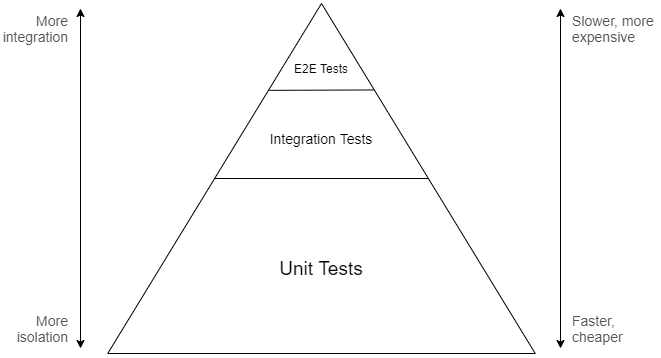
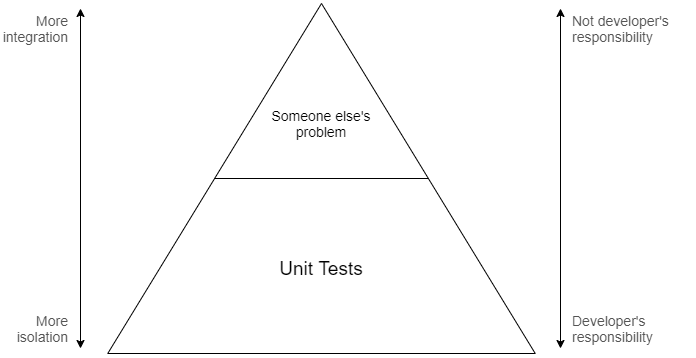
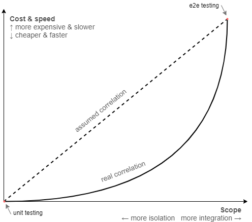

The importance of testing in modern software development is really hard to overstate. Delivering a successful product is not something you do once and forget about, but is rather a continuous recurring process. With every line of code that changes, software has to remain in a functional state, which implies the need for rigorous testing.

Over time, as the software industry evolved, testing practices have matured as well. Gradually moving towards automation, testing approaches have also influenced software design itself, spawning mantras like test-driven development, emphasizing patterns such as dependency inversion, and popularizing high-level architectures that are built around it.

Nowadays, automated testing is embedded so deeply within our perception of software development, it's hard to imagine one without the other. And since that ultimately enables us to produce software quickly without sacrificing quality, it's hard to argue that it's not a good thing.

However, despite there being many different approaches, modern "best practices" primarily push developers specifically towards *unit testing*. Tests, whose scope lies higher on [Mike Cohn's pyramid](https://martinfowler.com/articles/practical-test-pyramid.html#TheTestPyramid) are either written as part of a wider suite (often by completely different people) or even disregarded entirely.

The benefit of this approach is often supported by the argument that unit tests provide the most value during development because they're able to catch errors quickly and help enforce design patterns that facilitate modularity. This idea has become so widely accepted that the term "unit testing" is now somewhat conflated with automated testing in general, losing part of its meaning and contributing to confusion.

When I was a less experienced developer, I believed in following these "best practices" to the letter, as I thought that would make my code better. I didn't particularly enjoy writing unit tests because of all the ceremony involved with abstractions and mocking, but it was the recommended approach after all, so who am I to know better.

It was only later, as I've experimented more and built more projects, that I started to realize that there are much better ways to approach testing and that **focusing on unit tests is**, in most cases, **a complete waste of time**.

Aggressively-popularized "best practices" often have a tendency of manifesting cargo cults around them, enticing developers to apply design patterns or use specific approaches without giving them a much needed second thought. In the context of automated testing, I find this prevalent when it comes to our industry's unhealthy obsession with unit testing.

In this article I will share my observations about this testing technique and explain why I believe it to be inefficient. I'll also explain which approaches I'm currently using instead to test my code, both in open source projects and day-to-day work.

*Note: this article contains code examples which are written in C#, but the language itself is not (too) important to the points I'm making.*

## Fallacies of unit testing

Unit tests, as evident by the name, revolve around the concept of a "unit", which denotes a very small isolated part of a larger system. There is no formal definition of what a unit is or how small it should be, but it's mostly accepted that it corresponds to an individual function of a module (or method of an object).

Normally, when the code isn't written with unit tests in mind, it may be impossible to test some functions in complete isolation because they can have external dependencies. In order to _work around_ this issue, we can apply the dependency inversion principle and replace concrete dependencies with abstractions. These abstractions can then be substituted with real or fake implementations, depending on whether the code is executing normally or as part of a test.

Besides that, unit tests are expected to be pure. For example, if a function contains code that writes data to the file system, that part needs to be abstracted away as well, otherwise the test that verifies such behavior will be considered an integration test instead, since its coverage extends to the unit's integration with the file system.

Considering the factors mentioned above, we can conclude that **unit tests are only useful to verify pure business logic inside of a given function**. Their scope does not extend to testing side-effects or other integrations because that belongs to the domain of integration testing.

To illustrate how these nuances affect design, let's take a look at an example of a simple system that we want to test. Imagine we're working on an application that calculates local sunrise and sunset times, which it does through the help of the following two classes:

```csharp
public class LocationProvider : IDisposable
{
    private readonly HttpClient _httpClient = new HttpClient();

    // Gets location by query
    public Task<Location> GetLocationAsync(string locationQuery) { /* ... */ }

    // Gets current location by IP
    public Task<Location> GetLocationAsync() { /* ... */ }

    public void Dispose() => _httpClient.Dispose();
}

public class SolarCalculator : IDiposable
{
    private readonly LocationProvider _locationProvider = new LocationProvider();

    // Gets solar times for current location and specified date
    public Task<SolarTimes> GetSolarTimesAsync(DateTimeOffset date) { /* ... */ }

    public void Dispose() => _locationProvider.Dispose();
}
```

Although the design above is perfectly valid in terms of OOP, neither of these classes are actually unit-testable. Because `LocationProvider` depends on its own instance of `HttpClient` and `SolarCalculator` in turn depends on `LocationProvider`, it's impossible to isolate the business logic that may be contained within methods of these classes.

Let's iterate on that code and replace concrete implementations with abstractions:

```csharp
public interface ILocationProvider
{
    Task<Location> GetLocationAsync(string locationQuery);

    Task<Location> GetLocationAsync();
}

public class LocationProvider : ILocationProvider
{
    private readonly HttpClient _httpClient;

    public LocationProvider(HttpClient httpClient) =>
        _httpClient = httpClient;

    public Task<Location> GetLocationAsync(string locationQuery) { /* ... */ }

    public Task<Location> GetLocationAsync() { /* ... */ }
}

public interface ISolarCalculator
{
    Task<SolarTimes> GetSolarTimesAsync(DateTimeOffset date);
}

public class SolarCalculator : ISolarCalculator
{
    private readonly ILocationProvider _locationProvider;

    public SolarCalculator(ILocationProvider locationProvider) =>
        _locationProvider = locationProvider;

    public Task<SolarTimes> GetSolarTimesAsync(DateTimeOffset date) { /* ... */ }
}
```

By doing so we were able to decouple `LocationProvider` from `SolarCalculator`, but in exchange our code nearly doubled in size. Also note that we had to drop `IDisposable` from both classes because they **no longer own their dependencies** and thus have no business taking responsibility for their lifecycle.

While these changes may seem as an improvement to some, it's important to point out that the interfaces we've defined serve **no practical purpose other than making unit testing possible**. There's no need for actual polymorphism in our design, so, as far as our code is concerned, these abstractions are _autotelic_.

Let's try to reap the benefits of all that work and write a unit test for `SolarCalculator.GetSolarTimesAsync`:

```csharp
public class SolarCalculatorTests
{
    [Fact]
    public async Task GetSolarTimesAsync_ForKyiv_ReturnsCorrectSolarTimes()
    {
        // Arrange
        var location = new Location(50.45, 30.52);
        var date = new DateTimeOffset(2019, 11, 04, 00, 00, 00, TimeSpan.FromHours(+2));

        var expectedSolarTimes = new SolarTimes(
            new TimeSpan(06, 55, 00),
            new TimeSpan(16, 29, 00)
        );

        var locationProvider = Mock.Of<ILocationProvider>(lp =>
            lp.GetLocationAsync() == Task.FromResult(location)
        );

        var solarCalculator = new SolarCalculator(locationProvider);

        // Act
        var solarTimes = await solarCalculator.GetSolarTimesAsync(date);

        // Assert
        solarTimes.Should().BeEquivalentTo(expectedSolarTimes);
    }
}
```

Here we have a basic test that verifies that `SolarCalculator` works correctly for a known location. Since unit tests and their units are tightly coupled, we're following the recommended naming convention, where the test class is named after the class under test, and the name of the test method follows the `Method_Precondition_Result` pattern.

In order to simulate the desired precondition in the arrange phase, we have to inject corresponding behavior into the unit's dependency, `ILocationProvider`. In this case we do that by substituting the return value of `GetLocationAsync()` with a location for which the correct solar times are already known ahead of time.

Note that although `ILocationProvider` exposes two different methods, from the contract perspective **we have no way of knowing which one actually gets called**. This means that by choosing to mock a specific one of these methods, we are making an **assumption about the underlying implementation** of the method we're testing (which was deliberately hidden in the previous snippets).

All in all the test does correctly verify that the business logic inside `GetSolarTimesAsync` works as expected. However, let's expand on some of the observations we've made in the process.

___

1. Unit tests **have a limited purpose**

It's important to understand that the purpose of any unit test is very simple: verify business logic in an isolated scope. Depending on which interactions you intend to test, unit testing may or may not be the right tool for the job.

For example, does it make sense to unit test a method that calculates solar times using a long and complicated mathematical algorithm? Most likely, _yes_.

Does it make sense to unit test a method that sends a request to a REST API to get geographical coordinates? Most likely, _not_.

If you treat unit testing as a goal in itself, you will quickly find that, despite putting a lot of effort, most tests will not be able to provide you with the confidence you need, simply because they're testing the wrong thing. In many cases it's much more beneficial to test wider interactions with integration tests, rather than focusing specifically on unit tests.

Interestingly enough, some developers often get confused as to what constitutes a unit test or an integration test, which leads to them writing integration tests while still referring to them as unit tests. Although it could be argued that a unit size can be chosen arbitrarily and can span multiple components, this makes the concept very fuzzy, ultimately just making the overall usage of the term "unit test" completely useless.

2. Unit tests **lead to more complicated design**

One of the most popular arguments in favor of unit testing is that it enforces you to design software in a highly modular way. This builds on an assumption that it's easier to reason about code when it's split into many smaller components rather than a few larger ones.

In reality, however, it often leads to the opposite problem, where a particular feature may end up being very fragmented. This makes it much harder to assess the code because a developer needs to scan through multiple components that make up what should've been a single cohesive element.

Additionally, the abundant usage of abstraction, which is required to achieve component isolation, creates a lot of unnecessary indirection. Although an incredibly powerful and useful technique in itself, abstraction inevitably increases cognitive complexity, making it further more difficult to reason about the code.

Through that indirection we also end up losing some degree of encapsulation that we were able to maintain otherwise. For example, the responsibility of managing lifetimes of individual dependencies shifts from components that contain them to some other unrelated service (usually the dependency container).

Some of that infrastructural complexity can be also delegated to a dependency injection framework, making it easier to configure, manage, and activate dependencies. However, that reduces portability, which may be undesirable in some cases, for example when writing a library.

At the end of the day, while it's clear that unit testing does influence software design, it's highly debatable whether that's really a good thing.

3. Unit tests **are expensive**

Logically, it would make sense to assume that, since they are small and isolated, unit tests should be really easy and quick to write. Unfortunately, this is just another fallacy that seems to be rather popular, especially among managers.

Even though the previously-mentioned modular architecture lures us into thinking that individual components can be considered separately from each other, unit tests don't actually benefit from that. In fact, the complexity of a unit test only grows proportionally to the number of external interactions the unit has, due to all the work that you have to do to achieve isolation while still exercising required behavior.

The example illustrated previously in this article is very simple, but in a real project it's not unusual to see the arrange phase spanning many long lines, just to set preconditions for a single test. In some cases the mocked behavior can be so complex, it's almost impossible to unravel it back to figure out what it was supposed to do.

Besides that, unit tests are by design very tightly coupled to the code they're testing, which means that any effort to make a change is effectively doubled as the test suite needs to be updated as well. What makes this worse is that very few developers seem to find doing that an enticing task, often just pawning it off to more junior members on the team.

4. Unit tests **rely on implementation details**

The unfortunate implication of mock-based unit testing is that any test written with this approach is inherently implementation-aware. By mocking a specific dependency, your test becomes reliant on how the code under test consumes that dependency, which is not regulated by the public interface.

This additional coupling often leads to unexpected issues, where seemingly non-breaking changes can cause tests to start failing as mocks become out of date. It can be very frustrating and ultimately discourages developers from trying to refactor code, because it's never clear whether the error in test comes from an actual regression or due to being reliant on some implementation detail.

Unit testing stateful code can be even more tricky because it may not be possible to observe mutations through the publicly exposed interface. To work around this, you would normally inject spies, which is a type of mocked behavior that records when a function is called, letting you ensure that the unit uses its dependencies correctly.

Of course, when you not only rely on a specific function being called, but also on how many times it happened or which arguments were passed, the test becomes even more coupled to the implementation. Tests written in such way are only useful if the internal specifics are not ever expected to change, which is a highly unreasonable expectation to have.

Relying too much on implementation details also makes the tests themselves very complex, considering how much setup is required to configure mocks in order to simulate a specific behavior, especially when the interactions are not that trivial or when there are a lot of dependencies. When the tests get so complicated that their own behavior is hard to reason about, who's going to write tests to test the tests?

5. Unit tests **don't exercise user behavior**

No matter what type of software you're developing, its goal is to provide value for the end user. In fact, the primary reason why we're writing automated tests in the first place is to ensure that there are no unintended defects that would diminish that value.

In most cases, the user works with the software through some top-level interface such as a UI, CLI, or API. While the code itself might involve numerous layers of abstractions, the only one that matters to the user is the one they get to actually see and interact with.

It doesn't even matter if a few layers deep there's a bug in some part of the system, as long as it never surfaces to the user and doesn't affect the provided functionality. Conversely, it makes no difference that we may have full coverage on all of the lower-level pieces, if there's a defect in the user interface that renders our system effectively useless.

Of course, if you want to ensure that something works correctly, you have to check that exact thing and see if it does. In our case, the best way to gain confidence in the system is to simulate how an actual user would interact with the top-level interface and see if it works properly according to expectations.

The problem with unit tests is that they're the exact opposite of that. Since we're always dealing with small isolated pieces of our code that the user doesn't directly interact with, we never test the actual user behavior.

Doing mock-based testing puts the value of such tests under an even bigger question, because the parts of our system that would've been used otherwise are replaced with mocks, further distancing the simulated environment from reality. It's impossible to gain confidence that the user will have a smooth experience by testing something that doesn't resemble that experience.

[](https://twitter.com/rkoutnik/status/1242073856128495620)

## Pyramid-driven testing

So why would we, as an industry, decide that unit testing should be the primary method of testing software, given all of its existing flaws? For the most part, it's because testing at higher levels has always been considered too hard, slow, and unreliable.

If you refer to the traditional test pyramid, you will find that it suggests that the most significant part of testing should be performed at the unit level. The idea is that, since coarse-grained tests are assumed to be slower and more complicated, you will want to concentrate efforts towards the bottom of the integration spectrum to end up with an efficient and maintainable test suite:



The metaphorical model offered by the pyramid is meant to convey that a good testing approach should involve many different layers because focusing on the extremes can lead to issues where the tests are either too slow and unwieldy, or are useless at providing any confidence. That said, the lower levels are emphasized because that's where the return on investment for development testing is believed to be the highest.

Top-level tests, despite providing the most confidence, often end up being slow, hard to maintain, or too broad to be included as part of typically fast-paced development flow. That's why, in most cases, such tests are instead maintained separately by dedicated QA specialists, as it's usually not considered to be the developer's job to write them.

Integration testing, which is an abstract part of the spectrum that lies somewhere between unit testing and complete end-to-end testing, is quite often just disregarded entirely. Because it's not really clear what exact level of integration is preferable, how to structure and organize such tests, or for the fear that they might get out of hand, many developers prefer to avoid them in favor of a more clear-cut extreme which is unit testing.

For these reasons, all testing done during development typically resides at the very bottom of the pyramid. In fact, over time this has become so commonplace that development testing and unit testing are now practically synonymous with each other, leading to confusion that is only perpetrated further by conference talks, blog posts, books, and even some IDEs (JetBrains Rider in particular calls every test a unit test for some reason).

In the eyes of most developers, the test pyramid looks somewhat like this instead:



While the pyramid is a noble attempt to turn software testing into a solved problem, there are obviously many issues with this model. In particular, the assumptions it relies on might not be true for every context, especially the premise of highly-integrated test suites being slow or hard.

As humans, we are naturally inclined to rely on information passed on to us from those who are more experienced, so that we can benefit from the knowledge of past generations and apply our [second thinking system](https://en.wikipedia.org/wiki/Thinking,_Fast_and_Slow#Two_systems) on something more useful instead. This is an important evolutionary trait that makes our species extremely fit for survival.

However, whenever we extrapolate experiences into guidelines, we tend to think of them as being good on their own, forgetting about the circumstances that are integral to their relevancy. The reality is that circumstances change, and once perfectly reasonable conclusions (or best practices) might not apply so well anymore.

If we look back, it's clear that high-level testing was tough in 2000, it probably still was in 2009, but it's 2020 outside and we are, in fact, living in the future. Advancements in technology and software design have made it a much less significant issue than it once was.

Most modern application frameworks nowadays provide some sort of separate API layer used for testing, where you can run your application in a simulated in-memory environment that is very close to the real one. Virtualization tools like Docker also make it possible to execute tests that rely on actual infrastructural dependencies, while still remaining deterministic and fast.

We have solutions like [Mountebank](http://mbtest.org), [GreenMail](https://greenmail-mail-test.github.io/greenmail), [Appium](http://appium.io), [Selenium](https://selenium.dev), [Cypress](https://cypress.io), and countless others that simplify different aspects of high-level testing that were once considered unapproachable. Unless you're developing desktop applications for Windows and are stuck with [UIAutomation framework](https://docs.microsoft.com/en-us/windows/win32/winauto/entry-uiauto-win32), you will likely have many options available.

The slow test fallacy is, however, not the only false assumption that the pyramid is based on. The idea of having the majority of testing concentrated at the unit level only works out if those tests actually provide value, which of course depends on how much business logic is contained within the code under test.

Some applications may have a lot of business logic (e.g. payroll systems), some may have close to none (e.g. CRUD apps), most are somewhere in between. Majority of the projects I've personally worked on didn't have nearly enough of it to warrant extensive coverage with unit tests, but had plenty of infrastructural complexity on the other hand, which would actually benefit from integration testing.

Of course, in an ideal world one would evaluate the context of the project and come up with a testing approach that is most suitable for the problem at hand. In reality, however, most developers don't even begin to think about it at all, instead just blindly stacking mountains of unit tests following what the best practices seemingly advise you to do.

Finally, I think it's fair to say, the model provided by the test pyramid is actually just too simplistic in general. The vertical axes present the testing spectrum as a linear scale, where any gain in confidence you get by going up in the integration spectrum is offset by seemingly equivalent amount of loss in maintainability and speed. This may be true if you compare the extremes, but not necessarily so for the rest of the points in between.

It also doesn't account for the fact that isolation has a cost in itself and isn't something that comes for free simply by "avoiding" external interactions. If you consider these aspects, it's entirely likely that the scale is actually not linear and that the point of highest return on investment resides somewhere closer to the middle rather than at the unit level:



All in all, I would advise against using the test pyramid as a reference for what a typical test suite should look like and instead focus on what's important for your project. Let's look into what guidelines are actually useful in that regard.

## Reality-driven testing

When we consider which tests have value and which don't, we think about the level of confidence they provide. The more confident we feel, the less we have to think everything through when making changes in code, because we can always rely on tests to catch most of the bugs that appear if we miss something.

The amount of confidence a test gives us depends on how accurately it resembles the actual user behavior. If a test scenario operates at the system boundary without any knowledge of its inner workings, we end up trusting it a lot more, compared to a test which is more internally-involved.

In essence, the primary goal of writing tests should be to model the user behavior as close as possible and verify that the responsible components work correctly. The more integrated a test is, the closer it is to the system boundary, and the more accurately it tests how the software is actually used.

## Summary

I'm not the first person to write an article about the questionable value of unit testing in modern software development. Here are some other great posts:

- [Write tests. Not too many. Mostly integration (Kent C. Dodds)](https://kentcdodds.com/blog/write-tests)
- [Fallacy of Unit Testing (Aaron W. Hsu)](https://www.sacrideo.us/the-fallacy-of-unit-testing)
- [Why Most Unit Testing is Waste (James O. Coplien)](https://rbcs-us.com/documents/Why-Most-Unit-Testing-is-Waste.pdf)
- [Mocking is a Code Smell (Eric Elliott)](https://medium.com/javascript-scene/mocking-is-a-code-smell-944a70c90a6a)
- [Test-induced design damage (David Heinemeier Hansson)](https://dhh.dk/2014/test-induced-design-damage.html)
- [Slow database test fallacy (David Heinemeier Hansson)](https://dhh.dk/2014/slow-database-test-fallacy.html)
- [Testing of Microservices at Spotify (André Schaffer)](https://labs.spotify.com/2018/01/11/testing-of-microservices)
