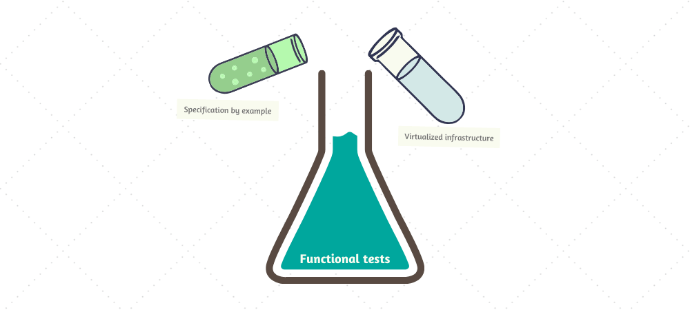

The importance of testing in modern software development is really hard to overstate. Delivering a successful product is not something you do once and forget about, but is rather a continuous recurring process. With every line of code that changes, software has to remain in a functional state, which implies the need for rigorous testing.

Over time, as the software industry evolved, testing practices have matured as well. Gradually moving towards automation, testing approaches have also influenced software design itself, spawning mantras like test-driven development, emphasizing patterns such as dependency inversion, and ultimately leading to high-level architectures such as the "Clean Architecture" and similar.

Nowadays, automated testing is embedded so deeply within our perception of software development, it's hard to imagine one without the other. And since that ultimately enables us to produce software quickly without sacrificing quality, it's hard to argue that it's not a good thing.

However, despite there being many different approaches, modern "best practices" primarily push developers specifically towards *unit testing*. Tests, whose scope lies higher on [Martin Fowler's pyramid](https://martinfowler.com/articles/practical-test-pyramid.html#TheTestPyramid) are either written as part of a wider suite (often by completely different people) or even disregarded entirely.

The benefit of this approach is often supported by the argument that unit tests provide the most value during development because they're able to catch errors quickly and help enforce design patterns that facilitate modularity. This idea has become so widely accepted that the term "unit testing" is now somewhat conflated with automated testing in general, losing part of its meaning and contributing to confusion.

When I was a less experienced developer, I believed in following these "best practices" to the letter, as I thought that would make my code better. I didn't particularly enjoy writing unit tests because of all the ceremony involved with abstractions and mocking, but it was the recommended approach after all, so who am I to know better.

It was only later, as I've experimented more and built more projects, that I started to realize that there are much better ways to approach testing and that **focusing on unit tests is**, in most cases, **a complete waste of time**.

Aggressively-popularized "best practices" often have a tendency of manifesting cargo cults around them, enticing developers to apply design patterns or use specific approaches without giving them a much needed second thought. In the context of automated testing, I find this prevalent when it comes to our industry's unhealthy obsession with unit testing.

In this article I will share my observations about unit testing and explain why I believe it to be a waste of time. I'll also explain which approaches I'm currently using instead to test my code, both in open source projects and day-to-day work.

*Note: this article contains code snippets in C#, but the language is irrelevant.*

## False promises

Unit tests, as evident by the name, revolve around the concept of a "unit", which denotes a very small, logically-independent part of a larger system. There is no formal definition of what a unit is or how small it should be, but it's mostly accepted that it corresponds to an individual function of a program (or a method of an object).

The test invokes a function with different inputs and compares produced results to expected outputs, making sure it behaves as expected. The idea is that, if all units in a system are tested to work correctly, the system as a whole should work correctly as well (barring integrations which are tested separately). Of course, that's only possible if the units are integrated with each other in a decoupled way which would allows us to isolate them easily, hence the need for dependency inversion.

More specifically, with unit tests we're testing business logic.

To illustrate the ... let's proceed with a simple example of a system that we may be interested in testing:

```csharp
public class LocationProvider : IDisposable
{
    private readonly HttpClient _httpClient = new HttpClient();

    public Task<Location> GetLocationAsync(string locationQuery) { /* ... */ }

    public Task<Location> GetLocationAsync() { /* ... */ }

    public void Dispose() => _httpClient.Dispose();
}

public class SolarCalculator : IDiposable
{
    private readonly LocationProvider _locationProvider = new LocationProvider();

    public Task<SolarTimes> GetSolarTimesAsync(DateTimeOffset date) { /* ... */ }

    public void Dispose() => _locationProvider.Dispose();
}
```

The code above illustrates a very simple system (or part thereof) which consists of two classes, `LocationProvider` for retrieving geographical coordinates and `SolarCalculator` which uses those coordinates to calculate sunrise and sunset on a particular date. While there's nothing wrong with this design, the classes above can't actually be unit tested because they're coupled.

Let's iterate and update the code to use dependency injection:

```csharp
public interface ILocationProvider
{
    Task<Location> GetLocationAsync(string locationQuery);

    Task<Location> GetLocationAsync();
}

public class LocationProvider : ILocationProvider
{
    private readonly HttpClient _httpClient;

    public LocationProvider(HttpClient httpClient) =>
        _httpClient = httpClient;

    public Task<Location> GetLocationAsync(string locationQuery) { /* ... */ }

    public Task<Location> GetLocationAsync() { /* ... */ }
}

public interface ISolarCalculator
{
    Task<SolarTimes> GetSolarTimesAsync(DateTimeOffset date);
}

public class SolarCalculator : ISolarCalculator
{
    private readonly ILocationProvider _locationProvider;

    public SolarCalculator(ILocationProvider locationProvider) =>
        _locationProvider = locationProvider;

    public Task<SolarTimes> GetSolarTimesAsync(DateTimeOffset date) { /* ... */ }
}
```

Ok, the code nearly doubled in size, but we've managed to decouple `LocationProvider` from `SolarCalculator` and replaced their point of integration with an interface. We had to drop `IDisposable` in the process, however, because the classes no longer own their dependencies so they shouldn't manage their lifetimes -- now we have to rely that it's done in the composition root instead.

Let's write some unit tests for this:

```csharp

```

## Detecting regressions

One of the expected benefits of automated tests is that we should be able to recklessly make changes to our code without worrying that some of the existing functionality may stop working properly. Once the tests are in place, any breaking changes should immediately be caught and reported.


## Unit tests are small and fast

Size is a very important factor in unit tests, as they should cover a very small portion of the system. Because of that, it makes sense to assume such tests should also execute quickly.

## Pure functions

So does that mean that unit tests should not be used at all? Well, as we've seen the issue with unit tests arise only if we're testing a unit which has dependencies on other units that we need to mock.

## Summary

- [Fallacy of Unit Testing (Aaron W. Hsu)](https://www.sacrideo.us/the-fallacy-of-unit-testing)
- [Slow database test fallacy (David Heinemeier Hansson)](https://dhh.dk/2014/slow-database-test-fallacy.html)
- [Test-induced design damage (David Heinemeier Hansson)](https://dhh.dk/2014/test-induced-design-damage.html)
- [Write tests. Not too many. Mostly integration (Kent C. Dodds)](https://kentcdodds.com/blog/write-tests)
- [Why Most Unit Testing is Waste (James O. Coplien)](https://rbcs-us.com/documents/Why-Most-Unit-Testing-is-Waste.pdf)
- [Mocking is a Code Smell (Eric Elliott)](https://medium.com/javascript-scene/mocking-is-a-code-smell-944a70c90a6a)
- [Testing of Microservices at Spotify (André Schaffer)](https://labs.spotify.com/2018/01/11/testing-of-microservices)
- [Stop writing Unit Tests (Anton Gorbikov)](https://antongorbikov.com/2018/09/24/stop-writing-unit-tests)
