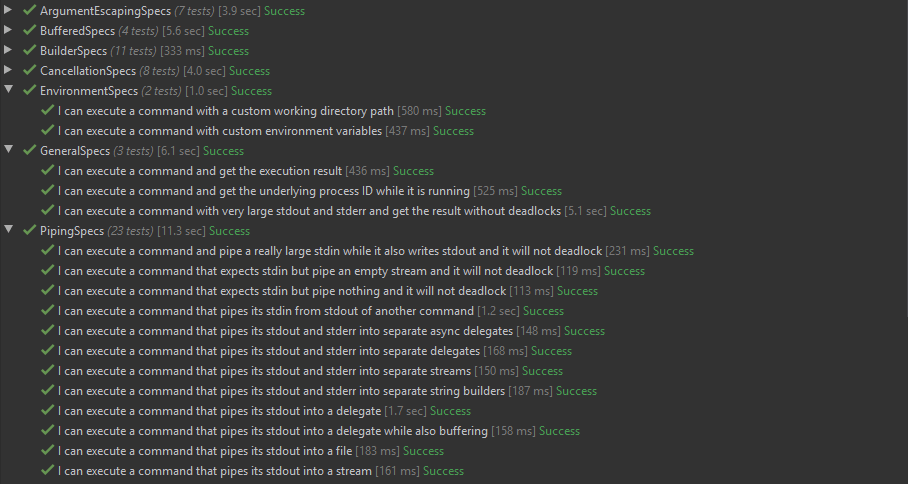

The importance of testing in modern software development is really hard to overstate. Delivering a successful product is not something you do once and forget about, but is rather a continuous recurring process. With every line of code that changes, software has to remain in a functional state, which implies the need for rigorous testing.

Over time, as the software industry evolved, testing practices have matured as well. Gradually moving towards automation, testing approaches have also influenced software design itself, spawning mantras like test-driven development, emphasizing patterns such as dependency inversion, and popularizing high-level architectures that are built around it.

Nowadays, automated testing is embedded so deeply within our perception of software development, it's hard to imagine one without the other. And since that ultimately enables us to produce software quickly without sacrificing quality, it's hard to argue that it's not a good thing.

However, despite there being many different approaches, modern "best practices" primarily push developers specifically towards *unit testing*. Tests, whose scope lies higher on [Mike Cohn's pyramid](https://martinfowler.com/articles/practical-test-pyramid.html#TheTestPyramid) are either written as part of a wider suite (often by completely different people) or even disregarded entirely.

The benefit of this approach is often supported by the argument that unit tests provide the most value during development because they're able to catch errors quickly and help enforce design patterns that facilitate modularity. This idea has become so widely accepted that the term "unit testing" is now somewhat conflated with automated testing in general, losing part of its meaning and contributing to confusion.

When I was a less experienced developer, I believed in following these "best practices" to the letter, as I thought that would make my code better. I didn't particularly enjoy writing unit tests because of all the ceremony involved with abstractions and mocking, but it was the recommended approach after all, so who am I to know better.

It was only later, as I've experimented more and built more projects, that I started to realize that there are much better ways to approach testing and that **focusing on unit tests is**, in most cases, **a complete waste of time**.

Aggressively-popularized "best practices" often have a tendency of manifesting cargo cults around them, enticing developers to apply design patterns or use specific approaches without giving them a much needed second thought. In the context of automated testing, I find this prevalent when it comes to our industry's unhealthy obsession with unit testing.

In this article I will share my observations about this testing technique and explain why I believe it to be inefficient. I'll also explain which approaches I'm currently using instead to test my code, both in open source projects and day-to-day work.

*Note: this article contains code examples which are written in C#, but the language itself is not (too) important to the points I'm making.*

*Note 2: I've come to realize that programming terms are completely useless at conveying meanings because everyone seems to understand them differently. In this article I will be relying on the "standard" definitions, where unit testing targets smallest separable parts of code, end-to-end testing targets software's outermost entry points, while integration testing is for everything in-between.*

## Fallacies of unit testing

Unit tests, as evident by the name, revolve around the concept of a "unit", which denotes a very small isolated part of a larger system. There is no formal definition of what a unit is or how small it should be, but it's mostly accepted that it corresponds to an individual function of a module (or method of an object).

Normally, when the code isn't written with unit tests in mind, it may be impossible to test some functions in complete isolation because they can have external dependencies. In order to _work around_ this issue, we can apply the dependency inversion principle and replace concrete dependencies with abstractions. These abstractions can then be substituted with real or fake implementations, depending on whether the code is executing normally or as part of a test.

Besides that, unit tests are expected to be pure. For example, if a function contains code that writes data to the file system, that part needs to be abstracted away as well, otherwise the test that verifies such behavior will be considered an integration test instead, since its coverage extends to the unit's integration with the file system.

Considering the factors mentioned above, we can conclude that **unit tests are only useful to verify pure business logic inside of a given function**. Their scope does not extend to testing side-effects or other integrations because that belongs to the domain of integration testing.

To illustrate how these nuances affect design, let's take a look at an example of a simple system that we want to test. Imagine we're working on an application that calculates local sunrise and sunset times, which it does through the help of the following two classes:

```csharp
public class LocationProvider : IDisposable
{
    private readonly HttpClient _httpClient = new HttpClient();

    // Gets location by query
    public async Task<Location> GetLocationAsync(string locationQuery) { /* ... */ }

    // Gets current location by IP
    public async Task<Location> GetLocationAsync() { /* ... */ }

    public void Dispose() => _httpClient.Dispose();
}

public class SolarCalculator : IDiposable
{
    private readonly LocationProvider _locationProvider = new LocationProvider();

    // Gets solar times for current location and specified date
    public async Task<SolarTimes> GetSolarTimesAsync(DateTimeOffset date) { /* ... */ }

    public void Dispose() => _locationProvider.Dispose();
}
```

Although the design above is perfectly valid in terms of OOP, neither of these classes are actually unit-testable. Because `LocationProvider` depends on its own instance of `HttpClient` and `SolarCalculator` in turn depends on `LocationProvider`, it's impossible to isolate the business logic that may be contained within methods of these classes.

Let's iterate on that code and replace concrete implementations with abstractions:

```csharp
public interface ILocationProvider
{
    Task<Location> GetLocationAsync(string locationQuery);

    Task<Location> GetLocationAsync();
}

public class LocationProvider : ILocationProvider
{
    private readonly HttpClient _httpClient;

    public LocationProvider(HttpClient httpClient) =>
        _httpClient = httpClient;

    public async Task<Location> GetLocationAsync(string locationQuery) { /* ... */ }

    public async Task<Location> GetLocationAsync() { /* ... */ }
}

public interface ISolarCalculator
{
    Task<SolarTimes> GetSolarTimesAsync(DateTimeOffset date);
}

public class SolarCalculator : ISolarCalculator
{
    private readonly ILocationProvider _locationProvider;

    public SolarCalculator(ILocationProvider locationProvider) =>
        _locationProvider = locationProvider;

    public async Task<SolarTimes> GetSolarTimesAsync(DateTimeOffset date) { /* ... */ }
}
```

By doing so we were able to decouple `LocationProvider` from `SolarCalculator`, but in exchange our code nearly doubled in size. Also note that we had to drop `IDisposable` from both classes because they **no longer own their dependencies** and thus have no business taking responsibility for their lifecycle.

While these changes may seem as an improvement to some, it's important to point out that the interfaces we've defined serve **no practical purpose other than making unit testing possible**. There's no need for actual polymorphism in our design, so, as far as our code is concerned, these abstractions are _autotelic_.

Let's try to reap the benefits of all that work and write a unit test for `SolarCalculator.GetSolarTimesAsync`:

```csharp
public class SolarCalculatorTests
{
    [Fact]
    public async Task GetSolarTimesAsync_ForKyiv_ReturnsCorrectSolarTimes()
    {
        // Arrange
        var location = new Location(50.45, 30.52);
        var date = new DateTimeOffset(2019, 11, 04, 00, 00, 00, TimeSpan.FromHours(+2));

        var expectedSolarTimes = new SolarTimes(
            new TimeSpan(06, 55, 00),
            new TimeSpan(16, 29, 00)
        );

        var locationProvider = Mock.Of<ILocationProvider>(lp =>
            lp.GetLocationAsync() == Task.FromResult(location)
        );

        var solarCalculator = new SolarCalculator(locationProvider);

        // Act
        var solarTimes = await solarCalculator.GetSolarTimesAsync(date);

        // Assert
        solarTimes.Should().BeEquivalentTo(expectedSolarTimes);
    }
}
```

Here we have a basic test that verifies that `SolarCalculator` works correctly for a known location. Since unit tests and their units are tightly coupled, we're following the recommended naming convention, where the test class is named after the class under test, and the name of the test method follows the `Method_Precondition_Result` pattern.

In order to simulate the desired precondition in the arrange phase, we have to inject corresponding behavior into the unit's dependency, `ILocationProvider`. In this case we do that by substituting the return value of `GetLocationAsync()` with a location for which the correct solar times are already known ahead of time.

Note that although `ILocationProvider` exposes two different methods, from the contract perspective **we have no way of knowing which one actually gets called**. This means that by choosing to mock a specific one of these methods, we are making an **assumption about the underlying implementation** of the method we're testing (which was deliberately hidden in the previous snippets).

All in all the test does correctly verify that the business logic inside `GetSolarTimesAsync` works as expected. However, let's expand on some of the observations we've made in the process.

___

1. Unit tests **have a limited purpose**

It's important to understand that the purpose of any unit test is very simple: verify business logic in an isolated scope. Depending on which interactions you intend to test, unit testing may or may not be the right tool for the job.

For example, does it make sense to unit test a method that calculates solar times using a long and complicated mathematical algorithm? Most likely, _yes_.

Does it make sense to unit test a method that sends a request to a REST API to get geographical coordinates? Most likely, _not_.

If you treat unit testing as a goal in itself, you will quickly find that, despite putting a lot of effort, most tests will not be able to provide you with the confidence you need, simply because they're testing the wrong thing. In many cases it's much more beneficial to test wider interactions with integration tests, rather than focusing specifically on unit tests.

Interestingly enough, some developers often get confused as to what constitutes a unit test or an integration test, which leads to them writing integration tests while still referring to them as unit tests. Although it could be argued that a unit size can be chosen arbitrarily and can span multiple components, this makes the concept very fuzzy, ultimately just making the overall usage of the term "unit test" completely useless.

2. Unit tests **lead to more complicated design**

One of the most popular arguments in favor of unit testing is that it enforces you to design software in a highly modular way. This builds on an assumption that it's easier to reason about code when it's split into many smaller components rather than a few larger ones.

In reality, however, it often leads to the opposite problem, where a particular feature may end up being very fragmented. This makes it much harder to assess the code because a developer needs to scan through multiple components that make up what should've been a single cohesive element.

Additionally, the abundant usage of abstraction, which is required to achieve component isolation, creates a lot of unnecessary indirection. Although an incredibly powerful and useful technique in itself, abstraction inevitably increases cognitive complexity, making it further more difficult to reason about the code.

Through that indirection we also end up losing some degree of encapsulation that we were able to maintain otherwise. For example, the responsibility of managing lifetimes of individual dependencies shifts from components that contain them to some other unrelated service (usually the dependency container).

Some of that infrastructural complexity can be also delegated to a dependency injection framework, making it easier to configure, manage, and activate dependencies. However, that reduces portability, which may be undesirable in some cases, for example when writing a library.

At the end of the day, while it's clear that unit testing does influence software design, it's highly debatable whether that's really a good thing.

3. Unit tests **are expensive**

Logically, it would make sense to assume that, since they are small and isolated, unit tests should be really easy and quick to write. Unfortunately, this is just another fallacy that seems to be rather popular, especially among managers.

Even though the previously-mentioned modular architecture lures us into thinking that individual components can be considered separately from each other, unit tests don't actually benefit from that. In fact, the complexity of a unit test only grows proportionally to the number of external interactions the unit has, due to all the work that you have to do to achieve isolation while still exercising required behavior.

The example illustrated previously in this article is very simple, but in a real project it's not unusual to see the arrange phase spanning many long lines, just to set preconditions for a single test. In some cases the mocked behavior can be so complex, it's almost impossible to unravel it back to figure out what it was supposed to do.

Besides that, unit tests are by design very tightly coupled to the code they're testing, which means that any effort to make a change is effectively doubled as the test suite needs to be updated as well. What makes this worse is that very few developers seem to find doing that an enticing task, often just pawning it off to more junior members on the team.

4. Unit tests **rely on implementation details**

The unfortunate implication of mock-based unit testing is that any test written with this approach is inherently implementation-aware. By mocking a specific dependency, your test becomes reliant on how the code under test consumes that dependency, which is not regulated by the public interface.

This additional coupling often leads to unexpected issues, where seemingly non-breaking changes can cause tests to start failing as mocks become out of date. It can be very frustrating and ultimately discourages developers from trying to refactor code, because it's never clear whether the error in test comes from an actual regression or due to being reliant on some implementation detail.

Unit testing stateful code can be even more tricky because it may not be possible to observe mutations through the publicly exposed interface. To work around this, you would normally inject spies, which is a type of mocked behavior that records when a function is called, letting you ensure that the unit uses its dependencies correctly.

Of course, when you not only rely on a specific function being called, but also on how many times it happened or which arguments were passed, the test becomes even more coupled to the implementation. Tests written in such way are only useful if the internal specifics are not ever expected to change, which is a highly unreasonable expectation to have.

Relying too much on implementation details also makes the tests themselves very complex, considering how much setup is required to configure mocks in order to simulate a specific behavior, especially when the interactions are not that trivial or when there are a lot of dependencies. When the tests get so complicated that their own behavior is hard to reason about, who's going to write tests to test the tests?

5. Unit tests **don't exercise user behavior**

No matter what type of software you're developing, its goal is to provide value for the end user. In fact, the primary reason why we're writing automated tests in the first place is to ensure that there are no unintended defects that would diminish that value.

In most cases, the user works with the software through some top-level interface such as a UI, CLI, or API. While the code itself might involve numerous layers of abstractions, the only one that matters to the user is the one they get to actually see and interact with.

It doesn't even matter if a few layers deep there's a bug in some part of the system, as long as it never surfaces to the user and doesn't affect the provided functionality. Conversely, it makes no difference that we may have full coverage on all of the lower-level pieces, if there's a defect in the user interface that renders our system effectively useless.

Of course, if you want to ensure that something works correctly, you have to check that exact thing and see if it does. In our case, the best way to gain confidence in the system is to simulate how an actual user would interact with the top-level interface and see if it works properly according to expectations.

The problem with unit tests is that they're the exact opposite of that. Since we're always dealing with small isolated pieces of our code that the user doesn't directly interact with, we never test the actual user behavior.

Doing mock-based testing puts the value of such tests under an even bigger question, because the parts of our system that would've been used otherwise are replaced with mocks, further distancing the simulated environment from reality. It's impossible to gain confidence that the user will have a smooth experience by testing something that doesn't resemble that experience.

[](https://twitter.com/rkoutnik/status/1242073856128495620)

## Pyramid-driven testing

So why would we, as an industry, decide that unit testing should be the primary method of testing software, given all of its existing flaws? For the most part, it's because testing at higher levels has always been considered too hard, slow, and unreliable.

If you refer to the traditional test pyramid, you will find that it suggests that the most significant part of testing should be performed at the unit level. The idea is that, since coarse-grained tests are assumed to be slower and more complicated, you will want to concentrate efforts towards the bottom of the integration spectrum to end up with an efficient and maintainable test suite:


The metaphorical model offered by the pyramid is meant to convey that a good testing approach should involve many different layers, because focusing on the extremes can lead to issues where the tests are either too slow and unwieldy, or are useless at providing any confidence. That said, the lower levels are emphasized as that's where the return on investment for development testing is believed to be the highest.

Top-level tests, despite providing the most confidence, often end up being slow, hard to maintain, or too broad to be included as part of typically fast-paced development flow. That's why, in most cases, such tests are instead maintained separately by dedicated QA specialists, as it's usually not considered to be the developer's job to write them.

Integration testing, which is an abstract part of the spectrum that lies somewhere between unit testing and complete end-to-end testing, is quite often just disregarded entirely. Because it's not really clear what exact level of integration is preferable, how to structure and organize such tests, or for the fear that they might get out of hand, many developers prefer to avoid them in favor of a more clear-cut extreme which is unit testing.

For these reasons, all testing done during development typically resides at the very bottom of the pyramid. In fact, over time this has become so commonplace that development testing and unit testing are now practically synonymous with each other, leading to confusion that is only further perpetrated by conference talks, blog posts, books, and even some IDEs (all tests are unit tests, as far as JetBrains Rider is concerned).

In the eyes of most developers, the test pyramid looks somewhat like this instead:


While the pyramid is a noble attempt to turn software testing into a solved problem, there are obviously many issues with this model. In particular, the assumptions it relies on might not be true for every context, especially the premise of highly-integrated test suites being slow or hard.

As humans, we are naturally inclined to rely on information passed on to us from those who are more experienced, so that we can benefit from the knowledge of past generations and apply our [second thinking system](https://en.wikipedia.org/wiki/Thinking,_Fast_and_Slow#Two_systems) on something more useful instead. This is an important evolutionary trait that makes our species extremely fit for survival.

However, whenever we extrapolate experiences into guidelines, we tend to think of them as being good on their own, forgetting about the circumstances that are integral to their relevancy. The reality is that circumstances change, and once perfectly reasonable conclusions (or best practices) might not apply so well anymore.

If we look back, it's clear that high-level testing was tough in 2000, it probably still was in 2009, but it's 2020 outside and we are, in fact, living in the future. Advancements in technology and software design have made it a much less significant issue than it once was.

Most modern application frameworks nowadays provide some sort of separate API layer used for testing, where you can run your application in a simulated in-memory environment that is very close to the real one. Virtualization tools like Docker also make it possible to execute tests that rely on actual infrastructural dependencies, while still remaining deterministic and fast.

We have solutions like [Mountebank](http://mbtest.org), [WireMock](http://wiremock.org), [GreenMail](https://greenmail-mail-test.github.io/greenmail), [Appium](http://appium.io), [Selenium](https://selenium.dev), [Cypress](https://cypress.io), and countless others that simplify different aspects of high-level testing that were once considered unapproachable. Unless you're developing desktop applications for Windows and are stuck with [UIAutomation framework](https://docs.microsoft.com/en-us/windows/win32/winauto/entry-uiauto-win32), you will likely have many options available.

On one of my previous projects, we had a web service which was tested at the system boundary using close to a hundred behavioral tests that took just under 10 seconds to run in parallel. Sure, it's possible to get much faster execution time than that with unit tests, but given the confidence they provide this was a no-brainer.

The slow test fallacy is, however, not the only false assumption that the pyramid is based on. The idea of having the majority of testing concentrated at the unit level only works out if those tests actually provide value, which of course depends on how much business logic is contained within the code under test.

Some applications may have a lot of business logic (e.g. payroll systems), some may have close to none (e.g. CRUD apps), most are somewhere in between. Majority of the projects I've personally worked on didn't have nearly enough of it to warrant extensive coverage with unit tests, but had plenty of infrastructural complexity on the other hand, which would actually benefit from integration testing.

Of course, in an ideal world one would evaluate the context of the project and come up with a testing approach that is most suitable for the problem at hand. In reality, however, most developers don't even begin to think about it at all, instead just blindly stacking mountains of unit tests following what the best practices seemingly advise you to do.

Finally, I think it's fair to say, the model provided by the test pyramid is just too simplistic in general. The vertical axes present the testing spectrum as a linear scale, where any gain in confidence you get by going up is apparently offset by an equivalent amount of loss in maintainability and speed. This may be true if you compare the extremes, but not necessarily so for the rest of the points in between.

It also doesn't account for the fact that isolation has a cost in itself and isn't something that comes for free simply by "avoiding" external interactions. Given how much effort it takes to write and maintain mocks, it's entirely possible that a less-isolated test can be cheaper and end up providing more confidence, albeit running slightly slower.

If you consider these aspects, it seems likely that the scale is not linear after all and that the point of highest return on investment resides somewhere closer to the middle rather than at the unit level:


All in all, when you're trying to establish an efficient test suite for your project, the test pyramid isn't the best guideline you can follow. It makes a lot more sense to focus on what's relevant specifically to your context, instead of relying on "best practices".

## Reality-driven testing

At the most basic level, a test provides value if it grants certainty that the software is working correctly. The more confident we feel, the less we have to rely on ourselves to spot potential bugs and regressions while introducing changes in code, because we trust our tests to do that for us.

That trust in turn depends on how accurately the test resembles the actual user behavior. A test scenario operating at the system boundary without knowledge of any internal specifics is bound to provide us with greater confidence (and thus, value) than a test working at a lower level.

In essence, the degree of confidence we gain from tests is the primary metric by which their value should be measured. Pushing it as high as possible is also the primary goal.

Of course, as we know, there are other factors in play as well, such as cost, speed, ability to parallelize, and whatnot, which are all important. The test pyramid makes strong assumptions about how these things scale in relation to each other, but these assumptions are not universal.

Moreover, these factors are also secondary to the primary goal of obtaining confidence. An expensive test that takes a really long time to run but provides a lot of confidence is still infinitely more useful than an extremely fast and simple test that does nothing.

For that reason, I find it best to **write tests that are as highly-integrated as possible, while keeping their speed and complexity reasonable**.

Does this mean that every test we write should be an end-to-end test? No, but we should be trying to get as far as we can in that direction, while keeping the downsides at an acceptable level.

What's acceptable or not is subjective and depends on the context. At the end of the day, it's important that those tests are written by developers and are actually used during development, which means they shouldn't feel like a burden to maintain and it should be possible to run them for local builds and on CI.

Doing this also means that you will likely end up with tests that are scattered across different levels of the integration scale, with seemingly no clear sense of structure. This isn't an issue we would have had with unit testing, because there each test is coupled to a specific method or a function, so the structure usually ends up mirroring that of the code itself.

Fortunately, this doesn't matter because organizing tests by individual classes or modules is not important in itself, but is rather a side-effect of unit testing. Instead, the tests should be partitioned by the actual user-facing functionality that they are meant to verify.

Such tests are often called _functional_ because they are based on the software's functional requirements that describe what features it has and how they work. Functional testing is not another layer on the pyramid, but instead a completely orthogonal concept.

Contrary to the popular belief, writing functional tests does not require you to use [Gherkin](https://en.wikipedia.org/wiki/Cucumber_(software)#Gherkin_language) or a BDD framework, but can be done with the very same tools that are typically used for unit testing. For example, consider how we can rewrite the example from the beginning of the article so that the tests are structured around supported user behavior rather than classes:

```csharp
public class SolarTimesSpecs
{
    [Fact]
    public async Task User_can_get_solar_times_automatically_for_their_location() { /* ... */ }

    [Fact]
    public async Task User_can_get_solar_times_during_periods_of_midnight_sun() { /* ... */ }

    [Fact]
    public async Task User_can_get_solar_times_even_if_their_location_cannot_be_determined() { /* ... */ }
}
```

Note that the actual implementation of the tests is hidden because it's not relevant to the fact that they're functional. What matters is that the tests and their structure is driven by the software requirements, while their scope can theoretically range anywhere from end-to-end to even unit level.

Naming tests in accordance to specifications rather than classes has an additional advantage of removing that unnecessary coupling. Now, if we decide to rename `SolarCalculator` to something else or move it to a different directory, the test names won't need to be updated to reflect that.

This structure is very useful in highlighting what's actually important, while leaving irrelevant details out. As another example, here is how the test suite is organized in [CliWrap](https://github.com/Tyrrrz/CliWrap) (the underscores are replaced with spaces by [xUnit](https://xunit.net/docs/configuration-files#methodDisplayOptions)):



As long as a piece of software does something at least remotely useful, it will always have functional requirements. Those can be either _formal_ (specification documents, user stories, etc.) or _informal_ (verbally agreed upon, assumed, JIRA tickets, written on toilet paper, etc.)

Turning informal specifications into functional tests can often be difficult because it requires us to take a step away from code and challenge ourselves to think from a user's perspective. What helps me with my open source projects is that I start by creating a readme file where I list a bunch of relevant usage examples, and then encode those into tests.

Finally, the second guideline is: **partition tests based on threads of behavior, rather than the code's internal structure**.

If we combine all these ideas, we get a mental framework that provides us with a clear goal for writing tests and a good sense of organization, while not relying on any assumptions. We can use it to establish a test suite for our project that focuses on value, and then scale it according to priorities and limitations relevant to the current context.

## Functional testing for web services (via ASP.NET Core)

There might still be some confusion as to what constitutes functional testing or how exactly it's supposed to look especially if you've never done it before, so it makes sense to show a simple but complete example. For this, we will turn the solar calculator from earlier into a web service and cover it with tests according to the rules we've outlined in the previous part of the article. This app will be based on ASP.NET Core, which is a web framework I'm most familiar with, but the same idea should also equally apply to to any other platform.

Our web service is going to expose endpoints to calculate sunrise and sunset times based on the user's IP or provided location. To make things a bit more interesting, we'll also add a Redis caching layer to store previous calculations for faster responses.

The tests will work by launching the app in a simulated environment where it can receive HTTP requests, handle routing, perform validation, and exhibit almost identical behavior to an app running in production. At the same time, we will also use Docker to make sure our tests are relying on the same infrastructural dependencies as the real app does.

Let's first go over the implementation of the web app to understand what we're dealing with. Note, some parts in the code snippets below are omitted for brevity, but you can also check out the full project on [GitHub](https://github.com/FuncTestingInAspNetCoreExample).

First off, we will need a way to get the user's location by IP, which is done by the `LocationProvider` class we've seen in earlier examples. It works simply by wrapping an external GeoIP lookup service called [IP-API](https://ip-api.com/):

```csharp
public class LocationProvider
{
    private readonly HttpClient _httpClient;

    public LocationProvider(HttpClient httpClient) =>
        _httpClient = httpClient;

    public async Task<Location> GetLocationAsync(IPAddress ip)
    {
        // If IP is local, just don't pass anything (useful when running on localhost)
        var ipFormatted = !ip.IsLocal() ? ip.MapToIPv4().ToString() : "";

        var json = await _httpClient.GetJsonAsync($"http://ip-api.com/json/{ipFormatted}");

        var latitude = json.GetProperty("lat").GetDouble();
        var longitude = json.GetProperty("lon").GetDouble();

        return new Location
        {
            Latitude = latitude,
            Longitude = longitude
        };
    }
}
```

In order to turn location into solar times, we're going to rely on the [sunrise/sunset algorithm published by US Naval Observatory](https://edwilliams.org/sunrise_sunset_algorithm.htm). The algorithm itself is too long to include here, but the rest of the implementation for `SolarCalculator` is as follows:

```csharp
public class SolarCalculator
{
    private readonly LocationProvider _locationProvider;

    public SolarCalculator(LocationProvider locationProvider) =>
        _locationProvider = locationProvider;

    private static TimeSpan CalculateSolarTimeOffset(Location location, DateTimeOffset instant,
        double zenith, bool isSunrise)
    {
        /* ... */

        // Algorithm omitted for brevity

        /* ... */
    }

    public async Task<SolarTimes> GetSolarTimesAsync(Location location, DateTimeOffset date) { /* ... */ }

    public async Task<SolarTimes> GetSolarTimesAsync(IPAddress ip, DateTimeOffset date)
    {
        var location = await _locationProvider.GetLocationAsync(ip);

        var sunriseOffset = CalculateSolarTimeOffset(location, date, 90.83, true);
        var sunsetOffset = CalculateSolarTimeOffset(location, date, 90.83, false);

        var sunrise = date.ResetTimeOfDay().Add(sunriseOffset);
        var sunset = date.ResetTimeOfDay().Add(sunsetOffset);

        return new SolarTimes
        {
            Sunrise = sunrise,
            Sunset = sunset
        };
    }
}
```

Since it's an MVC web app, we will also have a controller that provides endpoints to expose the app's functionality:

```csharp
[ApiController]
[Route("solartimes")]
public class SolarTimeController : ControllerBase
{
    private readonly SolarCalculator _solarCalculator;
    private readonly CachingLayer _cachingLayer;

    public SolarTimeController(SolarCalculator solarCalculator, CachingLayer cachingLayer)
    {
        _solarCalculator = solarCalculator;
        _cachingLayer = cachingLayer;
    }

    [HttpGet("by_ip")]
    public async Task<IActionResult> GetByIp(DateTimeOffset? date)
    {
        var ip = HttpContext.Connection.RemoteIpAddress;
        var cacheKey = ip.ToString();

        var cachedSolarTimes = await _cachingLayer.TryGetAsync<SolarTimes>(cacheKey);
        if (cachedSolarTimes != null)
            return Ok(cachedSolarTimes);

        var solarTimes = await _solarCalculator.GetSolarTimesAsync(ip, date ?? DateTimeOffset.Now);
        await _cachingLayer.SetAsync(cacheKey, solarTimes);

        return Ok(solarTimes);
    }

    [HttpGet("by_location")]
    public async Task<IActionResult> GetByLocation(double lat, double lon, DateTimeOffset? date)
    {
        /* ... */
    }
}
```

As seen above, the `/solartimes/by_ip` endpoint mostly just delegates execution to `SolarCalculator`, but also has very simple caching logic to avoid redundant requests to 3rd party services. The caching is done by the `CachingLayer` class which encapsulates a Redis client used to store and retrieve JSON content:

```csharp
public class CachingLayer
{
    private readonly IConnectionMultiplexer _redis;

    public CachingLayer(IConnectionMultiplexer connectionMultiplexer) =>
        _redis = connectionMultiplexer;

    public async Task<T> TryGetAsync<T>(string key) where T : class
    {
        var result = await _redis.GetDatabase().StringGetAsync(key);

        if (result.HasValue)
            return JsonSerializer.Deserialize<T>(result.ToString());

        return null;
    }

    public async Task SetAsync<T>(string key, T obj) where T : class =>
        await _redis.GetDatabase().StringSetAsync(key, JsonSerializer.Serialize(obj));
}
```

Finally, all of the above parts are wired together in the `Startup` class by configuring request pipeline and registering required services:

```csharp
public class Startup
{
    private readonly IConfiguration _configuration;

    public Startup(IConfiguration configuration) =>
        _configuration = configuration;

    private string GetRedisConnectionString() =>
        _configuration.GetConnectionString("Redis");

    public void ConfigureServices(IServiceCollection services)
    {
        services.AddMvc(o => o.EnableEndpointRouting = false);

        services.AddSingleton<IConnectionMultiplexer>(
            ConnectionMultiplexer.Connect(GetRedisConnectionString()));

        services.AddSingleton<CachingLayer>();

        services.AddHttpClient<LocationProvider>();
        services.AddTransient<SolarCalculator>();
    }

    public void Configure(IApplicationBuilder app, IWebHostEnvironment env)
    {
        if (env.IsDevelopment())
            app.UseDeveloperExceptionPage();

        app.UseMvcWithDefaultRoute();
    }
}
```

Note that we didn't have our classes implement any autotelic interfaces because we're not planning to use mocks. It may happen that we will need to substitute one of the services in tests but it's not yet clear now, so we avoid unnecessary work (and design damage) until we're sure we need it.

Although it's a rather simple project, this app already incorporates a decent amount of infrastructural complexity by relying on a 3rd party web service (GeoIP provider) as well as a persistence layer (Redis). This is a rather common setup which a lot of real-life projects can relate to.

With a classical approach focused on unit testing, we would find ourselves targeting the service layer and possibly the controller layer of our app, writing isolated tests that ensure that every branch of code executes correctly. Doing that would be useful to an extent, but could never give us confidence that the actual endpoints, with all of the middleware and peripheral components, work as intended.

Instead, we will write tests that target the endpoints directly. To do that, we will need to create a separate testing project and add a few infrastructural components that will support our tests. One of them is `FakeApp` which is going to be used to encapsulate a virtual instance of our app:

```csharp
public class FakeApp : IDisposable
{
    private readonly WebApplicationFactory<Startup> _appFactory;

    public HttpClient Client { get; }

    public FakeApp()
    {
        _appFactory = new WebApplicationFactory<Startup>();
        Client = _appFactory.CreateClient();
    }

    public void Dispose()
    {
        Client.Dispose();
        _appFactory.Dispose();
    }
}
```

The majority of the work is already done by [`WebApplicationFactory`](https://docs.microsoft.com/en-us/aspnet/core/test/integration-tests?view=aspnetcore-3.1), which is a utility provided by the framework that allows us to bootstrap the app in-memory for testing purposes. It also provides us with API to override configuration, service registrations, and the request pipeline if needed.

We can use an instance of this object in tests to run the app, send requests with the provided `HttpClient`, and then check that the response matches our expectations. This instance can be either shared among multiple tests or instead created separately for each one.

Since we also rely on Redis, we want to have a way to spin up a fresh server to be used by our app. There are many ways to do it, but for a simple example I decided to use xUnit's fixture API for this purpose:

```csharp
public class RedisFixture : IAsyncLifetime
{
    private string _containerId;

    public async Task InitializeAsync()
    {
        // Simplified, but ideally should bind to a random port
        var result = await Cli.Wrap("docker")
            .WithArguments("run -d -p 6379:6379 redis")
            .ExecuteBufferedAsync();

        _containerId = result.StandardOutput.Trim();
    }

    public async Task ResetAsync() =>
        await Cli.Wrap("docker")
            .WithArguments($"exec {_containerId} redis-cli FLUSHALL")
            .ExecuteAsync();

    public async Task DisposeAsync() =>
        await Cli.Wrap("docker")
            .WithArguments($"container kill {_containerId}")
            .ExecuteAsync();
}
```

The above code works by implementing the `IAsyncLifetime` interface that lets us define methods which are going to be executed before and after the tests run. We are using these methods to start a Redis container in Docker and then kill it once the testing has finished.

Besides that, the `RedisFixture` class also exposes `ResetAsync` method which can be used to execute the `FLUSHALL` command to delete all keys from the database. We will be calling this method to reset Redis to a clean slate before each test. As an alternative, we could also just restart the container instead, which takes a bit longer but is probably more reliable.

Now that the infrastructure is set up, we can move on to writing our first test:

```csharp
public class SolarTimeSpecs : IClassFixture<RedisFixture>, IAsyncLifetime
{
    private readonly RedisFixture _redisFixture;

    public SolarTimeSpecs(RedisFixture redisFixture)
    {
        _redisFixture = redisFixture;
    }

    // Reset Redis before each test
    public async Task InitializeAsync() => await _redisFixture.ResetAsync();

    [Fact]
    public async Task User_can_get_solar_times_for_their_location_by_ip()
    {
        // Arrange
        using var app = new FakeApp();

        // Act
        var response = await app.Client.GetStringAsync("/solartimes/by_ip");
        var solarTimes = JsonSerializer.Deserialize<SolarTimes>(response);

        // Assert
        solarTimes.Sunset.Should().BeWithin(TimeSpan.FromDays(1)).After(solarTimes.Sunrise);
        solarTimes.Sunrise.Should().BeCloseTo(DateTimeOffset.Now, TimeSpan.FromDays(1));
        solarTimes.Sunset.Should().BeCloseTo(DateTimeOffset.Now, TimeSpan.FromDays(1));
    }
}
```

As you can see, the setup is really simple. All we need to do is create an instance of `FakeApp` and use the provided `HttpClient` to send requests to one of the endpoints, just like you would if it was a real web app.

This specific test works by querying the `/solartimes/by_ip` route, which determines user's sunrise and sunset times for the current date based on their IP. Since we're relying on an actual GeoIP provider and don't know what the result is going to be, we're performing property-based assertions to ensure that the solar times are valid.

Although those assertions will be able to catch a multitude of potential bugs, it doesn't give us full confidence that the result is actually correct. There are a couple of different ways we can improve on this, however.

An obvious option would be to replace the actual GeoIP provider with a fake instance that will always return the same location, allowing us to hard-code the expected solar times. The downside of doing that is that we will be effectively reducing the integration scope, which means we won't be able to verify that our app talks to the 3rd party service correctly.

As an alternative approach, we can instead substitute the IP address that the test server receives from the client. This way we can make the test more strict, while maintaining the same integration scope.


## Drawbacks and considerations

Unfortunately, there is [no silver bullet](https://en.wikipedia.org/wiki/No_Silver_Bullet) and the approaches described in this article also suffer from some potential drawbacks. In the interest of fairness, it makes sense to mention them as well.

One of the biggest challenges I've found when doing high-level functional testing is figuring out a good balance between usefulness and usability. Compared to approaches that focus specifically on unit testing, it does take more effort to ensure that such tests are sufficiently deterministic, don't take too long, can run independently of each other, and are generally usable during development.

The wide scope of tests also implies the need for a deeper understanding of the project's dependencies and technologies it relies upon. It's important to know how they're used, whether they can be easily containerized, which options are available and what are the trade-offs.

In the context of integration testing, the "testability" aspect is not defined by how well the code can be isolated, but instead by how well the actual infrastructure accommodates and facilitates testing. This puts a certain prerequisite on the responsible person and the team in general in terms of technical expertise.

It may also take some time to set up and configure the testing environment, as it involves creating fixtures, wiring fake implementations, adding custom initialization and cleanup behavior, and so on. All of these things need to be maintained as the project scales and becomes more complicated.

Writing functional tests in itself involves a bit more planning as well, because it's no longer just about covering every method of every class, but rather about outlining software requirements and turning them into code. Understanding what those requirements are and which of them are functional can also be tricky sometimes, as it requires an ability to think from a user's perspective.

Another common concern is that high-level tests often suffer from a lack of locality. If a test fails, either due to unmet expectations or because of an unhandled exception, it's usually unclear what exactly caused the error.

Although there are ways to mitigate this issue, ultimately it's always going to be a trade-off: isolated tests are better at indicating the cause of an error, while integrated tests are better at highlighting the impact. Both are equally useful, so it comes down to what you consider to be more important.

At the end of the day, I still think functional testing is worth it even despite these shortcomings, as I find that it leads to a better developer experience overall. It's been a while since I've done classic unit testing and I'm not looking forward to starting again.

## Summary

Unit testing is a popular approach for testing software, but mostly for the wrong reasons. It's often touted as an effective way for developers to test their code while also enforcing best design practices, however many find it encumbering and superficial.

It's important to understand that development testing does not equate to unit testing. The primary goal is not to write tests which are as isolated as possible, but rather to gain confidence that the code works according to its functional requirements. And there are better ways to achieve that.

Writing high-level tests that are driven by user behavior will provide you with much higher return on investment in the long run, and it isn't as hard as it seems. Find an approach that makes the most sense for your project and stick to it.

Here are the main takeaways:

0. Think critically and challenge best practices
1. Don't rely on the the test pyramid
2. Separate tests by functionality, rather than by classes, modules, or scope
3. Aim for the highest level of integration while maintaining reasonable speed and cost
4. Avoid sacrificing software design for testability
5. Consider mocking only as a last resort

There are also other great articles about alternative testing approaches in modern software development. These are the ones I've personally found really interesting:

- [Write tests. Not too many. Mostly integration (Kent C. Dodds)](https://kentcdodds.com/blog/write-tests)
- [Mocking is a Code Smell (Eric Elliott)](https://medium.com/javascript-scene/mocking-is-a-code-smell-944a70c90a6a)
- [Test-induced design damage (David Heinemeier Hansson)](https://dhh.dk/2014/test-induced-design-damage.html)
- [Slow database test fallacy (David Heinemeier Hansson)](https://dhh.dk/2014/slow-database-test-fallacy.html)
- [Fallacy of Unit Testing (Aaron W. Hsu)](https://www.sacrideo.us/the-fallacy-of-unit-testing)
- [The No. 1 unit testing best practice: Stop doing it (Vitaliy Pisarev)](https://techbeacon.com/app-dev-testing/no-1-unit-testing-best-practice-stop-doing-it)
- [Testing of Microservices at Spotify (Andr Schaffer)](https://labs.spotify.com/2018/01/11/testing-of-microservices)
