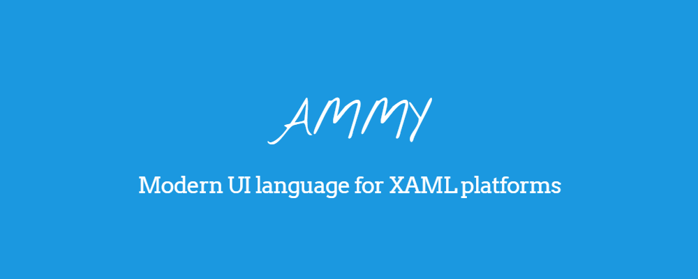

Quite a long time ago I've stumbled upon a very interesting open source project called [AmmyUI](https://github.com/AmmyUI/AmmyUI). Its main goal is to make designing XAML apps a lot better by... removing XAML from the equation.

Ammy is a JSON-like layout language which compiles to XAML and also has some cool extra features.

I've never been a big fan of XAML, so it got me interested and I decided to use it when starting one of my projects [DiscordChatExporter](https://github.com/Tyrrrz/DiscordChatExporter).

## Installation

To use AmmyUI, you will need to add its NuGet package to your project -- either `Ammy.WPF`, `Ammy.UWP`, or `Ammy.XamarinForms`, depending on your platform.

Although technically not required, you will definitely want to also install the [Visual Studio extension](https://marketplace.visualstudio.com/items?itemName=ionoy.Ammy) as it provides syntax highlighting and Intellisense support.

## Syntax

AmmyUI works by letting you define your views in its custom language, and then converting them to XAML at build time. The syntax looks a lot like JSON but with some nuances and shortcuts, as you can see here:

```json5
Window "MainWindow" {
  Width: 200
  Height: 100
  TextBlock {
    Text: "Hello, World!"
  }
}
```

In the above statement, we declare a window, set its name and size, and add a text block child to it.

Compare this to an equivalent in XAML:

```xml
<Window x:Name="MainWindow" Width="100" Height="100">
  <TextBlock Text="Hello, World!" />
</Window>
```

Although on its own this already looks a bit cleaner, Ammy's true power lies in its extensive set of features.

### Names and resource keys

Names and keys are first-class citizens and can be defined really quickly using shortcuts:

```json5
// Grid with a name
Grid "MyGrid" {
}

// Grid with a resource key
Grid Key="MyGrid" {
}
```

### Using statements

Instead of defining aliases for XML namespaces, Ammy is using an approach identical to C# -- `using` directives.

This means you can import an entire CLR namespace and stop worrying about prefixing nodes with namespace aliases.

For example, if you are using [MaterialDesignInXamlToolkit](https://github.com/ButchersBoy/MaterialDesignInXamlToolkit) and want to use a `Card` control in your layout, you can simply do this:

```json5
using MaterialDesignThemes.Wpf

Window "DiscordChatExporter.Views.MainWindow" {
  Title: "DiscordChatExporter"
  Width: 600
  Height: 550

  // MaterialDesignThemes.Wpf.Card
  Card {
    Padding: 8
    Margin: [6, 0, 6, 0]

    TextBlock {
      Text: "Hello, World!"
    }
  }
}
```

### Binding shortcuts

Ammy also provides lots of shortcuts for declaring bindings. A very basic binding can be set up like this:

```json5
TextBlock {
  Text: bind Text
}
```

You can also specify binding source using a special `from` keyword. Here's how you can easily bind to a property of a different control:

```json5
TextBlock "OtherTextBlock" {
  Text: "Hello, World!"
}

TextBlock {
  Text: bind Text from "OtherTextBlock"
}
```

There are many other things you can use with `from`, namely `$this`, `$template`, `$ancestor<TextBlock>(3)`, `$previous`, `SomeType.StaticProperty`, `$resource SomeResource` -- each of them replaces a normally rather lengthy binding declaration in XAML.

### Resource shortcuts

Similar to bindings, Ammy has a few shortcuts for referencing resources as well:

```json5
TextBlock {
  Foreground: resource "ForegroundBrush"     // static
  Foreground: dyn resource "ForegroundBrush" // dynamic
}
```

### Inline binding converters

This is easily my most favorite feature, something that lets you forget about `BoolToVisibilityConverter`, `InvertBoolToVisibilityConverter` and the likes.

In Ammy you can specify a converter right inside your binding declaration:

```json5
TextBlock {
  Visibility: bind IsTextAvailable
              convert (bool b) => b ? Visibility.Visible : Visibility.Collapsed
}
```

You can write most C# code inside a converter, invoke your own methods, use your own classes, etc.

### Variables

This framework also offers some features to help you keep your code DRY. For example, you can declare variables and use them in different ways:

```json5
$primaryColor = "#343838"
$propertyName = "Text"

TextBlock {
  Foreground: SolidColorBrush { Color: $primaryColor }
  Text: bind $propertyName
}
```

### Mixins

You can also define mixins, which are reusable sets of properties that can be included in your controls:

```json5
mixin Centered() for TextBlock {
  TextAlignment: Center
}

TextBlock {
  #Centered()
}
```

Mixins can also take any number of parameters, some of which can be optional:

```json5
mixin Cell (row = none, column = none, rowSpan = none, columnSpan = none) for FrameworkElement {
  Grid.Row: $row
  Grid.Column: $column
  Grid.RowSpan: $rowSpan
  Grid.ColumnSpan: $columnSpan
}

TextBlock {
  // Row 0, Col 2, RowSpan 0, ColSpan 0
  #Cell(0, 2)
}
```

The AmmyUI NuGet package also comes with quite a few pre-defined mixins that can help you develop your app more rapidly.

### Aliases

Alias is sort of similar to a mixin, except that it's used to essentially create templates for your UI elements.

```json5
alias BigCenteredTextBlock(text) {
  TextBlock {
    HorizontalAlignment: Center
    FontSize: 24
    Text: $text
  }
}

Grid {
  @BigCenteredTextBlock("Hello, World!") {
    Foreground: Red
  }
}
```

## My experience

I think AmmyUI is a very interesting project and highlights how much better WPF could've been if it didn't involve XAML.

Ultimately, I don't think Ammy is production ready yet but I recommend trying it out in one of your side projects.
