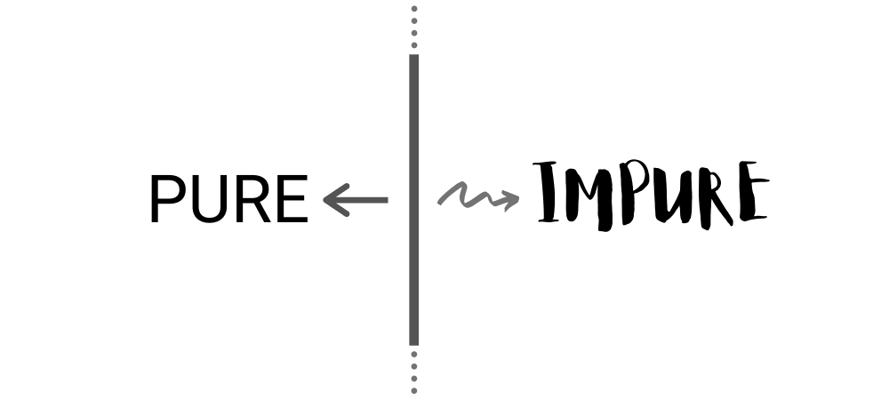

About a month ago I published an article titled ["Unit Testing is Overrated"](/blog/unit-testing-is-overrated) where I shared my thoughts on how developers place way too much faith in that testing approach and why it often isn't the best tool for the job. While I didn't expect that post to do particularly well, in three weeks it managed to get over 100'000 views and 1'000 comments, even despite its controversial nature (or, perhaps, owing to it?).

It was really interesting to follow the discussions that unfolded, given the vast contrast of opinions people seemed to have on the subject. And while most commenters mainly shared their personal experiences, a few have also voiced criticism of the way some arguments were presented.

In particular, a couple of comments mentioned that the drawbacks I've described, especially those pertaining to abstractions and mocking, are really just a byproduct of object-oriented programming and its inherent flaws. Had my examples been designed with functional principles in mind, many of the outlined problems would never have surfaced.

More specifically, the suggested solution was to refactor the presented class hierarchy, by extracting the pure business logic away from the rest of the code. Getting rid of the impure dependency eliminates the need for mocking, which in turn simplifies unit testing.

This exact approach was actually mentioned in later parts of the article as well, albeit in a slightly different context. Although it does make isolated testing easier for that particular snippet of code, the raised issues are more nuanced than that.

Nevertheless, I think that the principle of separating code based on purity is very important and often overlooked. When applied correctly, it can have an incredible impact on the design of your software, providing benefits in many areas, including, but not limited to, unit testing.

Depending on who you ask, this principle may be referred to by different names, such as ["Functional core, imperative shell"](https://destroyallsoftware.com/screencasts/catalog/functional-core-imperative-shell), ["Impure-pure-impure sandwich"](https://blog.ploeh.dk/2017/02/02/dependency-rejection/), and maybe even some others. And while most developers seem to agree on its value, there's still some misunderstanding remaining as to where it is actually useful.

In this article I will try to explain the main ideas behind this concept, starting from what makes code pure or impure, to how we can take advantage of it to write better software. We will also look at some examples to see where this principle can be applied in practice.

_Note: as usual, the code samples in this article are written in C#, but the ideas are universal and apply to practically any language._

## Pure vs impure

As I'm writing this in 2020, there is no doubt that most readers are already familiar with the concept of purity in programming. Nevertheless, let's go over it one more time to make sure we're on the same page.

In essence, _pure code_ is code encapsulated within a function, whose **evaluation is influenced only by its parameters** and whose **evaluation influences only its returned value**. In other words, a pure function doesn't have any implicit arguments, doesn't depend on or interact with external state, and doesn't generate any observable _side-effects_.

Conversely, a function which breaks at least one of those two rules is considered _impure_. To illustrate this, let's look at a very simple example:

```csharp
public static bool IsFoodEdible(DateTimeOffset expiration) =>
    DateTimeOffset.Now < expiration;

public static bool IsFoodEdible(DateTimeOffset expiration, DateTimeOffset instant) =>
    instant < expiration;
```

While both versions of the `IsFoodEdible` function are similar, only one of them is actually pure. The first overload has an implicit dependency on an external state, specifically the current system time. In practice, this means that evaluating this function multiple times may very well produce different results even for the same input parameter, which violates the first rule.

The other version takes the current date and time as an explicit parameter instead and thus does not exhibit that problem. Regardless of whether we call that function now or ten years into the future, the result is guaranteed to always be the same for the same set of parameters. In other words, the behavior of this function depends only on the parameters that were passed to it.

Because of that, the second function shown in the above example is pure, while the first one isn't. Additionally, the following variant would be impure as well:

```csharp
public static void IsFoodEdible(DateTimeOffset expiration, DateTimeOffset instant)
{
    if (instant < expiration)
        Console.WriteLine("It's edible.");
    else
        Console.WriteLine("It's not edible.");
}
```

In this case, the impurity comes from the fact that this function generates side-effects by interacting with the standard output stream. Since the evaluation of this function influences something other than the returned value, it breaks the second rule we outlined earlier.

Moreover, as a general observation, we can also establish that any function that doesn't return anything (whose return type is `void`) is practically guaranteed to be impure, because a pure function without a return value is inherently useless. Furthermore, if a function executes asynchronously, it's also likely going to be impure, because asynchrony naturally comes from I/O operations.

Finally, the function in the following example may seem impure at a first glance too, but really isn't:

```csharp
public static bool AllFoodEdible(IReadOnlyList<DateTimeOffset> expirations, DateTimeOffset instant)
{
    for (var i = 0; i < products.Count; i++)
    {
        if (instant >= expirations[i])
            return false;
    }

    return true;
}
```

Seeing as `AllFoodEdible` mutates the value of `i` during the course of its execution, one could think that such a function is not pure either, because its evaluation influences more than just its result. However, because the variable `i` is defined in local scope and cannot be accessed from outside of this function, these mutations are not externally observable and, as such, do not make the code impure.

Besides that, **impurity is also contagious**. While an impure function can call any other function, a pure function may only call other pure functions:

```csharp
// Impure function
public static string GetId() => Guid.NewGuid().ToString();

// Pure function
public static string GetFilePath(string dirPath, string name) =>
    dirPath + name;

// Impure function (because it calls an impure function)
public static string GetFilePath(string dirPath, string name) =>
    dirPath + name + GetId();
```

Now, of course it wouldn't be very useful to classify code based on these seemingly arbitrary traits if it didn't provide us with some useful insights. When it comes to purity, these insights come in a form of properties that all pure functions are known to possess:

- They produce deterministic results which can be safely cached
- They never have race conditions and can be safely parallelized
- They are self-contained and don't influence the behavior of other functions
- They are always CPU-bound and don't need to execute asynchronously
- They are highly localized and are generally easier to debug and reason about
- They don't have implicit dependencies and are trivial to test in isolation

Judging by this list alone, it's rather clear that pure code is extremely flexible and convenient to work with. In fact, the initial instinct may be that we should optimize our design in such way that we focus exclusively on writing pure code.

Unfortunately, that's not possible because **purity is not an indication of quality, but rather of purpose**. Any program will invariably have impure code, as it's required to handle infrastructural concerns, such as reading user input, persisting data, making changes in the environment, and all the other things that make our software actually useful.

These aspects are dictated by the functional requirements and not so much by the design. No matter what, we will always have some impure elements in our code.

Having said that, it's also important to remember that impurity is inherently contagious. Depending on how we expose it to the rest of our code, we may end with different degrees of impurity in our software.

That, in turn, is something we can actually control. By designing our application in a way that minimizes impure interactions and delays them as much as possible, we can limit the amount of effectful and non-deterministic code we have, allowing us to reap the most benefits out of pure functions.

## Flattening the dependency tree

Although the concept of purity forms the foundation of functional programming, it isn't given as much thought in the object-oriented world. In fact, the main purpose of object-oriented design is to aggregate related behavior in a single contextual entity, which usually involves state and mutations.

Software written with OOP in mind follows a hierarchical design, where objects are composed together to represent different layers of abstraction in a connected fashion. Any impurities that may exist in those objects are free to spread from child to parent, potentially contaminating the entire dependency tree.

To better understand what that means in practice, let's revisit an example from my previous article. The idea was to build a simple web API application that calculates user's sunrise and sunset times based on their IP. This functionality was modeled using three classes:

- `LocationProvider` to get a location from an IP address, using a public GeoIP provider
- `SolarCalculator` to calculate solar times from that location
- `SolarTimesController` to expose the result through an HTTP endpoint

Here's the code for that:

```csharp
public class LocationProvider
{
    private readonly HttpClient _httpClient;

    /* ... */

    public async Task<Location> GetLocationAsync(IPAddress ip)
    {
        // Pure
        var ipFormatted = !ip.IsLocal()
            ? ip.MapToIPv4().ToString()
            : "";

        // Impure
        var json = await _httpClient.GetJsonAsync($"http://ip-api.com/json/{ipFormatted}");

        // Pure
        var latitude = json.GetProperty("lat").GetDouble();
        var longitude = json.GetProperty("lon").GetDouble();

        return new Location(latitude, longitude);
    }
}

public class SolarCalculator
{
    private readonly LocationProvider _locationProvider;

    /* ... */

    private DateTimeOffset CalculateSunrise(Location location, DateTimeOffset date)
    {
        /* Pure (implementation omitted) */
    }

    private DateTimeOffset CalculateSunset(Location location, DateTimeOffset date)
    {
        /* Pure (implementation omitted) */
    }

    public async Task<SolarTimes> GetSolarTimesAsync(IPAddress ip, DateTimeOffset date)
    {
        // Impure
        var location = await _locationProvider.GetLocationAsync(ip);

        // Pure
        var sunrise = CalculateSunrise(location, date);
        var sunset = CalculateSunset(location, date);

        return new SolarTimes(sunrise, sunset);
    }
}

[ApiController, Route("solartimes")]
public class SolarTimeController : ControllerBase
{
    private readonly SolarCalculator _solarCalculator;

    /* ... */

    [HttpGet("by_ip")]
    public async Task<IActionResult> GetSolarTimesByIp(DateTimeOffset? date)
    {
        // Impure
        var result = await _solarCalculator.GetSolarTimesAsync(
            HttpContext.Connection.RemoteIpAddress,
            date ?? DateTimeOffset.Now
        );

        return Ok(result);
    }
}
```

Note how these three classes represent a vertical slice from a potentially much more involved object hierarchy. Schematically, the flow of data in this relationship can be depicted like so:

```ini
 [ LocationProvider ]
           |
           ↓
  [ SolarCalculator ]
           |
           ↓
[ SolarTimesController ]
```

This is a very typical scenario for "classically" designed object-oriented software. You'll probably find it extremely familiar if you have experience working on code that follows the [n-tier architecture](https://en.wikipedia.org/wiki/Multitier_architecture) or any other similar pattern.

If we consider this relationship from a standpoint of purity, we'll notice that the entire call chain shown previously is impure. And while for `LocationProvider` it makes sense because it performs non-deterministic I/O, the `SolarCalculator` is impure only due to its dependency on the former.

That design is not ideal, because we lose out on the benefits of pure functions without really getting anything in return. Now if we wanted to, for example, test `SolarCalculator.GetSolarTimesAsync` in isolation, we would only be able do that with the help of an autotelic abstraction and a mock object, which is not desirable.

This issue could've been avoided if we architected our code with the pure-impure segregation principle in mind. Let's see how we can refactor our classes to push the impurities out of `SolarCalculator`:

```csharp
public class LocationProvider
{
    /* ... */
}

public class SolarCalculator
{
    /* ... */

    public SolarTimes GetSolarTimes(Location location, DateTimeOffset date)
    {
        // Pure
        var sunrise = CalculateSunrise(location, date);
        var sunset = CalculateSunset(location, date);

        return new SolarTimes(sunrise, sunset);
    }
}

[ApiController, Route("solartimes")]
public class SolarTimesController
{
    private readonly LocationProvider _locationProvider;
    private readonly SolarCalculator _solarCalculator;

    /* ... */

    [HttpGet("by_ip")]
    public async Task<IActionResult> GetSolarTimesByIp(DateTimeOffset? date)
    {
        // Impure
        var location = await _locationProvider.GetLocationAsync(
            HttpContext.Connection.RemoteIpAddress
        );

        // Pure
        var result = _solarCalculator.GetSolarTimes(
            location,
            date ?? DateTimeOffset.Now
        );

        return Ok(result);
    }
}
```

Previously, the method in `SolarCalculator` took an IP address as a parameter and relied on `LocationProvider` to get the coordinates it maps to. After refactoring, the method now instead takes the location directly, skipping the previously required impure step.

Of course, that impurity didn't just disappear into thin air, our software still needs to get the location somehow. The difference is that now this concern is pushed out towards the boundary of the system, which in this case is the controller.

By doing that, the data flow has changed as well, from a direct hierarchy to something more resembling of a pipeline:

```ini
[ LocationProvider ]  [ SolarCalculator ]
          |                   |
          |_____         _____|
                ↓       ↓
        [ SolarTimesController ]
```

The benefit of this design is that the pure business logic is no longer contaminated by non-deterministic effectful code, which means we can take advantage of the useful properties we listed in the previous section. If we wanted to parallelize or test `SolarCalculator`, it's trivial to do so now, while it wasn't as easy before.

## Interleaved impurities

This type of "lossless" refactoring shown above is usually only possible when the impure operation comes either directly before or directly after the pure code we want to isolate. Unfortunately, this is not always the case.

Let's consider the following example of a class that manages user identity in an application:

```csharp
public class UserManager
{
    private readonly Database _database;

    /* ... */

    private string GenerateId() => Guid.NewGuid().ToString();

    private string ComputeHash(string str) => new SHA1CryptoServiceProvider().ComputeHash(
        Encoding.UTF8.GetBytes(str)
    );

    public async Task<User> CreateUserAsync(string userName, string password)
    {
        // Impure
        var userId = GenerateId();

        // Pure
        var passwordHash = ComputeHash(password);
        var user = new User(userId, userName, passwordHash);

        // Impure
        await _database.PersistUserAsync(user);

        return user;
    }
}
```

Looking at the snippet above, it's clear that we can apply the pure-impure segregation principle and extract the pure portion of the code into a self-contained function. The `GenerateId` method can be pushed out and replaced with a parameter, while the database side-effect can be moved to a higher layer without any changes.

```csharp
// Next example, make sure userName is unique
```

## "Almost" pure code

## Inverting side-effects

## Summary
