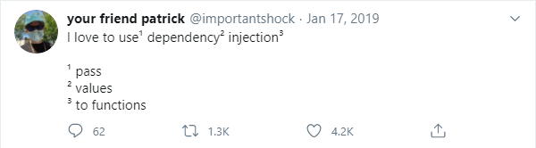

About two months ago I published an article titled ["Unit Testing is Overrated"](/blog/unit-testing-is-overrated) where I shared my thoughts on how developers place way too much faith in that testing approach and why it often isn't the best tool for the job. While I didn't expect that post to do particularly well, in three weeks it managed to get over 100K views and 1000 comments, even despite its controversial nature (or, perhaps, owing to it?).

It was really interesting to follow the discussions that unfolded, given the vast contrast of opinions people seemed to have on the subject. And while most commenters mainly shared their personal experiences, a few have also voiced criticism of the way some arguments were presented.

In particular, one person mentioned that the drawbacks I've described, especially those pertaining to abstractions and mocking, are really just a byproduct of object-oriented programming and its inherent flaws. Had my examples been designed with functional principles in mind, many of the outlined problems would never have surfaced.

More specifically, the suggested solution was to refactor the presented class hierarchy by extracting the pure business logic away from the rest of the code. Getting rid of the impure dependency eliminates the need for mocking, which in turn simplifies unit testing.

This exact approach was actually mentioned in later parts of the post as well, albeit in a slightly different context. Although it does make isolated testing easier for that particular snippet of code, it doesn't actually invalidate the main issues raised by the article.

That said, I also think that the underlying principle of code separation based on purity is very important and often overlooked. When used correctly, it can positively influence software design, providing benefits in terms of readability, portability and, as mentioned, unit testing.

Depending on who you ask, this principle may have different names, such as [functional core, imperative shell](https://destroyallsoftware.com/screencasts/catalog/functional-core-imperative-shell), [impure-pure-impure sandwich](https://blog.ploeh.dk/2017/02/02/dependency-rejection), and some others. And while most developers seem to agree on its value, there's still some misunderstanding remaining as to how it's applied beyond simple academic examples.

At the end of the day, just like with any other software development pattern, its usefulness is entirely situational. However, it offers a good mental model for reasoning about non-determinism in code, which is relevant regardless of context.

In this article we will look at what actually makes something pure or impure, why is that important to us, and how we can leverage that knowledge to write better software. I will show examples of where applying this principle lends to better design, as well scenarios where it doesn't.

_Note: as usual, the code samples in this article are written in C#, but the main ideas apply to any language._

## Pure vs impure

As I'm writing this in 2020, there is no doubt that most readers are already familiar with the concept of purity in programming. Nevertheless, let's go over it one more time to make sure we're on the same page.

In essence, _pure code_ is code encapsulated within a function, whose **evaluation is influenced only by its parameters** and whose **evaluation influences only its returned value**. In other words, a pure function doesn't have any implicit arguments, doesn't depend on or interact with external state, and doesn't generate any observable _side-effects_.

Conversely, a function which breaks at least one of those two rules is considered _impure_. To illustrate this, let's look at a very simple example:

```csharp
public static bool IsFoodEdible(DateTimeOffset expiration) =>
    DateTimeOffset.Now < expiration;

public static bool IsFoodEdible(DateTimeOffset expiration, DateTimeOffset instant) =>
    instant < expiration;
```

While both versions of the `IsFoodEdible` function are similar, only one of them is actually pure. The first overload gets the current time from the system clock, which creates an implicit dependency on external state. In practice, this means that evaluating the function multiple times may very well produce different results even for the same input parameter, violating the first rule of purity.

The other version takes the current time as an explicit parameter instead and thus does not exhibit that problem. Regardless of whether we call that function now or ten years into the future, the result is guaranteed to always be the same for the same input. In other words, the behavior of the function depends only on the parameters that were passed to it and nothing else.

Because of that, the second function shown in the above example is pure, while the first one isn't. Additionally, the following variant would be impure as well:

```csharp
public static void IsFoodEdible(DateTimeOffset expiration, DateTimeOffset instant)
{
    if (instant < expiration)
        Console.WriteLine("It's edible.");
    else
        Console.WriteLine("It's not edible.");
}
```

In this case, the impurity comes from the fact that this function generates side-effects by interacting with the standard output stream. Since the evaluation of this function influences something other than its returned value, it breaks the second rule we outlined earlier.

Generally speaking, **any function that doesn't return anything** (or whose return value may be ignored) **is guaranteed to be impure**, because a pure function without a return value is inherently useless. Furthermore, if a function executes asynchronously, it's also a reliable giveaway that a function is impure, since asynchrony naturally comes from I/O operations.

Finally, the function in the following example may seem impure at a first glance too, but actually isn't:

```csharp
public static bool AllFoodEdible(IReadOnlyList<DateTimeOffset> expirations, DateTimeOffset instant)
{
    for (var i = 0; i < products.Count; i++)
    {
        if (instant >= expirations[i])
            return false;
    }

    return true;
}
```

Seeing as `AllFoodEdible` mutates the value of `i` during the course of its execution, one could think that such a function is not pure either. However, because the variable `i` is encapsulated within a local scope and cannot be accessed from outside of this function, these mutations are not externally observable and, as such, do not make the code impure.

Now, of course it wouldn't be very useful to classify code based on these seemingly arbitrary traits if it didn't provide us with some useful insights. When it comes to purity, these insights come in a form of properties that all pure functions are known to possess:

- They produce deterministic results which can be safely cached
- They never have race conditions and can be easily parallelized
- They are self-contained and don't influence the behavior of other functions
- They are always CPU-bound and don't need to execute asynchronously
- They are highly localized and are generally easier to debug and reason about
- They don't have implicit dependencies and are trivial to test in isolation

Judging by this list alone, it's rather clear that pure code is extremely flexible and convenient to work with. In fact, the initial instinct may be that we should optimize our design in such way that we focus exclusively on writing pure code.

Unfortunately, that's not possible because **purity**, in itself, **is not an indication of quality, but rather of purpose**. Any program will invariably have impure code, as it's required to handle infrastructural concerns, such as reading user input, persisting data, making changes in the environment, and all the other things that make our software actually useful.

These aspects are dictated by the functional requirements of the software and not so much by its design. That means that we can't simply eliminate impurities from our code, at least not without also changing how it works.

Having said that, one very important characteristic of **impurity** is that it's **inherently contagious**. If an otherwise pure function calls an impure function, it becomes impure as well:

```csharp
// Impure function
public static string GetId() => Guid.NewGuid().ToString();

// Impure function (calls an impure function)
public static string GetFilePath(string dirPath, string name) =>
    dirPath + name + GetId();

// Pure function (takes the result of impure function as a parameter)
public static string GetFilePath(string dirPath, string name, string id) =>
    dirPath + name + id;
```

In other words, depending on how the code is structured and how it interacts with non-deterministic and effectful operations, impurities may make up a larger or smaller portion of the whole. That, in turn, is something we can actually control.

As a guiding principle, we can establish that, to reap the most benefits out of pure functions, the design of our software needs to **limit impure interactions and delay them as much as possible**. Ideally, they should be pushed towards the outermost layers of the architecture, also known as the _system boundaries_.

## Flattening the dependency tree

Although the concept of purity forms the foundation of functional programming, it isn't given as much thought in the object-oriented world. In fact, the main purpose of object-oriented design is to aggregate related behavior in a single contextual entity, which usually involves state and mutations.

Software written with OOP in mind follows a hierarchical design, where objects are composed together to represent different layers of abstraction in a connected fashion. Any impurities that may exist in those objects are free to spread from child to parent, potentially contaminating the entire dependency tree.

To better understand what that means in practice, let's revisit an example from my previous article. The idea was to build a simple web API application that calculates user's sunrise and sunset times based on their IP. This functionality was modeled using three classes:

- `LocationProvider` to get a location from an IP address, using a public GeoIP database
- `SolarCalculator` to calculate solar times from that location
- `SolarTimesController` to expose the result through an HTTP endpoint

Here's the code for that:

```csharp
public class LocationProvider
{
    private readonly HttpClient _httpClient;

    /* ... */

    public async Task<Location> GetLocationAsync(IPAddress ip)
    {
        // Pure
        var ipFormatted = !ip.IsLocal()
            ? ip.MapToIPv4().ToString()
            : "";

        // Impure
        var json = await _httpClient.GetJsonAsync($"http://ip-api.com/json/{ipFormatted}");

        // Pure
        var latitude = json.GetProperty("lat").GetDouble();
        var longitude = json.GetProperty("lon").GetDouble();

        return new Location(latitude, longitude);
    }
}

public class SolarCalculator
{
    private readonly LocationProvider _locationProvider;

    /* ... */

    private DateTimeOffset CalculateSunrise(Location location, DateTimeOffset date)
    {
        /* Pure (implementation omitted) */
    }

    private DateTimeOffset CalculateSunset(Location location, DateTimeOffset date)
    {
        /* Pure (implementation omitted) */
    }

    public async Task<SolarTimes> GetSolarTimesAsync(IPAddress ip, DateTimeOffset date)
    {
        // Impure
        var location = await _locationProvider.GetLocationAsync(ip);

        // Pure
        var sunrise = CalculateSunrise(location, date);
        var sunset = CalculateSunset(location, date);

        return new SolarTimes(sunrise, sunset);
    }
}

[ApiController, Route("solartimes")]
public class SolarTimeController : ControllerBase
{
    private readonly SolarCalculator _solarCalculator;

    /* ... */

    [HttpGet("by_ip")]
    public async Task<IActionResult> GetSolarTimesByIp(DateTimeOffset? date)
    {
        // Impure
        var result = await _solarCalculator.GetSolarTimesAsync(
            HttpContext.Connection.RemoteIpAddress,
            date ?? DateTimeOffset.Now
        );

        return Ok(result);
    }
}
```

Note how these three classes represent a vertical slice from a potentially much more involved object hierarchy. Schematically, the flow of data in this relationship can be depicted like so:

```ini
 [ LocationProvider ]
           |
           ↓
  [ SolarCalculator ]
           |
           ↓
[ SolarTimesController ]
```

This is a very typical scenario for "classically" designed object-oriented software. You'll probably find it extremely familiar if you have experience working on code that follows the [n-tier architecture](https://en.wikipedia.org/wiki/Multitier_architecture) or any other similar pattern.

If we consider this relationship from a standpoint of purity, we'll notice that the entire call chain shown previously is impure. And while for `LocationProvider` it makes sense because it performs non-deterministic I/O, the `SolarCalculator` is impure only due to its dependency on the former.

That design is not ideal, because we lose out on the benefits of pure functions without really getting anything in return. Now if we wanted to, for example, test `SolarCalculator.GetSolarTimesAsync` in isolation, we would only be able do that with the help of an autotelic abstraction and a mock object, which is not desirable.

This issue could've been avoided if we architected our code with the pure-impure segregation principle in mind. Let's see how we can refactor our classes to push the impurities out of `SolarCalculator`:

```csharp
public class LocationProvider
{
    /* ... */
}

public class SolarCalculator
{
    // Can be made into a static method
    public SolarTimes GetSolarTimes(Location location, DateTimeOffset date)
    {
        // Pure
        var sunrise = CalculateSunrise(location, date);
        var sunset = CalculateSunset(location, date);

        return new SolarTimes(sunrise, sunset);
    }
}

[ApiController, Route("solartimes")]
public class SolarTimesController
{
    private readonly LocationProvider _locationProvider;
    private readonly SolarCalculator _solarCalculator;

    /* ... */

    [HttpGet("by_ip")]
    public async Task<IActionResult> GetSolarTimesByIp(DateTimeOffset? date)
    {
        // Impure
        var location = await _locationProvider.GetLocationAsync(
            HttpContext.Connection.RemoteIpAddress
        );

        // Pure
        var result = _solarCalculator.GetSolarTimes(
            location,
            date ?? DateTimeOffset.Now
        );

        return Ok(result);
    }
}
```

Previously, the method in `SolarCalculator` took an IP address as a parameter and relied on `LocationProvider` to get the coordinates it maps to. After refactoring, the method now instead takes the location directly, skipping the previously required impure step.

Of course, that impurity didn't just disappear into thin air, our software still needs to get the location somehow. The difference is that now this concern is pushed out towards the boundary of the system, which in this case is the controller.

In doing that, we also flattened the hierarchy so that all of the dependencies are aggregated at the boundary. The data flow now looks a bit more like a pipeline instead:

```ini
[ LocationProvider ]  [ SolarCalculator ]
          |                   |
          |_____         _____|
                ↓       ↓
        [ SolarTimesController ]
```

The benefit of this design is that the pure business logic is no longer contaminated by non-deterministic effectful code, which means we can take advantage of the useful properties we listed in the previous section. If we wanted to parallelize or test `SolarCalculator`, it's much easier to do so now than it was before.

## Interleaved impurities

This type of "lossless" refactoring shown above is possible only when the impure operation comes either directly before or directly after the pure code that we want to isolate. Unfortunately, this is not always the case.

Often we have to deal with functions that have pure and impure concerns interleaved with each other, creating a cohesive structure that is hard to break apart. This happens when exposing the entire set of required data as function parameters is simply unfeasible.

To illustrate a scenario like that, let's take a look at a slightly more involved example. The following snippet contains a class called `RecommendationsProvider` which is responsible for generating song suggestions for a user of some music streaming service:

```csharp
public class RecommendationsProvider
{
    private readonly SongService _songService;

    /* ... */

    public async Task<IReadOnlyList<Song>> GetRecommendationsAsync(string userName)
    {
        // 1. Get own top songs
        // 2. Get other users who listened to them
        // 3. Get top songs of those users
        // 4. Return recommendations

        // Impure
        var scrobbles = await _songService.GetTopScrobblesAsync(userName);

        // Pure
        var scrobblesSnapshot = scrobbles
            .OrderByDescending(s => s.ScrobbleCount)
            .Take(100)
            .ToArray();

        var recommendationCandidates = new List<Song>();
        foreach (var scrobble in scrobblesSnapshot)
        {
            // Impure
            var otherListeners = await _songService
                .GetTopListenersAsync(scrobble.Song.Id);

            // Pure
            var otherListenersSnapsot = otherListeners
                .Where(u => u.TotalScrobbleCount >= 10_000)
                .OrderByDescending(u => u.TotalScrobbleCount)
                .Take(20)
                .ToArray();

            foreach (var otherListener in otherListenersSnapsot)
            {
                // Impure
                var otherScrobbles = await _songService
                    .GetTopScrobblesAsync(otherListener.UserName);

                // Pure
                var otherScrobblesSnapshot = otherScrobbles
                    .Where(s => s.Song.IsVerifiedArtist)
                    .OrderByDescending(s => s.Song.Rating)
                    .Take(10)
                    .ToArray();

                recommendationCandidates.AddRange(
                    otherScrobblesSnapshot.Select(s => s.Song)
                );
            }
        }

        // Pure
        var recommendations = recommendationCandidates
            .OrderByDescending(s => s.Rating)
            .Take(200)
            .ToArray();

        return recommendations;
    }
}
```

The above algorithm works by retrieving the user's most listened songs, finding others who've listened to the same titles, and then extracting their top songs as well. In the end, the recommendations are formed based on what users with a similar taste listen to the most.

It's quite clear that this function would benefit greatly from being pure, due to how much business logic is encapsulated within it, but unfortunately the refactoring technique we relied upon earlier won't work here. In order to fully isolate `GetRecommendationsAsync` from its impure dependencies, we would have to somehow supply the function with an entire list of songs, users, and their scrobbles upfront, which is completely impractical (and likely impossible).

As a workaround, we could also split the function into smaller pieces, each handling one of the four stages of the algorithm separately. In doing so, we'd probably arrive at a pipeline consisting of `ProcessOwnScrobbles`, `ProcessOtherListeners`, `ProcessOtherScrobbles`, and `FinalizeRecommendations`, with impure operations inserted between them.

While that would work, the value of such change is questionable. Instead of having one cohesive element to reason about, we'd end up with multiple fragmented parts which are completely useless to us on their own.

However, since our original goal is to push the impurities out towards the system boundaries, we may try to approach this issue from another angle. In essence, all we need to do is delay the evaluation of impure functions until the last possible opportunity.

Let's see how we can achieve that:

```csharp
public class RecommendationsProvider
{
    // Can be made into a static method
    public Func<SongService, Task<IReadOnlyList<Song>>> GetRecommendationsFunc(string userName)
    {
        return async songService =>
        {
            var scrobbles = await songService.GetTopScrobblesAsync(userName);

            var scrobblesSnapshot = scrobbles
                .OrderByDescending(s => s.ScrobbleCount)
                .Take(100)
                .ToArray();

            /* ... */
        };
    }
}
```

Now, instead of evaluating the result directly, our method preserves `userName` in a closure and returns another function which can be evaluated at a later point. That function, in turn, relies on a parameter of type `SongService` to retrieve the song recommendations we need.

Because `GetRecommendationsFunc` does not perform any impure operations itself and simply returns an impure function, it is completely pure. Essentially, instead of yielding the result directly, this method returns a lambda which encodes all of the information required to obtain it:

```csharp
// Pure
var getRecommendationsAsync = new RecommendationsProvider().GetRecommendationsFunc("JohnDoe");

// Impure
var recommendations = await getRecommendationsAsync(new SongService());
```

This technique may look extremely awkward in the context of object-oriented programming, but this is something functional languages have first-class support for, thanks to a feature known as _currying_. As an example, this is essentially the same code as above, but written in F# instead:

```fsharp
let getRecommendations userName songService = task {
    let! scrobbles = songService.GetTopScrobblesAsync(userName)

    let scrobblesSnapshot = scrobbles
        |> Seq.sortByDescending (fun s -> s.ScrobbleCount)
        |> Seq.take 100
        |> Seq.toArray

    // ...
}

// Pure
let getRecommendationsPartial = getRecommendations "JohnDoe"

// Impure
let! recommendations = getRecommendationsPartial SongService()
```

At this point you may notice that, by delaying the resolution of an impure dependency towards the system boundary, we've essentially reinvented dependency injection. The only difference is that it works in reverse order compared to what we're used to.

While the object-oriented way of doing dependency injection expects us to provide the dependencies first, the functional way typically operates in the opposite direction. For contrast, here are both approaches side-by-side:

```csharp
// Object-oriented DI (dependencies first)
var recommendationsProvider = new RecommendationsProvider(new SongService());
var recommendations = await recommendationsProvider.GetRecommendationsAsync("JohnDoe");

// Functional DI (dependencies last)
var getRecommendationsAsync = Domain.GetRecommendationsFunc("JohnDoe");
var recommendations = await getRecommendationsAsync(new SongService());
```

[](https://twitter.com/importantshock/status/1085740688283746304)

Although both of these approaches are essentially equivalent, there's a slight nuance to the second one. As functions are generally easier to compose than objects, we can apply various transformations on the result, without observing its actual value.

For example, we can define a special `Map` extension method that allows us to transform a delegate from one type to another. The following is its implementation for asynchronous functions with just one parameter:

```csharp
public static Func<TParam, Task<TMappedResult>> Map(
    this Func<TParam, Task<TResult>> source,
    Func<TResult, TMappedResult> transform)
{
    return async param =>
    {
        var result = await source(param);
        return transform(result);
    };
}
```

Note that although the above code evaluates the result of `source`, it happens within a nested lambda. This effectively makes the transformation lazy, which means that the `Map` method itself remains pure.

As an example, let's use this extension to refine the provided recommendations to only contain songs of a specific genre and limit their total number:

```csharp
// Pure
var getRecommendationsAsync = Domain.GetRecommendationsFunc("JohnDoe");

// Pure
var getSpecificRecommendationsAsync = getRecommendationsAsync.Map(recommendations =>
    // Get only a subset of recommendations
    recommendations
        .Where(s => s.Genres.Contains("Metal"))
        .Take(10)
        .ToArray()
);

// Impure
var specificRecommendations = await getSpecificRecommendationsAsync(new SongService());
```

Similarly, we can also define another extension method called `Merge`. This one would allow us to lazily combine two impure functions together:

```csharp
public static Func<TParam, Task<TResult>> Merge(
    this Func<TParam, Task<TResult>> source,
    Func<TParam, Task<TResult>> other,
    Func<TResult, TResult, TResult> join)
{
    return async param =>
    {
        var left = await source(param);
        var right = await other(param);

        return join(left, right);
    }
}
```

Its usage would then be as follows:

```csharp
// Pure
var getRecommendationsForJohnDoeAsync = Domain.GetRecommendationsFunc("JohnDoe");
var getRecommendationsForJaneDoeAsync = Domain.GetRecommendationsFunc("JaneDoe");

// Pure
var getAllRecommendationsAsync = getRecommendationsForJohnDoeAsync.Merge(
    getRecommendationsForJaneDoeAsync,
    // Merge both recommendations into a single list
    (recommendationsForJohn, recommendationsForJane) =>
        recommendationsForJohn
            .Concat(recommendationsForJane)
            .ToArray()
);

// Impure
var allRecommendations = await getAllRecommendationsAsync(new SongService());
```

There's no point denying that programming in such style, while definitely possible, is extremely cumbersome in an OO-first language. Although we managed to achieve our goal of separating pure and impure concerns from each other, it came at a considerable cost.

If you're really keen on writing code like this in C#, I would recommend using [Language-Ext](https://github.com/louthy/language-ext) for general functional primitives and [Eff](https://github.com/nessos/Eff) for effectful composition. In case you want to learn more about the latter, there is a [great introductory article](https://eiriktsarpalis.wordpress.com/2020/07/20/effect-programming-in-csharp) written by one of its authors.

## Pure "enough" code

Although it's convenient to treat purity as an objectively provable characteristic, it's actually a bit more nuanced than that. As a matter of fact, one could say that purity is a relative concept, not an absolute one.

To understand what exactly I mean by that, let's take a look at an example:

```csharp
public static int FindIndexOf(IEnumerable<Item> items, Item item)
{
    var i = 0;

    foreach (var o in items)
    {
        if (o == item)
            return i;

        i++;
    }

    throw new Exception("Item not found.");
}
```

This is a very simple function that attempts to find an index that corresponds to the position of an item in a sequence, or throw an exception in case of failure. The negative outcome is assumed to be very improbable in this scenario, hence why an exception is used as opposed to a fallback value.

According to the criteria of purity, this function is not pure because the result of its evaluation is not entirely encapsulated within the returned value. Throwing an exception is an effectful operation, since it can change the behavior of the function above in the call stack, or lead to the termination of the program altogether.

However, despite all that, the function is still deterministic, cacheable, parallelizable, and testable, as long as we remember to handle the exception that may be raised in certain circumstances. Even though it's not technically pure, it still retains most of the important properties we care about.

Let's consider an even simpler example:

```csharp
public static int Wrap(int value, int period) => value % period;
```

Seeing as the above code literally just represents a mathematical expression, it seems logical that it must be pure. In reality, however, this function shares the exact same problem as the one in the previous snippet.

The modulus operator has an exceptional outcome, which occurs when the supplied divisor is equal to _zero_. If we were to try and invoke `Wrap(123, 0)`, it would throw an exception, indicating that the function is actually impure as well.

Notably, this problem could be avoided if we used something like `Option<int>` as return type instead. This approach eliminates the need for an exception (and this is how [Darklang does it](https://docs.darklang.com/languagedetails#floats)), but comes with an expense of making basic arithmetic operations appear more cumbersome.

In any case, even though the code we wrote originally doesn't satisfy the theoretical definition of purity, it might be _pure enough_ for our usage scenario.

Let's also take a look at an opposite situation:

```csharp
public static string GetOutputPath(Report report, string outputDir)
{
    var fileExtension = report.Format == ReportFormat.Html
        ? "html"
        : "txt";

    var fileName = $"{report.Name}.{fileExtension}";

    return Path.Combine(outputDir, fileName);
}
```

The code above assembles a file path for the provided report by combining the output directory with the generated file name. It calls the [`Path.Combine`](https://docs.microsoft.com/en-us/dotnet/api/system.io.path.combine?view=netcore-3.1#System_IO_Path_Combine_System_String_System_String_) method, whose behavior relies on the value of the `Path.DirectorySeparatorChar` constant, as it indicates which directory separator character is used by the operating system.

Since it is a constant and its value is guaranteed to always be the same for the duration of the program's lifetime, our function is pure (as long as we also disregard exceptions). However, it's pure only within the current session.

If we imagine that we're building a cross-platform solution, it's logical that we treat specifics of each platform as environmental parameters. In other words, for code that is expected to run seamlessly on Windows and Linux, the path separator constant essentially acts as a global variable.

Assuming our goal is to test `GetOutputPath` in isolation, simply relying on the parameters of the function is not enough. We would also need to execute tests on each of the supported operating systems, to make sure it actually works with all possible path separators.

In this case, the fact that the function is pure does not provide us with sufficient guarantees. While it's pure by definition, it's not _pure enough_ for what we need.

As you can see, the concept of purity gets a bit hazy once you start digging into specifics. In reality, everything around us is inherently impure, so what we accept as pure really depends on what level of abstraction we choose to operate at.

If you decide to follow the rules pedantically, you'll find the idea of modelling any problem domain with pure functions quickly becomes impractical. However, it's important to remember that **the goal is not purity in itself, but rather the benefits it provides**.

At the end of the day, it's up to the developer to draw the line and decide what makes sense and what doesn't. The concept of purity is really just an approximation and should be treated as such.

## Summary

Overall, the concept of purity is very useful, as it helps us understand how some operations may make our code non-deterministic, difficult to reason about, and cumbersome to test in isolation. Impure interactions are not bad on their own, but the constraints they impose are contagious in nature and may spread to other parts of the application.

The pure-impure segregation principle aims to limit impurities to an essential minimum, by decoupling them from the rest of the code. Ultimately, the goal is push all non-pure operations towards the outermost layers of the system, while keeping the domain layer comprised entirely of pure functions.

Designing software in such way leads to an architecture that resembles a pipeline rather than a hierarchy, which favors functional style of programming. Depending on the project, this may aid in expressing the flow of data more clearly, among other useful benefits.

However, this is not always practical and there are scenarios where extracting pure code comes at a cost of severely reduced cohesiveness. In any case, if your goal is to facilitate testing without mocking, [architecting your solution for high-level testing](/blog/unit-testing-is-overrated) is likely going to be a much better time investment.
